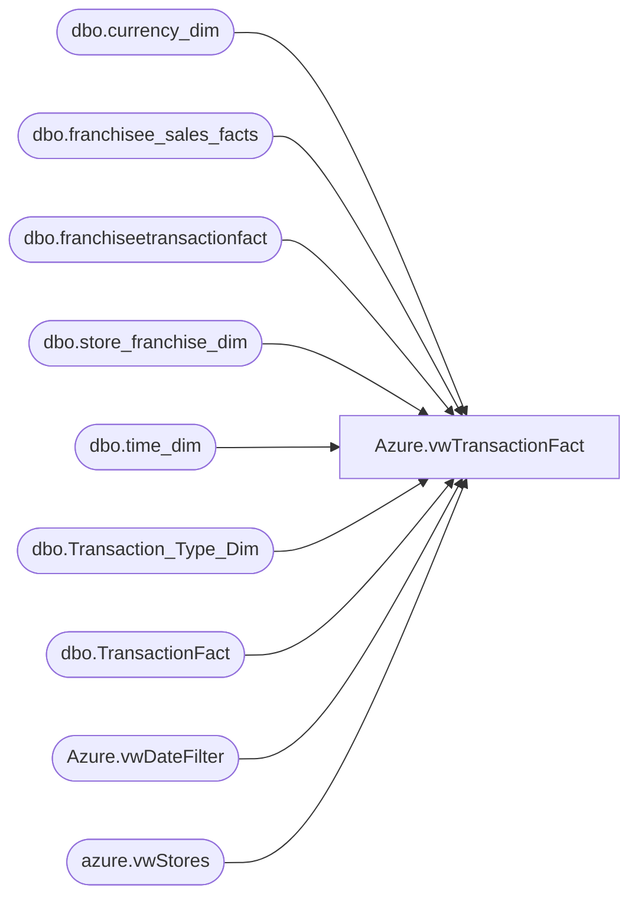

# Azure.vwTransactionFact

**Database:** dw  
**Server:** papamart  

## Architecture Diagram



## Table Dependencies

| Referenced Table |
|---|
| dbo.currency_dim |
| dbo.franchisee_sales_facts |
| dbo.franchiseetransactionfact |
| dbo.store_franchise_dim |
| dbo.time_dim |
| dbo.Transaction_Type_Dim |
| dbo.TransactionFact |
| Azure.vwDateFilter |
| azure.vwStores |

## View Code

```sql
CREATE view [Azure].[vwTransactionFact]

AS
-- =============================================================================================================
-- Name: [Azure].[vwTransactionFact]
--
-- Description: Transaction data at the header level.
--
--
-- Dependencies: 
--
-- Revision History
--		Name:				Date:			Comments:
--		Tim Bytnar			4/2/2018		Initial creation
--		John Eck			9/25/2018		Alterations for including Franchisee TransactionFact data
--		Ian Wallace			5/26/2020		Added ShipFromStore and PickUpFromStore columns
--		Dan Tweedie			2021-2-24		Updated to use new TransactionFact table which only holds data from 2018-1-1 to present, so processing is hopefully faster
-- =============================================================================================================
--select * from PreStage


SELECT '0' AS TransactionID
      ,Store_Key AS StoreKey
      ,CONVERT(DATE,dd.actual_date) AS TransactionDate
	  ,CAST(CONVERT(VARCHAR,CONVERT(DATE,dd.actual_date)) +' ' + LEFT(CONVERT(TIME,CONVERT(VARCHAR,td.hour) + ':' + CONVERT(VARCHAR,td.minute)),5) + ':00.000' AS DATETIME) AS TransactionDateTime
      ,ttd.[transaction_type] AS TransactionType
      ,cAST(tff.[transaction_no] AS vARCHAR(20)) AS TransactionNumber
      ,tff.[register_no] AS RegisterNumber
      ,tff.[GAAP_transaction_flag] AS GAAPTransaction
	  ,tff.[store_transaction_flag] AS StoreTransaction
	  ,tff.[Enterprise_Selling_Only_Flag] AS EnterpriseSellingOnlyTransaction
	  ,case when tff.Enterprise_Selling_Amount<>0 then 1 else 0 end as EnterpriseSellingTransaction
      ,tff.[donation_only_flag] AS DonationTransaction
      ,tff.[giftcard_only_flag] AS GiftCardOnlyTransaction
	  ,tff.[party_flag] AS PartyFlag
	  ,tff.[total_units] AS TotalUnits
      ,tff.[GAAP_sales_amount] AS GAAPSalesAmount
	  ,tff.[Store_Sales_Amount] AS StoreSalesAmount
	  ,tff.[Enterprise_Selling_Amount] AS EnterpriseSellingAmount
	  ,CASE WHEN tff.Enterprise_Selling_Only_Flag=1 THEN CAST(tff.Store_Sales_Amount AS DECIMAL(15,3)) ELSE 0 END AS EnterpriseSellingOnlyStoreSalesAmount
	  ,CASE WHEN tff.Enterprise_Selling_Units<>0 THEN CAST(tff.Store_Sales_Amount AS DECIMAL(15,3)) ELSE 0 END AS EnterpriseSellingStoreSalesAmount
      ,tff.[net_sales_amount] AS NetSalesAmount
	  ,tff.[unit_gross_amount] AS UnitGrossAmount
      ,tff.[unit_net_amount] AS UnitNetAmount
      ,tff.[reward_certificate_amount] AS RewardCertificateAmount
      ,tff.[buy_stuff_amount] AS BuyStuffAmount
	  ,tff.[redemption_amount] AS RedemptionAmount
      ,tff.[tax_amount] AS TaxAmount
	  ,tff.[unit_discount_amount] AS UnitDiscountAmount
      ,tff.[coupon_discount_amount] AS CouponDiscountAmount
      ,tff.[coupon_discount_units] AS CouponDiscountUnits
      ,tff.[giftcard_discount_amount] AS GiftcardDiscountAmount
	  ,tff.[total_discount_amount] AS TotalDiscountAmount
	  ,tff.[receipt_total_amount] AS ReceiptTotalAmount
      ,tff.[fin_GAAP_sales_amount] AS FinGAAPSalesAmount
	  ,tff.[fin_Store_Sales_Amount] AS FinStoreSalesAmount
	  ,tff.[upsell_discount_amount] AS UpsellDiscountAmount
      ,tff.[merchandise_UGA] AS MerchandiseUnitGrossAmount
      ,tff.[merchandise_units] AS MerchandiseUnits
      ,tff.[Gaap_Units] AS GAAPUnits
      ,tff.[Enterprise_Selling_Units] AS EnterpriseSellingUnits
      ,tff.[merchandise_cost] AS MerchandiseCost
      ,tff.[donations_UGA] AS DonationUnitGrossAmount
      ,tff.[donations_units] AS DonationUnits 
      ,tff.[party_deposit_UGA] AS PartyDepositUnitGrossAmount
      ,tff.[party_deposit_units] AS PartyDepositUnits
      ,tff.[giftcard_UGA] AS GiftCardUnitGrossAmount
      ,tff.[giftcard_units] AS GiftCardUnits 
      ,tff.[animal_UGA] AS AnimalUnitGrossAmount
      ,tff.[animal_units] AS AnimalUnits
      ,tff.[animal_cost] AS AnimalCost
      ,tff.[non_animal_UGA] AS NonAnimalUnitGrossAmount
      ,tff.[non_animal_units] AS NonAnimalUnits
      ,tff.[non_animal_cost] AS NonAnimalCost
      ,tff.[footwear_UGA] AS FootwearUnitGrossAmount
      ,tff.[footwear_units] AS FootwearUnits
      ,tff.[footwear_cost] AS FootwearCost
      ,tff.[accessories_UGA] AS AccessoryUnitGrossAmount
      ,tff.[footwear_cost] AS AccessoryCost
      ,tff.[accessories_units] AS AccessoryUnits
      ,tff.[sounds_UGA] AS SoundUnitGrossAmount
      ,tff.[sounds_units] AS SoundUnits
      ,tff.[sounds_cost] AS SoundCost
      ,tff.[clothing_UGA] AS ClothingUnitGrossAmount
      ,tff.[clothing_units] AS ClothingUnits
      ,tff.[clothing_cost] AS ClothingCost
      ,tff.[other_UGA] AS OtherUnitGrossAmount
      ,tff.[other_units] AS OtherUnits
      ,tff.[other_cost] AS OtherCost
      ,tff.[shipping_UGA] AS ShippingUnitGrossAmount
      ,tff.[shipping_units] AS ShippingUnits
      ,tff.[other_fees_UGA] AS OtherFeesUnitGrossAmount
      ,tff.[other_fees_units] AS OtherFeesUnits
      ,tff.[cub_cash_UGA] AS CubCashUnitGrossAmount
      ,tff.[cub_cash_units] AS CubCashUnits
      ,tff.[paid_outs_UGA] AS PaidOutsUnitGrossAmount
      ,tff.[paid_outs_units] AS PaidOutsUnits
      ,tff.[stuffing_supplies_UGA] AS StuffingSuppliesUnitGrossAmount
      ,tff.[stuffing_supplies_units] AS StuffingSuppliesUnits
      ,tff.[sports_UGA] AS SportUnitGrossAmount
      ,tff.[sports_units] AS SportUnits
      ,tff.[sports_cost] AS SportCost
      ,tff.[prestuffed_UGA] AS PresuffedUnitGrossAmount
      ,tff.[prestuffed_units] AS PresuffedUnits
      ,tff.[prestuffed_cost] AS PresuffedCost
      ,tff.[scents_UGA] AS ScentUnitGrossAmount
      ,tff.[scents_units] AS ScentUnits
      ,tff.[scents_cost] AS ScentCost
	  ,cd.currency_code AS CurrencyCode
	  ,CASE WHEN (tff.Store_transaction_flag=1 OR tff.giftcard_only_flag=1) THEN 1 ELSE 0 END AS CaptureEligible,
		tff.EmployeeDiscountUGA,
		tff.ReturnUGA,
		tff.ReturnUnits,
		tff.party_key,
		Cast(tff.transaction_id as Varchar(20)) + cast(Store_Key as Varchar(10)) + cast(tff.[register_no] as Varchar(10)) as TransactionKey
		,		0 as SingleAnimalTransaction
	,isnull(tff.isShipFromStore,0) as isShipFromStore,
	isnull(tff.isPickupFromStore,0) as isPickUpFromStore,
	case 
		when isnull(tff.isShipFromStore,0) = 1 
		then Store_Sales_Amount
		else 0
	end as ShipFromStoreAmount,
	case 
		when isnull(tff.isShipFromStore,0) = 1 
		then tff.Store_units 
		else 0 
	end as ShipFromStoreUnits,
	
	case 
		when isnull(tff.isShipFromStore,0) = 1 
		then tff.fin_Store_sales_amount 
		else 0
	end as FinancialShipFromStoreAmount,
	
	case 
		when isnull(tff.isPickupFromStore,0) = 1 
		then Store_Sales_Amount
		else 0
	end as PickupFromStoreAmount,
	case 
		when isnull(tff.isPickupFromStore,0) = 1 
		then tff.Store_units 
		else 0 
	end as PickupFromStoreUnits,
	case 
		when isnull(tff.isPickupFromStore,0) = 1 
		then tff.fin_Store_sales_amount 
		else 0
	end as FinancialPickupFromStoreAmount,

	CAST(CASE
		WHEN tff.unit_discount_amount <> 0 THEN tff.isShipFromStore
		ELSE 0
	END AS smallint) AS numShipFromStoreTransWithDiscount,
	CAST(CASE
		WHEN tff.unit_discount_amount <> 0 THEN tff.isPickupFromStore
		ELSE 0
	END AS smallint) AS numPickupFromStoreTransWithDiscount

  FROM [dw].[dbo].TransactionFact tff WITH(NOLOCK) INNER JOIN
	  --  [dw].[Azure].[vwStores] ds WITH(NOLOCK)
		--	ON ds.StoreKey=CONVERT(VARCHAR,tff.store_key) INNER JOIN
		[dw].Azure.vwDateFilter dd WITH(NOLOCK)
			ON tff.date_key = dd.date_key  INNER JOIN
		[dw].[dbo].[time_dim] td WITH(NOLOCK)
			ON td.time_key = tff.time_key INNER JOIN
		[dw].[dbo].[Transaction_Type_Dim] ttd WITH(NOLOCK)
			ON ttd.transaction_key = tff.transaction_type_key INNER JOIN
		[dw].[dbo].[currency_dim] cd WITH(NOLOCK)
			ON cd.currency_key=tff.currency_key  
	--where Cast(tff.transaction_id as Varchar(20)) + cast(Store_Key as Varchar(10))<>'6887711496672'		
	where tff.transaction_id not in (484030267,484030232,484030231,493479758,514733581,514733561,514733565, 514733562, 514733590, 514733582)
	
union all
SELECT  '0'  AS TransactionID ,
		fsf.Store_Key AS StoreKey,
		CONVERT(DATE,dd.actual_date) AS TransactionDate,
		CAST(CONVERT(VARCHAR,CONVERT(DATE,dd.actual_date)) +' ' + LEFT(CONVERT(TIME,CONVERT(VARCHAR,td.hour) + ':' + CONVERT(VARCHAR,td.minute)),5) + ':00.000' AS DATETIME) AS TransactionDateTime,
		ttd.transaction_type as TransactionType,
		cast(fsf.transaction_no as varchar(20)) as TransactionNumber,
		fsf.register_no as RegisterNumber,
		fsf.GAAP_transaction_flag as GAAPTransaction,
		fsf.[store_transaction_flag] AS StoreTransaction,
	    fsf.[Enterprise_Selling_Only_Flag] AS EnterpriseSellingOnlyTransaction,
		0 as EnterpriseSellingTransaction,
        fsf.[donation_only_flag] AS DonationTransaction,
        fsf.[giftcard_only_flag] AS GiftCardOnlyTransaction,
  		fsf.[party_flag] AS PartyFlag,
	    fsf.[total_units] AS TotalUnits,
		fsf.[GAAP_sales_amount] AS GAAPSalesAmount,
		fsf.[Store_Sales_Amount] AS StoreSalesAmount,
		fsf.[Enterprise_Selling_Amount] AS EnterpriseSellingAmount,
		0 as       [EnterpriseSellingOnlyStoreSalesAmount] ,
        0 as [EnterpriseSellingStoreSalesAmount],
		fsf.[net_sales_amount] AS NetSalesAmount,
		fsf.[unit_gross_amount] AS UnitGrossAmount,
		fsf.[unit_net_amount] AS UnitNetAmount,
		fsf.[reward_certificate_amount] AS RewardCertificateAmount,
		fsf.[buy_stuff_amount] AS BuyStuffAmount,
		fsf.[redemption_amount] AS RedemptionAmount,
		fsf.[tax_amount] AS TaxAmount,
		fsf.[unit_discount_amount] AS UnitDiscountAmount,
		fsf.[coupon_discount_amount] AS CouponDiscountAmount,
		fsf.[coupon_discount_units] AS CouponDiscountUnits,
		fsf.[giftcard_discount_amount] AS GiftcardDiscountAmount,
		fsf.[total_discount_amount] AS TotalDiscountAmount,
		fsf.[receipt_total_amount] AS ReceiptTotalAmount,
		fsf.[fin_GAAP_sales_amount] AS FinGAAPSalesAmount,
		fsf.[fin_Store_Sales_Amount] AS FinStoreSalesAmount,
		fsf.[upsell_discount_amount] AS UpsellDiscountAmount,
		fsf.[merchandise_UGA] AS MerchandiseUnitGrossAmount,
		fsf.[merchandise_units] AS MerchandiseUnits,
		fsf.[Gaap_Units] AS GAAPUnits,
		fsf.[Enterprise_Selling_Units] AS EnterpriseSellingUnits,
		fsf.[merchandise_cost] AS MerchandiseCost,
		fsf.[donations_UGA] AS DonationUnitGrossAmount,
		fsf.[donations_units] AS DonationUnits ,
		fsf.[party_deposit_UGA] AS PartyDepositUnitGrossAmount,
		fsf.[party_deposit_units] AS PartyDepositUnits,
		fsf.[giftcard_UGA] AS GiftCardUnitGrossAmount,
		fsf.[giftcard_units] AS GiftCardUnits ,
		fsf.[animal_UGA] AS AnimalUnitGrossAmount,
		fsf.[animal_units] AS AnimalUnits,
		fsf.[animal_cost] AS AnimalCost,
		fsf.[non_animal_UGA] AS NonAnimalUnitGrossAmount,
		fsf.[non_animal_units] AS NonAnimalUnits,
		fsf.[non_animal_cost] AS NonAnimalCost,
		fsf.[footwear_UGA] AS FootwearUnitGrossAmount,
		fsf.[footwear_units] AS FootwearUnits,
		fsf.[footwear_cost] AS FootwearCost,
		fsf.[accessories_UGA] AS AccessoryUnitGrossAmount,
		fsf.[footwear_cost] AS AccessoryCost,
		fsf.[accessories_units] AS AccessoryUnits,
		fsf.[sounds_UGA] AS SoundUnitGrossAmount,
		fsf.[sounds_units] AS SoundUnits,
		fsf.[sounds_cost] AS SoundCost,
		fsf.[clothing_UGA] AS ClothingUnitGrossAmount,
		fsf.[clothing_units] AS ClothingUnits,
		fsf.[clothing_cost] AS ClothingCost,
		fsf.[other_UGA] AS OtherUnitGrossAmount,
		fsf.[other_units] AS OtherUnits,
		fsf.[other_cost] AS OtherCost,
		fsf.[shipping_UGA] AS ShippingUnitGrossAmount,
		fsf.[shipping_units] AS ShippingUnits,
		fsf.[other_fees_UGA] AS OtherFeesUnitGrossAmount,
		fsf.[other_fees_units] AS OtherFeesUnits,
		fsf.[cub_cash_UGA] AS CubCashUnitGrossAmount,
		fsf.[cub_cash_units] AS CubCashUnits,
		fsf.[paid_outs_UGA] AS PaidOutsUnitGrossAmount,
		fsf.[paid_outs_units] AS PaidOutsUnits,
		fsf.[stuffing_supplies_UGA] AS StuffingSuppliesUnitGrossAmount,
		fsf.[stuffing_supplies_units] AS StuffingSuppliesUnits,
		fsf.[sports_UGA] AS SportUnitGrossAmount,
		fsf.[sports_units] AS SportUnits,
		fsf.[sports_cost] AS SportCost,
		fsf.[prestuffed_UGA] AS PresuffedUnitGrossAmount,
		fsf.[prestuffed_units] AS PresuffedUnits,
		fsf.[prestuffed_cost] AS PresuffedCost,
		fsf.[scents_UGA] AS ScentUnitGrossAmount,
		fsf.[scents_units] AS ScentUnits,
		fsf.[scents_cost] AS ScentCost,
		cd.currency_code as CurrencyCode,
		CASE WHEN (fsf.Store_transaction_flag=1 OR fsf.giftcard_only_flag=1) THEN 1 ELSE 0 END AS CaptureEligible,
		0 as EmployeeDiscountUGA,
		0 as ReturnUGA,
		0 as ReturnUnits,
		0 AS PartyKey,
	--	Cast(transaction_id as Varchar(20)) + cast(fsf.Store_Key as Varchar(10)) as TransactionKey
		
		
	case when fsf.transaction_id = '68876' and fsf.store_key = 11496676 then '6887611496676x1'
			when fsf.transaction_id = '68877' and fsf.store_key = 11496672 then '6887711496672x2'
			when fsf.transaction_id = '68875' and fsf.store_key = 11496696 then '6887511496696x3'
			when fsf.transaction_id = '68880' and fsf.store_key = 11496684 then '6888011496684x4'
			when fsf.transaction_id = '68882' and fsf.store_key = 11496711 then '6888211496711x5'
			when fsf.transaction_id = '68888' and fsf.store_key = 11496683 then '6888811496683x6'
			when fsf.transaction_id = '68886' and fsf.store_key = 11496683 then '6888611496683x7'
			else Cast(transaction_id as Varchar(20)) + cast(fsf.Store_Key as Varchar(10)) end as TransactionKey
		
		
		
		,		0  as SingleAnimalTransaction
	,0 as isShipFromStore,
	0 as isPickUpFromStore,
	0 as ShipFromStoreAmount,
	0 as ShipFromStoreUnits,
	0 as FinancialShipFromStoreAmount,
	0 as PickupFromStoreAmount,
	0 as PickupFromStoreUnits,
	0 as FinancialPickupFromStoreAmount,
	0 AS numShipFromStoreTransWithDiscount,
	0 AS numPickupFromStoreTransWithDiscount
FROM dbo.franchiseetransactionfact AS fsf WITH(NOLOCK) INNER JOIN
     dbo.store_franchise_dim AS sfd WITH(NOLOCK) ON sfd.store_key = fsf.store_key INNER JOIN
     --DOMO.vwDOMOStores AS ds WITH(NOLOCK) ON ds.StoreID = sfd.store_id INNER JOIN
	 azure.vwStores AS ds with (nolock)  ON ds.StoreID = sfd.store_id INNER JOIN
     Azure.vwDateFilter AS dd WITH(NOLOCK) ON dd.date_key = fsf.date_key INNER JOIN
     dbo.currency_dim AS cd WITH(NOLOCK) ON cd.currency_key = fsf.currency_key INNER JOIN
	 [dbo].[time_dim] td WITH(NOLOCK) ON fsf.time_key = td.time_key INNER JOIN
	 dbo.Transaction_Type_Dim ttd ON fsf.transaction_type_key = ttd.transaction_key
WHERE   ((ds.TradingGroup  in ( 'Franchise - BABW-AU','Franchise - INTENCITY ENTERTAINMENT (PTY) LTD','Franchise - CP Retail Concepts PTE LTD') and dd.Actual_Date >= '12/31/2017') 
				or ds.TradingGroup  in('Franchise - Tablez and Toys Pvt Ltd ', 'Franchise - Harry''s Kitchen Brand Limited','Franchise - Ansaldo S.A.','Franchise - BAB GULF FZE' )
				)

and Cast(transaction_id as Varchar(20)) + cast(fsf.Store_Key as Varchar(10)) not in 
('514733580267','514733581267','514733561267','514733565267','514733562267','514733562267','514733590269','514733582267')

UNION ALL


SELECT	'0'  as TransactionID,
		ds.StoreKey AS StoreKey,
		CONVERT(DATE,dd.actual_date) AS TransactionDate,
		dd.actual_date AS TransactionDateTime,
		'Unclassified' as TransactionType,
		'0' as TransactionNumber,
		0 as RegisterNumber,
		fsf.transaction_count as GAAPTransaction,
		1 AS StoreTransaction,
	    0 AS EnterpriseSellingOnlyTransaction,
		0 as EnterpriseSellingTransaction,
        0 AS DonationTransaction,
        0 AS GiftCardOnlyTransaction,
  		0 AS PartyFlag,
	    (ISNULL(fsf.accessories_units,0) + 
			 ISNULL(fsf.clothes_units,0) + 
			 ISNULL(fsf.footware_units,0) + 
			 ISNULL(fsf.friend_units,0) + 
			 ISNULL(fsf.gift_card_units,0) + 
			 ISNULL(fsf.human_units,0) + 
			 ISNULL(fsf.pet_units,0) + 
			 ISNULL(fsf.prestuffed_units,0) + 
			 ISNULL(fsf.sound_units,0) + 
			 ISNULL(fsf.sound_units,0) + 
			 ISNULL(fsf.sports_units,0) + 
			 ISNULL(fsf.stuffers_units,0) + 
			 ISNULL(fsf.unstuffed_units,0)) AS TotalUnits,
		fsf.total_sales AS GAAPSalesAmount,
		fsf.total_sales AS StoreSalesAmount,
		0 AS EnterpriseSellingAmount,
		0 as       [EnterpriseSellingOnlyStoreSalesAmount] ,
        0 as [EnterpriseSellingStoreSalesAmount],
		total_sales AS NetSalesAmount,
		0 AS UnitGrossAmount,
		0 AS UnitNetAmount,
		0 AS RewardCertificateAmount,
		0 AS BuyStuffAmount,
		0 AS RedemptionAmount,
		0 AS TaxAmount,
		0 AS UnitDiscountAmount,
		0 AS CouponDiscountAmount,
		0 AS CouponDiscountUnits,
		0 AS GiftcardDiscountAmount,
		fsf.coupons_and_discounts AS TotalDiscountAmount,
		0 AS ReceiptTotalAmount,
		fsf.total_sales AS FinGAAPSalesAmount,
		fsf.total_sales AS FinStoreSalesAmount,
		CAST(0 AS money) AS UpsellDiscountAmount,
		(ISNULL(fsf.unstuffed_sales,0) + 
			ISNULL(fsf.clothes_sales,0) + 
			ISNULL(fsf.accessories_sales,0) + 
			ISNULL(fsf.footware_sales,0) + 
			ISNULL(fsf.sports_sales,0) + 
			ISNULL(fsf.sound_sales,0) + 
			ISNULL(fsf.prestuffed_sales,0)) AS MerchandiseUnitGrossAmount,
		(ISNULL(fsf.unstuffed_units,0) + 
			ISNULL(fsf.clothes_units,0) + 
			ISNULL(fsf.accessories_units,0) + 
			ISNULL(fsf.footware_units,0) + 
			ISNULL(fsf.sports_units,0) + 
			ISNULL(fsf.sound_units,0) + 
			ISNULL(fsf.prestuffed_units,0)) AS MerchandiseUnits,
		(ISNULL(fsf.accessories_units,0) + 
			 ISNULL(fsf.clothes_units,0) + 
			 ISNULL(fsf.footware_units,0) + 
			 ISNULL(fsf.friend_units,0) + 
			 ISNULL(fsf.gift_card_units,0) + 
			 ISNULL(fsf.human_units,0) + 
			 ISNULL(fsf.pet_units,0) + 
			 ISNULL(fsf.prestuffed_units,0) + 
			 ISNULL(fsf.sound_units,0) + 
			 ISNULL(fsf.sound_units,0) + 
			 ISNULL(fsf.sports_units,0) + 
			 ISNULL(fsf.stuffers_units,0) + 
			 ISNULL(fsf.unstuffed_units,0)) AS GAAPUnits,
		0 AS EnterpriseSellingUnits,
		CAST(0 AS money) AS MerchandiseCost,
		0 AS DonationUnitGrossAmount,
		0 AS DonationUnits ,
		0 AS PartyDepositUnitGrossAmount,
		0 AS PartyDepositUnits,
		0 AS GiftCardUnitGrossAmount,
		0 AS GiftCardUnits ,
		fsf.unstuffed_sales AS AnimalUnitGrossAmount,
		fsf.unstuffed_units AS AnimalUnits,
		CAST(0 AS money) AS AnimalCost,
		0 AS NonAnimalUnitGrossAmount,
		0 AS NonAnimalUnits,
		CAST(0 AS money) AS NonAnimalCost,
		fsf.footware_sales AS FootwearUnitGrossAmount,
		fsf.footware_units AS FootwearUnits,
		CAST(0 AS money) AS FootwearCost,
		fsf.accessories_sales AS AccessoryUnitGrossAmount,
		CAST(0 AS money) AS AccessoryCost,
		fsf.accessories_units AS AccessoryUnits,
		fsf.sound_sales AS SoundUnitGrossAmount,
		fsf.sound_units AS SoundUnits,
		CAST(0 AS money) AS SoundCost,
		fsf.clothes_sales AS ClothingUnitGrossAmount,
		fsf.clothes_units AS ClothingUnits,
		CAST(0 AS money) AS ClothingCost,
		0 AS OtherUnitGrossAmount,
		0 AS OtherUnits,
		CAST(0 AS money) AS OtherCost,
		0 AS ShippingUnitGrossAmount,
		0 AS ShippingUnits,
		0 AS OtherFeesUnitGrossAmount,
		0 AS OtherFeesUnits,
		fsf.giftcards_redeemed AS CubCashUnitGrossAmount,
		0 AS CubCashUnits,
		0 AS PaidOutsUnitGrossAmount,
		0 AS PaidOutsUnits,
		0 AS StuffingSuppliesUnitGrossAmount,
		0 AS StuffingSuppliesUnits,
		fsf.sports_sales AS SportUnitGrossAmount,
		fsf.sports_units AS SportUnits,
		CAST(0 AS money) AS SportCost,
		fsf.prestuffed_sales AS PresuffedUnitGrossAmount,
		fsf.prestuffed_units AS PresuffedUnits,
		CAST(0 AS money) AS PresuffedCost,
		0 AS ScentUnitGrossAmount,
		0 AS ScentUnits,
		CAST(0 AS money) AS ScentCost,
		cd.currency_code as CurrencyCode,
		0 AS CaptureEligible,
		0 as EmployeeDiscountUGA,
		0 as ReturnUGA,
		0 as ReturnUnits,
		0 AS PartyKey,
		Cast(Date_key as varchar(20)) + cast(ds.StoreKey as Varchar(10)) as TransactionKey
		,		0  as SingleAnimalTransaction
	,0 as isShipFromStore,
	0 as isPickUpFromStore,
	0 as ShipFromStoreAmount,
	0 as ShipFromStoreUnits,
	0 as FinancialShipFromStoreAmount,
	0 as PickupFromStoreAmount,
	0 as PickupFromStoreUnits,
	0 as FinancialPickupFromStoreAmount,
	0 AS numShipFromStoreTransWithDiscount,
	0 AS numPickupFromStoreTransWithDiscount
FROM    dbo.franchisee_sales_facts AS fsf INNER JOIN
        dbo.store_franchise_dim AS sfd ON sfd.store_key = fsf.franchisee_store_key INNER JOIN
        --DOMO.vwDOMOStores AS ds ON ds.StoreID = sfd.store_id INNER JOIN
		azure.vwStores  AS ds ON ds.StoreID = sfd.store_id INNER JOIN
        Azure.vwDateFilter AS dd ON dd.date_key = fsf.week_ending_date_key INNER JOIN
        dbo.currency_dim AS cd ON cd.currency_key = fsf.currency_key
WHERE   (ds.TradingGroup IN ('Franchise - Build A Bear Deutschland GmbH', 'Franchise - Central Dept Stores LTD', 'Franchise - CP Retail Concepts PTE LTD', 
								 'Franchise - Koates X Siempre','Franchise - BABW-AU', 'Franchise - BABW Turkey'/* Mexico*/ )
			  or (ds.TradingGroup  in ( 'Franchise - BABW-AU','Franchise - INTENCITY ENTERTAINMENT (PTY) LTD','Franchise - CP Retail Concepts PTE LTD') and dd.Actual_Date < '12/31/2017'))

and Cast(Date_key as varchar(20)) + cast(ds.StoreKey as Varchar(10)) not in
('514733580267','514733581267','514733561267','514733565267','514733562267','514733562267','514733590269','514733582267')
```

