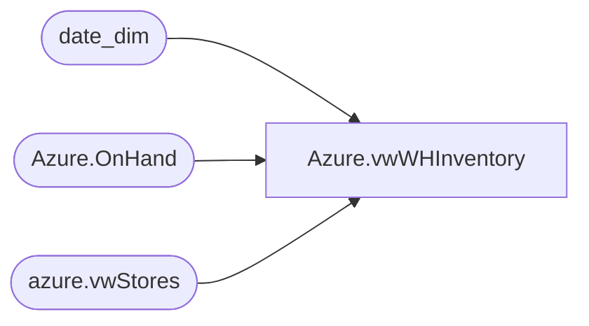

# Azure.vwWHInventory

**Database:** dw  
**Server:** papamart  

## Architecture Diagram



## Table Dependencies

| Referenced Table |
|---|
| date_dim |
| Azure.OnHand |
| azure.vwStores |

## View Code

```sql
CREATE view [Azure].[vwWHInventory]

as
-- =============================================================================================================
-- Name: [Azure].[vwWHInventory]
--
-- Description: Warehouse Inventory
--
--
-- Dependencies: 
--
-- Revision History
--		Name:				Date:			Comments:
--		John Eck			12/19/2018		Initial Creation
--		Ian Wallave			05/17/2021		Added 4 'Available' union all rows 
--											
-- =============================================================================================================
With D as (Select Actual_date,fiscal_week,fiscal_year from date_dim where datepart(dw,actual_date) = 1)

select O.Storekey,ProductKey,OnHand,workYear,WorkWeek,StoreNumber ,
Case Inv_Status When 'Available' Then ( 
Case StoreNumber  when '0960' then 'WC960'
 when '0980' then 'Ohio980'
 when '1000' then 'OhioLocked'
 when '2970' then 'UK2970'
 else 'Other'
 END)
 Else 'WH' End + ' ' + Inv_Status
 AS WHType,
 Actual_date as DateKey
from Azure.OnHand o left join azure.vwStores S on O.storeKey = s.storeKey
                    left join d on (fiscal_year = workYear and fiscal_week = Workweek)
					
where o.LocationType = 'WH'

union all 
select 253,28274,0,2089,14,'0980','WH Allocated','2018-05-06 00:00:00.000'
union all 
select 253,28274,0,2089,14,'0980','WH Damaged','2018-05-06 00:00:00.000'
union all 
select 253,28274,0,2089,14,'0980','WH Reserved Cust Order','2018-05-06 00:00:00.000'
union all 
select 253,28274,0,2089,14,'0980','OhioLocked Available','2018-05-06 00:00:00.000'
union all 
select 253,28274,0,2089,14,'0980','WC960 Available','2018-05-06 00:00:00.000'
union all 
select 253,28274,0,2089,14,'0980','UK2970 Available','2018-05-06 00:00:00.000'
union all 
select 253,28274,0,2089,14,'0980','Ohio980 Available','2018-05-06 00:00:00.000'
--union all
--select 253,28274,0,2089,14,'0980','OUTLET Available','2018-05-06 00:00:00.000'
```

