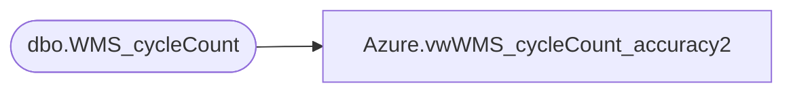

# Azure.vwWMS_cycleCount_accuracy2

**Database:** dw  
**Server:** papamart  

## Architecture Diagram



## Table Dependencies

| Referenced Table |
|---|
| dbo.WMS_cycleCount |

## View Code

```sql
CREATE view [Azure].[vwWMS_cycleCount_accuracy2]

AS
-- =============================================================================================================
--		Name:				Date:			Comments:
--		Ian Wallace			5/18/2021		Initial creation
-- =============================================================================================================


SELECT 
     sum( [AmtBeforeCount]) as 'AmtBeforeCount'
      ,cast([DateOfCount] as date) as 'DateOfCount'
      ,sum([FinalCountAmt]) as 'FinalCountAmt'
     ,[Location]
      ,[SKU]
      ,sum([UnitDifference]) as 'UnitDifference'
	,'dollarDifference' = case when (sum([AmtBeforeCount]) = sum([FinalCountAmt])) then sum([UnitDifference])*max([CostPerUnit])
							else sum([UnitDifference])*max([CostPrice]) end
	, 'perpetualDollarAmt' = case when (sum([AmtBeforeCount]) = sum([FinalCountAmt])) then sum([AmtBeforeCount])*max([CostPerUnit])
							else sum([AmtBeforeCount])*max([CostPrice]) end
	 ,'UnitDifferencePerc' = case when sum(AmtBeforeCount) = 0 then 1 else sum([UnitDifference])/sum(AmtBeforeCount) end
	  ,[Warehouse]
  FROM [dbo].[WMS_cycleCount]
  --where [AcceptReject] = 'Accept'
  where [AcceptReject] in ('Accept','None')
--and SKU = '028506' and  cast(DateOfCount as date) = '03/14/2021' 
--and  WorkID in ('WK014077209','WK013898429')
 --and WorkID = 'WK013898429'
 --and cast(DateOfCount as date) = '03/17/2021'
 group by [AcceptReject],[DateOfCount],[SKU],[Location],[Warehouse],[WorkId]
```

