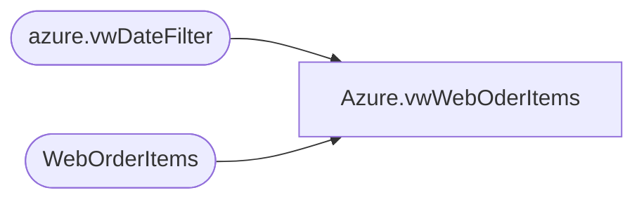

# Azure.vwWebOderItems

**Database:** dw  
**Server:** papamart  

## Architecture Diagram



## Table Dependencies

| Referenced Table |
|---|
| azure.vwDateFilter |
| WebOrderItems |

## View Code

```sql
CREATE view [Azure].[vwWebOderItems]

as
-- =============================================================================================================
-- Name: [Azure].[vwWebOderItems]
--
-- Description: Product Dimension
--
--
-- Dependencies: 
--
-- Revision History
--		Name:				Date:			Comments:
--		John Eck			12/19/2018		Initial Creation

--											
-- =============================================================================================================

select 
	woi.TransactionID,
	woi.OrderID,
	woi.OrderItemID,	
	woi.SKU,	
	woi.Qty,	
	woi.ItemDescription,	
	woi.Price,	
	woi.DiscountedPrice,	
	cast(woi.InsertDate	as date) as InsertDate,
	cast(woi.UpdateDate	as date) as UpdateDate,
	woi.TrackingNumber,	
	woi.product_key
from WebOrderItems woi
join azure.vwDateFilter df on cast(df.actual_date as date)=cast(woi.InsertDate as date)
```

