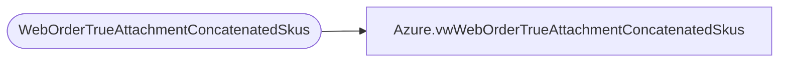

# Azure.vwWebOrderTrueAttachmentConcatenatedSkus

**Database:** dw  
**Server:** papamart  

## Architecture Diagram



## Table Dependencies

| Referenced Table |
|---|
| WebOrderTrueAttachmentConcatenatedSkus |

## View Code

```sql
CREATE view [Azure].[vwWebOrderTrueAttachmentConcatenatedSkus]

as

select OrderNum, 
OrderDate, 
SkuString, 
DescriptionString, 
Quantity, 
Price, 
KeyStoryString, 
MstatString, 
Country

from WebOrderTrueAttachmentConcatenatedSkus (nolock)
```

