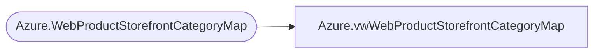

# Azure.vwWebProductStorefrontCategoryMap

**Database:** dw  
**Server:** papamart  

## Architecture Diagram



## Table Dependencies

| Referenced Table |
|---|
| Azure.WebProductStorefrontCategoryMap |

## View Code

```sql
create view Azure.vwWebProductStorefrontCategoryMap
as

select *
from Azure.WebProductStorefrontCategoryMap
```

