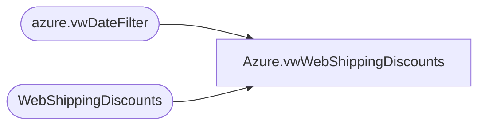

# Azure.vwWebShippingDiscounts

**Database:** dw  
**Server:** papamart  

## Architecture Diagram



## Table Dependencies

| Referenced Table |
|---|
| azure.vwDateFilter |
| WebShippingDiscounts |

## View Code

```sql
CREATE view [Azure].[vwWebShippingDiscounts]

as
-- =============================================================================================================
-- Name: [Azure].[vwWebShippingDiscounts]
--
-- Description: Product Dimension
--
--
-- Dependencies: 
--
-- Revision History
--		Name:				Date:			Comments:
--		John Eck			12/19/2018		Initial Creation

--											
-- =============================================================================================================

select 
	d.ShippingDiscountID,	
	d.OrderID,	
	d.PromoCode,
	d.DiscountAmount,	
	d.DiscountName,	
	cast(d.InsertDate	as date) as InsertDate,
	cast(d.UpdateDate as date) as UpdateDate
from WebShippingDiscounts d
join azure.vwDateFilter df on cast(d.InsertDate as date)=cast(df.actual_date as date)
```

