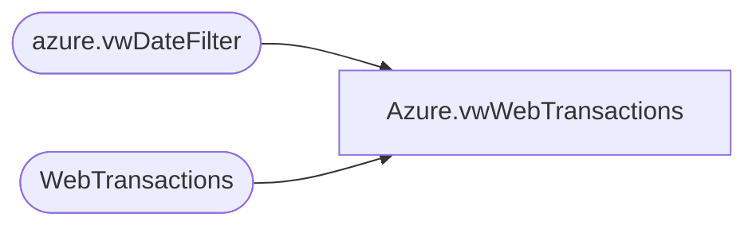

# Azure.vwWebTransactions

**Database:** dw  
**Server:** papamart  

## Architecture Diagram



## Table Dependencies

| Referenced Table |
|---|
| azure.vwDateFilter |
| WebTransactions |

## View Code

```sql
CREATE view [Azure].[vwWebTransactions]

as
-- =============================================================================================================
-- Name: [Azure].[vwWebTransactions]
--
-- Description: Product Dimension
--
--
-- Dependencies: 
--
-- Revision History
--		Name:				Date:			Comments:
--		John Eck			12/19/2018		Initial Creation

--											
-- =============================================================================================================

--select * from WebTransactions


select 
	TransactionID,
	TransactionNum,
	TransactionDateTime,
	TaxAmount,
	TaxJurisdiction,
	InsertDate,
	UpdateDate,
	cast(TransactionDateTime as date) as TransactionDate--not in the model, used only for partition filter
from WebTransactions t
join azure.vwDateFilter df on cast(TransactionDateTime as date)=cast(df.actual_date as date)
```

