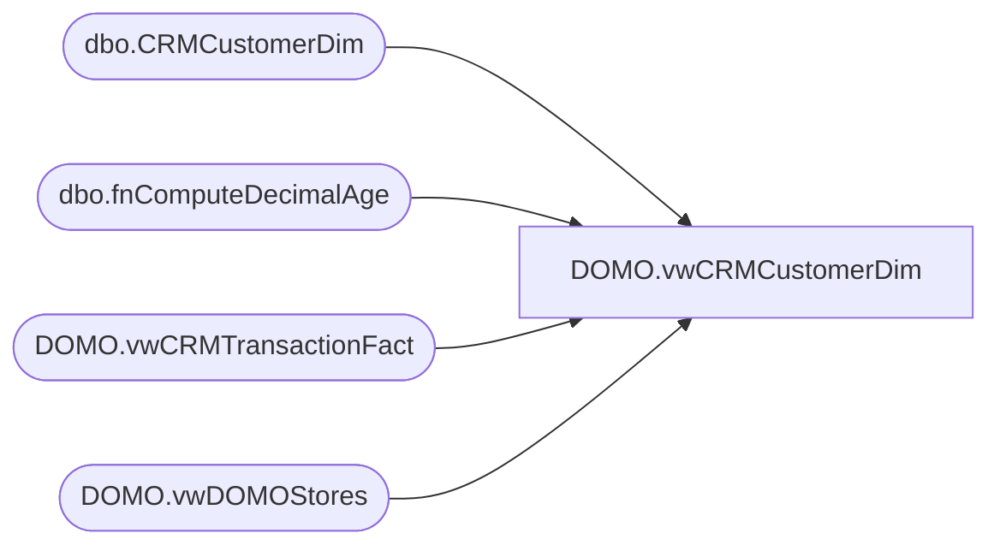

# DOMO.vwCRMCustomerDim

**Database:** dw  
**Server:** papamart  

## Architecture Diagram



## Table Dependencies

| Referenced Table |
|---|
| dbo.CRMCustomerDim |
| dbo.fnComputeDecimalAge |
| DOMO.vwCRMTransactionFact |
| DOMO.vwDOMOStores |

## View Code

```sql
CREATE view [DOMO].[vwCRMCustomerDim]

AS
-- =============================================================================================================
-- Name: [DOMO].[vwCRMCustomerDim]
--
-- Description: NameMe transaction data - demographic information on who purchases product.
--				Contains customers with CRM captured transactions in previous two full years and current YTD transactions.
--
--
-- Dependencies: 
--
-- Revision History
--		Name:				Date:			Comments:
--		Anthony Delgado		10/05/2016		Initial creation
--
-- =============================================================================================================
WITH Customers (CustomerNumber) AS (
	SELECT DISTINCT CustomerNumber
	FROM dw.DOMO.vwCRMTransactionFact
	)
SELECT cd.[CustomerID]
	  ,cd.[CustomerNumber]
      ,cd.[MembershipDate]
      ,cd.[Gender]
      ,dw.dbo.fnComputeDecimalAge(cd.[BirthDate],GETDATE()) AS Age
      ,d.[StoreID] AS StoreKey
      ,CASE WHEN cd.[CountryCode] IN ('CAN','CAF') THEN 'CAN'
	        WHEN cd.[CountryCode]='GBR' THEN 'GBR'
			ELSE 'USA'
		END AS ProgramCountryCode
      ,cd.[PostalCode]
      ,cd.[PointsEligible]
      ,cd.[MembershipType]
      ,CASE WHEN cd.[Emailable]=1 THEN 'Yes' ELSE 'No' END AS Emailable
	  ,cd.[InsertedDate]
FROM [dw].[dbo].[CRMCustomerDim] cd
INNER JOIN Customers c
	ON c.CustomerNumber=cd.CustomerNumber
INNER JOIN dw.DOMO.vwDOMOStores d
	ON d.StoreKey=cd.StoreKey
```

