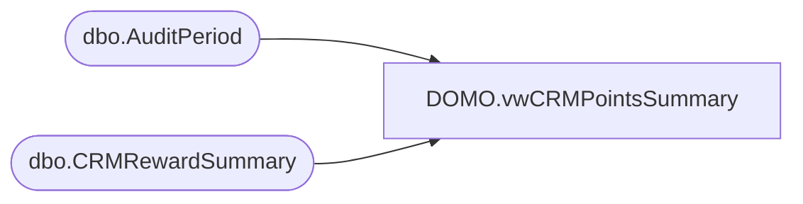

# DOMO.vwCRMPointsSummary

**Database:** dw  
**Server:** papamart  

## Architecture Diagram



## Table Dependencies

| Referenced Table |
|---|
| dbo.AuditPeriod |
| dbo.CRMRewardSummary |

## View Code

```sql
CREATE view [DOMO].[vwCRMPointsSummary]

AS
-- =============================================================================================================
-- Name: [DOMO].[vwCRMPointsSummary]
--
-- Description: Monthly CRM points summary
--
--
-- Dependencies: 
--
-- Revision History
--		Name:				Date:			Comments:
--		Anthony Delgado		06/15/2016		Initial creation
--
-- =============================================================================================================

SELECT   a.AuditYear
		,a.AuditPeriod
		,c.CountryCode
		,c.BeginningPointsTotal
		,c.EarnedPointsTotal
		,c.RedeemedPointsTotal
		,c.AdjustedPointsTotal
		,c.ExpiredPointsTotal
		,(SELECT BeginningPointsTotal FROM SOX.dbo.CRMRewardSummary WHERE AuditPeriodKey=c.AuditPeriodKey+1 AND CountryCode=c.CountryCode) AS EndingPointsTotal
		,ISNULL(c.BeginningPointsTotal,0)+ISNULL(c.EarnedPointsTotal,0)-ISNULL(c.RedeemedPointsTotal,0)+ISNULL(c.AdjustedPointsTotal,0)-ISNULL(c.ExpiredPointsTotal,0) AS EndingPointsTotalCalc
FROM SOX.dbo.CRMRewardSummary c
INNER JOIN SOX.dbo.AuditPeriod a
	ON a.AuditPeriodKey=c.AuditPeriodKey
```

