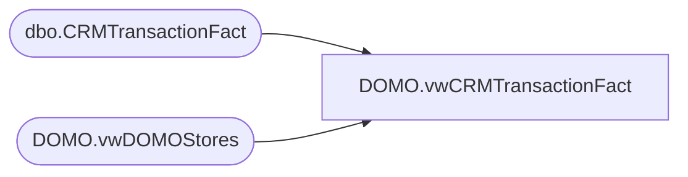

# DOMO.vwCRMTransactionFact

**Database:** dw  
**Server:** papamart  

## Architecture Diagram



## Table Dependencies

| Referenced Table |
|---|
| dbo.CRMTransactionFact |
| DOMO.vwDOMOStores |

## View Code

```sql
CREATE view [DOMO].[vwCRMTransactionFact]

AS
-- =============================================================================================================
-- Name: [DOMO].[vwCRMransactionFact]
--
-- Description: CRM Transaction data at the header level.
--
--
-- Dependencies: 
--
-- Revision History
--		Name:				Date:			Comments:
--		Anthony Delgado		10/05/2016		Initial creation
--
-- =============================================================================================================
SELECT c.[TransactionID] AS POSTransactionID
      ,c.[CRMTransactionID]
      ,d.[StoreID] AS StoreKey
      ,c.[TransactionDate]
      ,c.[CRMTransactionType]
      ,c.[CustomerNumber]
	  ,c.[InsertedDate]
FROM [dw].[dbo].[CRMTransactionFact] c
INNER JOIN dw.DOMO.vwDOMOStores d
	ON d.StoreKey=c.StoreKey
WHERE TransactionDate>=DATEADD(year, -2, DATEADD(yy, DATEDIFF(yy, 0, GETDATE()), 0))
AND TransactionDate<CONVERT(DATE,GETDATE())


dbo,vwDW_CRM_TRN_SUM_FACT,/***********************************************************************************************
Object Name:	[vwDW_CRM_TRN_SUM_FACT]

Author			Date			Comment
Funmi Agbebi	11/4/2009		Added VALID_CRM_MBRSHP_DT field. Included case statements to nullify all CRM_MBRSHP_DT earlier than 6/1/2008
Funmi Agbebi	3/6/2009		original creation

Purpose:		View used for reporting.  Primarily used by vwDW_SFSGst view which is in turn 
				used by the 'SFS Guest Facts' and 'SFS Guest With Email Facts' measure groups 
				of the SSAS papa mart cube to identify new vs repeat sfs guests and sfs gsts 
				with email.
				Joins CRM_TRN_SUM_FACT to CLNSD_GST_DIM and date_dim
**********************************************************************************************/


CREATE VIEW 
[dbo].[vwDW_CRM_TRN_SUM_FACT]
AS 
select 				tran_date.actual_date transaction_date  -- to be deleted
					,g.CRM_MBRSHP_DT
					,case when g.CRM_MBRSHP_DT < '6/1/2008' then null 
					 else g.CRM_MBRSHP_DT end as VALID_CRM_MBRSHP_DT
					,case when g.CRM_MBRSHP_DT is null then null  
					 when g.CRM_MBRSHP_DT < '6/1/2008' then null  
					 when g.CRM_MBRSHP_DT > '5/31/2008'    
					 and g.CRM_MBRSHP_DT = tran_date.actual_date then 'N' 
					 else 'R' end as SFS_GstVisitType

					,case when g.CRM_MBRSHP_DT is null then null  
					 when g.CRM_MBRSHP_DT < '6/1/2008' then null  
					 when g.CRM_MBRSHP_DT > '5/31/2008'    
					 and g.CRM_MBRSHP_DT = tran_date.actual_date then c.CLNSD_GST_ID
					 else null end as New_SFSGstID

					,case when g.CRM_MBRSHP_DT is null then null  
					 when g.CRM_MBRSHP_DT < '6/1/2008' then null  
					 when g.CRM_MBRSHP_DT > '5/31/2008'    
					 and g.CRM_MBRSHP_DT < tran_date.actual_date then c.CLNSD_GST_ID
					 else null end as Repeat_SFSGstID
					
					,g.EMAIL_ADDR_ID
	
					,case when g.EMAIL_ADDR_ID > 0 then 1
					 else 0 END as SFSValidEmail  --  SFS_ValidEmail

					,case when g.EMAIL_ADDR_ID > 0 then c.CLNSD_GST_ID
					 else null END as SFSValidEmail_GstID  -- ValidEmail_SFSGstID  

					,case when g.CRM_MBRSHP_DT is null then null  
					 when g.CRM_MBRSHP_DT < '6/1/2008' then null  
					 when g.CRM_MBRSHP_DT > '5/31/2008'    
					 and g.CRM_MBRSHP_DT = tran_date.actual_date 
					 and g.EMAIL_ADDR_ID > 0 then c.CLNSD_GST_ID
					 else null end as NewSFSValidEmail_GstID -- ValidEmail_NewSFSGstID 

					,case when g.CRM_MBRSHP_DT is null then null  
					 when g.CRM_MBRSHP_DT < '6/1/2008' then null  
					 when g.CRM_MBRSHP_DT > '5/31/2008'    
					 and g.CRM_MBRSHP_DT < tran_date.actual_date 
					 and g.EMAIL_ADDR_ID > 0 then c.CLNSD_GST_ID
					 else null end as RepeatSFSValidEmail_GstID -- ValidEmail_RepeatSFSGstID 
, c.* 
 from [CRM_TRN_SUM_FACT] c with (nolock) 
left join CLNSD_GST_DIM g  with (nolock) on 
c.CLNSD_GST_ID = g. CLNSD_GST_ID 
left join date_dim tran_date with (nolock) on  
c.dt_id = tran_date.date_key
left join date_dim mbrshp_date with (nolock) on  
g.CRM_MBRSHP_DT = mbrshp_date.actual_date
```

