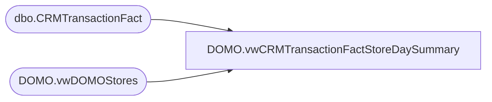

# DOMO.vwCRMTransactionFactStoreDaySummary

**Database:** dw  
**Server:** papamart  

## Architecture Diagram



## Table Dependencies

| Referenced Table |
|---|
| dbo.CRMTransactionFact |
| DOMO.vwDOMOStores |

## View Code

```sql
CREATE view [DOMO].vwCRMTransactionFactStoreDaySummary

AS
-- =============================================================================================================
-- Name: [DOMO].[vwCRMTransactionFactStoreDaySummary]
--
-- Description: NameMe transaction data store day summary - demographic information on who purchases product.
--				Contains previous two full years and current YTD transactions.
--
--
-- Dependencies: 
--
-- Revision History
--		Name:				Date:			Comments:
--		Anthony Delgado		10/05/2016		Initial creation
--
-- =============================================================================================================
SELECT d.StoreID AS StoreKey
      ,c.[TransactionDate]
      ,SUM(CASE WHEN c.[CRMTransactionType]='New' THEN 1 END) AS NewLoyaltyTransactionCount
	  ,SUM(CASE WHEN c.[CRMTransactionType]='Repeat' THEN 1 END) AS RepeatLoyaltyTransactionCount
FROM [dw].[dbo].[CRMTransactionFact] c
INNER JOIN dw.DOMO.vwDOMOStores d
	ON d.StoreKey=c.StoreKey
WHERE c.TransactionDate>=DATEADD(year, -2, DATEADD(yy, DATEDIFF(yy, 0, GETDATE()), 0))
AND c.TransactionDate<CONVERT(DATE,GETDATE())
GROUP BY c.TransactionDate, d.StoreID
```

