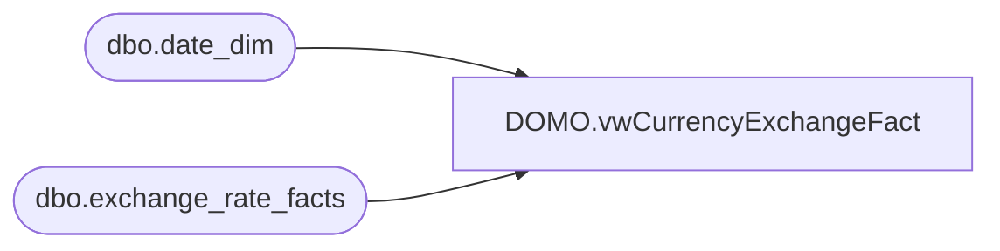

# DOMO.vwCurrencyExchangeFact

**Database:** dw  
**Server:** papamart  

## Architecture Diagram



## Table Dependencies

| Referenced Table |
|---|
| dbo.date_dim |
| dbo.exchange_rate_facts |

## View Code

```sql
CREATE view [DOMO].[vwCurrencyExchangeFact]

AS
-- =============================================================================================================
-- Name: [DOMO].[vwCurrencyExchangeFact]
--
-- Description: Currency exchange rates by month.
--
--
-- Dependencies: 
--
-- Revision History
--		Name:				Date:			Comments:
--		Anthony Delgado	12/17/2015			Initial Creation
--
-- =============================================================================================================

-- Franchise rates are fiscal month end
SELECT DISTINCT d.fiscal_year AS FiscalYear, d.fiscal_period AS FiscalMonth, e.from_currency_code AS FromCurrencyCode, e.to_currency_code AS ToCurrencyCode, e.fiscal_month_end_rate AS ExchangeRate
FROM dw.dbo.exchange_rate_facts e
INNER JOIN dw.dbo.date_dim d
	ON d.date_key=e.date_key
WHERE (e.from_currency_code IN ('AUD','BHD','OMR','QAR','AED','BRL','KWD','MXN','RUB','SEK','SGD','THB','TRL','TRY','ZAR','ZDK','ZUR')
OR e.to_currency_code IN ('AUD','BHD','OMR','QAR','AED','BRL','KWD','MXN','RUB','SEK','SGD','THB','TRL','TRY','ZAR','ZDK','ZUR'))
AND d.actual_date>=DATEADD(year, -2, DATEADD(yy, DATEDIFF(yy, 0, GETDATE()), 0))
UNION ALL
-- Corporate rates are fiscal month average
SELECT DISTINCT d.fiscal_year AS FiscalYear, d.fiscal_period AS FiscalMonth, e.from_currency_code AS FromCurrencyCode, e.to_currency_code AS ToCurrencyCode, e.fiscal_month_ave_rate AS ExchangeRate
FROM dw.dbo.exchange_rate_facts e
INNER JOIN dw.dbo.date_dim d
	ON d.date_key=e.date_key
WHERE (
			(e.from_currency_code IN ('EUR','CNY','DKK','CAD','GBP') AND e.to_currency_code NOT IN ('AUD','BHD','OMR','QAR','AED','BRL','KWD','MXN','RUB','SEK','SGD','THB','TRL','TRY','ZAR','ZDK','ZUR'))
		OR (e.to_currency_code IN ('EUR','CNY','DKK','CAD','GBP') AND e.from_currency_code NOT IN ('AUD','BHD','OMR','QAR','AED','BRL','KWD','MXN','RUB','SEK','SGD','THB','TRL','TRY','ZAR','ZDK','ZUR'))
		OR (e.to_currency_code IN ('USD') AND e.from_currency_code IN ('USD'))
	  )
AND d.actual_date>=DATEADD(year, -2, DATEADD(yy, DATEDIFF(yy, 0, GETDATE()), 0))
```

