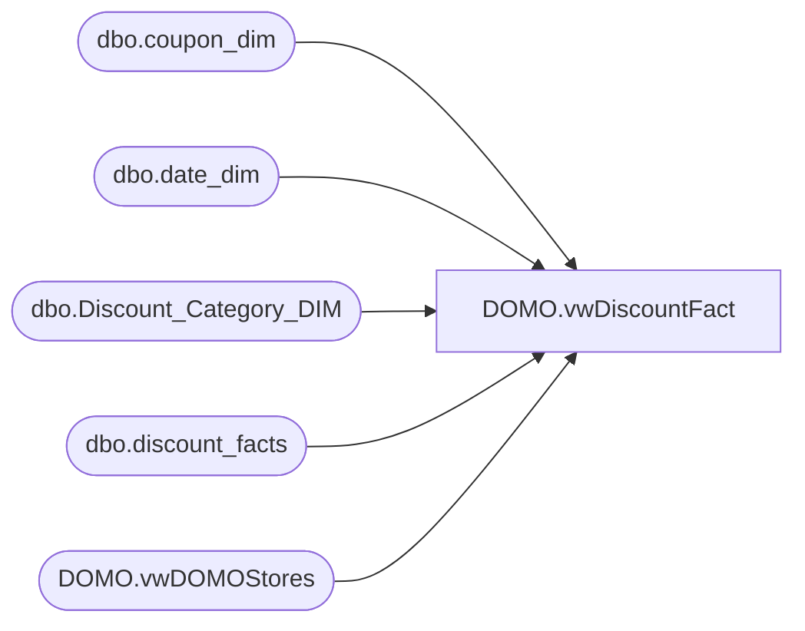

# DOMO.vwDiscountFact

**Database:** dw  
**Server:** papamart  

## Architecture Diagram



## Table Dependencies

| Referenced Table |
|---|
| dbo.coupon_dim |
| dbo.date_dim |
| dbo.Discount_Category_DIM |
| dbo.discount_facts |
| DOMO.vwDOMOStores |

## View Code

```sql
CREATE VIEW [DOMO].vwDiscountFact AS
-- =============================================================================================================
-- Name: [DOMO].[vwDiscountFact]
--
-- Description: Discounts for all transactions beginning two years ago through yesterday.
--
--
-- Dependencies: 
--
-- Revision History
--		Name:				Date:			Comments:
--		Anthony Delgado		05/19/2016		Initial creation
--
-- =============================================================================================================
SELECT  df.transaction_id AS TransactionID,
		d.actual_date AS TransactionDate,
		ds.StoreID AS StoreKey,
		df.reference_no AS ReferenceNumber,
		df.line_object_key AS LineObject, 
		df.units DiscountUnits, 
		df.unit_gross_amount AS DiscountUnitGrossAmount, 
		df.isExpired AS ExpiredFlag,
		cd.CategoryType AS DiscountCategoryType,
		cd.channelType AS DiscountChannelType,
		cd.financialGroup AS DiscountFinancialGroup,
		c.Retail_Pro AS RetailPro, 
		c.coupon_desc AS CouponDesc
FROM dw.dbo.discount_facts df
INNER JOIN dw.dbo.coupon_dim c
	ON c.coupon_key=df.coupon_key
LEFT OUTER JOIN dw.dbo.Discount_Category_DIM cd
	ON cd.categoryTypeID=df.categoryTypeID
INNER JOIN dw.DOMO.vwDOMOStores ds
	ON ds.StoreKey=df.store_key
INNER JOIN dw.dbo.date_dim d
	ON d.date_key=df.date_key
WHERE d.actual_date>=DATEADD(year, -2, DATEADD(yy, DATEDIFF(yy, 0, GETDATE()), 0))
AND d.actual_date<CONVERT(DATE,GETDATE())
```

