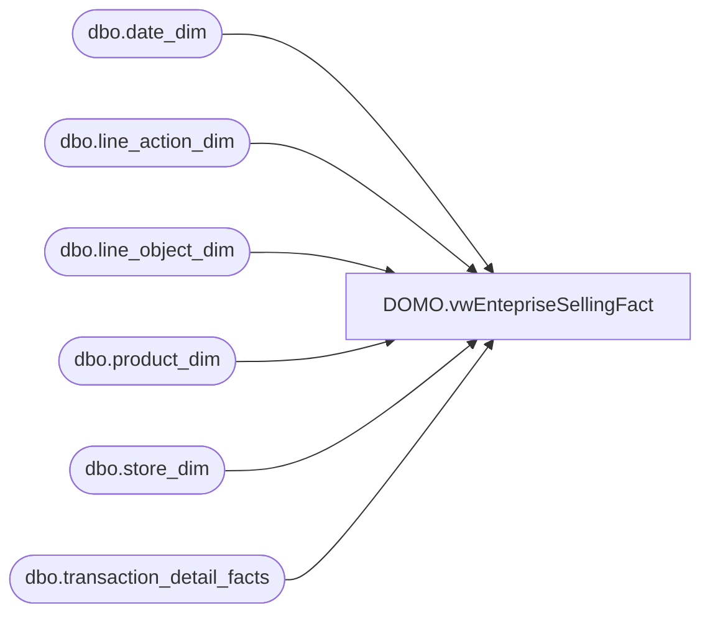

# DOMO.vwEntepriseSellingFact

**Database:** dw  
**Server:** papamart  

## Architecture Diagram



## Table Dependencies

| Referenced Table |
|---|
| dbo.date_dim |
| dbo.line_action_dim |
| dbo.line_object_dim |
| dbo.product_dim |
| dbo.store_dim |
| dbo.transaction_detail_facts |

## View Code

```sql
CREATE VIEW [DOMO].[vwEntepriseSellingFact] AS
-- =============================================================================================================
-- Name: [DOMO].[vwEntepriseSellingFact]
--
-- Description: Enterprise selling transactions; order, fulfillment, cancel, return
--
--
-- Dependencies: 
--
-- Revision History
--		Name:				Date:			Comments:
--		Anthony Delgado		07/14/2016		Initial creation
--
-- =============================================================================================================
WITH 
ESTrans AS
	(
		SELECT DISTINCT transaction_id AS TransactionID,
						d.actual_date AS TransactionDate
		FROM dw.dbo.transaction_detail_facts tdf
		INNER JOIN dw.dbo.date_dim d
			ON d.date_key=tdf.date_key
		WHERE line_object_key = 954 -- line object 106
		AND d.actual_date between '6/16/2016' and CAST(GETDATE()-1 AS DATE) -- first ES order on 6/16/2016
	),
HasNonES AS
	(
		SELECT DISTINCT tdf.transaction_id AS TransactionID
		FROM dw.dbo.transaction_detail_facts tdf
		INNER JOIN ESTrans e 
			ON e.TransactionID=tdf.transaction_id
		WHERE tdf.line_object_key <> 954
	)
SELECT tdf.transaction_id AS TransactionID, 
tdf.transaction_line_seq AS LineSeq,	
sd.store_id AS StoreKey,
e.TransactionDate,
tdf.reference_no AS ReferenceNumber,
CASE WHEN HNE.TransactionID IS NULL
		THEN 'NO' 
		ELSE 'YES' 
END AS HasNonESitems,
la.Line_Action_Description AS ESAction,
tdf.product_key AS ProductKey, 
tdf.units AS Units,
ISNULL(tdf.unit_gross_amount, 0) AS UnitGrossAmount,
ISNULL(tdf.unit_gross_amount, 0) - ISNULL(unit_disc_amount, 0) AS UnitNetAmount,
ISNULL(unit_disc_amount, 0) AS UnitDiscountAmount
FROM ESTrans e 
INNER JOIN dw.dbo.transaction_detail_facts tdf
	ON tdf.transaction_id=e.TransactionID
INNER JOIN dw.dbo.date_dim dd 
	ON tdf.date_key = dd.date_key
INNER JOIN dw.dbo.store_dim sd 
	ON tdf.store_key = sd.store_key
INNER JOIN dw.dbo.product_dim p 
	ON p.product_key = tdf.product_key
INNER JOIN dw.dbo.line_object_dim lo 
	ON lo.line_object_key = tdf.line_object_key
INNER JOIN dw.dbo.line_action_dim la 
	ON la.line_action_key = tdf.line_action_key
LEFT OUTER JOIN HasNonES HNE 
	ON HNE.TransactionID = e.TransactionID
WHERE la.Line_Action_Description<>'sold'
AND p.product_key>0
```

