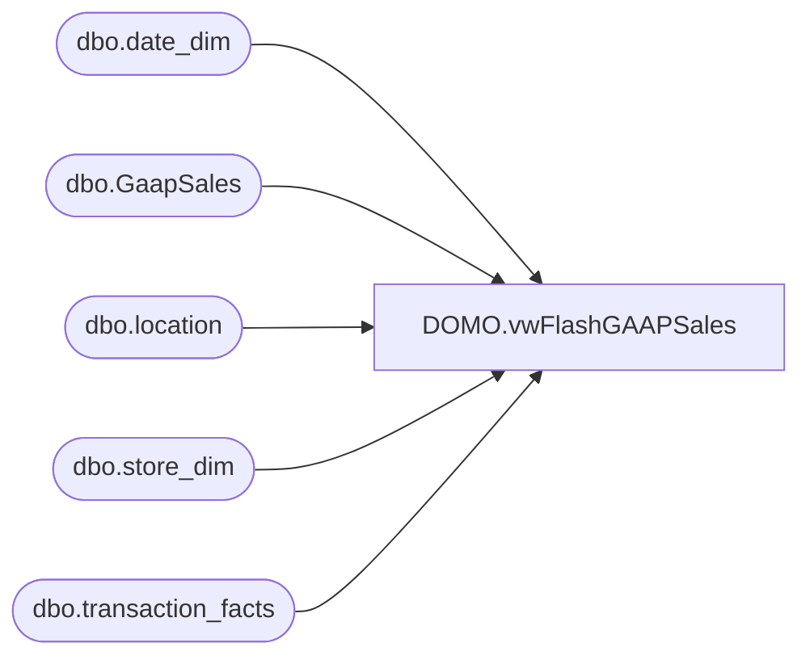

# DOMO.vwFlashGAAPSales

**Database:** dw  
**Server:** papamart  

## Architecture Diagram



## Table Dependencies

| Referenced Table |
|---|
| dbo.date_dim |
| dbo.GaapSales |
| dbo.location |
| dbo.store_dim |
| dbo.transaction_facts |

## View Code

```sql
CREATE VIEW [DOMO].[vwFlashGAAPSales]

AS
-- =============================================================================================================
-- Name: [DOMO].[vwFlashGAAPSales]
--
-- Description: Flash GAAP Sales for today, and GAAP Sales for Comp date up through current time.
--
--
-- Dependencies: 
--
-- Revision History
--		Name:				Date:			Comments:
--		Anthony Delgado		05/16/2016		Initial creation
--		Anthony Delgado		09/09/2016		Addition of LY_GAAPSalesAmount
--		Dan Tweedie			10/14/2016		For LY, changed to Left Join, and join to transaction_fact cte instead
-- =============================================================================================================

with
LY as
	(
		select
			sd.store_id, 
			cast(dd.actual_date as date) actual_date, 
			sum(tf.gaap_sales_amount) gaap_sales_amount
		from 
			dw.dbo.transaction_facts tf
			join dw.dbo.date_dim dd on tf.date_key = dd.date_key
			join dw.dbo.store_dim sd on tf.store_key = sd.store_key
		where 
			cast(dd.actual_date as date) between cast(dateadd(dd, -370, getdate()) as date) and cast(dateadd(dd, -364, getdate()) as date) 
		group by 
			sd.store_id, 
			cast(dd.actual_date as date) 
	) 
select 	cast(gs.location_code as int) as StoreKey,
		cast(getdate() as date) as FlashDate,
		case when gs.entry_date IN ('OFFLINE','No transactions polled') then cast(getdate() as date) else convert(datetime, gs.entry_date) end as TimePolled,
       	case when l.jurisdiction_id = 5 and source = 'Coalition' then cast(isnull(gs.net_sales,0.00)/1.2300 as decimal(10,2))
			 when l.jurisdiction_id = 4  and source = 'Coalition' then cast(isnull(gs.net_sales,0.00)/1.1960 as decimal(10,2))
			 when l.jurisdiction_id = 2  and source = 'Coalition' and gs.location_code <> 2013 then cast(isnull(gs.net_sales,0.00)/1.2 as decimal(10,2))
			 when l.jurisdiction_id = 7 and source = 'Coalition' then cast(isnull(gs.net_sales,0.00)/1.25 as decimal(10,2))
			 when l.jurisdiction_id = 8 and source = 'Coalition' then cast(isnull(gs.net_sales,0.00)/1.17 as decimal(10,2))
			 else cast(isnull(net_sales,0.00) as decimal(10,2))
		end as FlashGAAPSalesAmount,
		isnull(ly.gaap_sales_amount,0) as LY_GAAPSalesAmount
from bedrockdb01.auditworks.dbo.GaapSales gs
join BEDROCKDB02.me_01.dbo.location l 
	on	gs.location_code collate SQL_Latin1_General_CP1_CI_AS = l.location_code
--left join dw.DOMO.vwTransactionFactStoreDaySummary t
--	on right(('0000' + CAST(t.StoreKey AS VARCHAR)), 4)=gs.location_code collate SQL_Latin1_General_CP1_CI_AS
--	and t.TransactionDate=case when gs.entry_date IN ('No transactions polled','OFFLINE') then cast(getdate()-364 as date) else dateadd(day, -364, convert(date, gs.entry_date)) end
left join LY
		on cast(gs.location_code as int) = LY.store_id
		and cast(dateadd(dd, -364, getdate()) as date) = LY.actual_date
```

