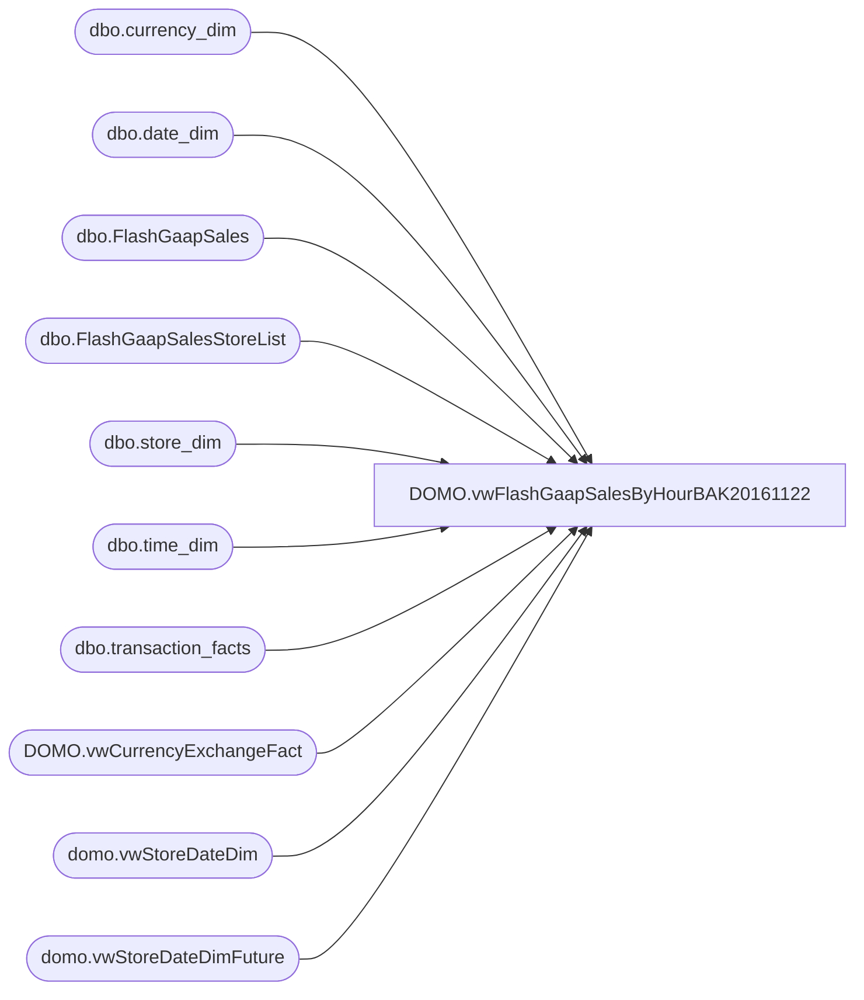

# DOMO.vwFlashGaapSalesByHourBAK20161122

**Database:** dw  
**Server:** papamart  

## Architecture Diagram



## Table Dependencies

| Referenced Table |
|---|
| dbo.currency_dim |
| dbo.date_dim |
| dbo.FlashGaapSales |
| dbo.FlashGaapSalesStoreList |
| dbo.store_dim |
| dbo.time_dim |
| dbo.transaction_facts |
| DOMO.vwCurrencyExchangeFact |
| domo.vwStoreDateDim |
| domo.vwStoreDateDimFuture |

## View Code

```sql
CREATE view [DOMO].[vwFlashGaapSalesByHourBAK20161122]

as

--==================================================================================================
--	Author			Date			Details
--	Dan Tweedie		10/02/2016		Shows POS sales by hour, compares to last year to show percentage of ly total per day by hour.
--									Is called from SSIS, data is dependent on most recent run of SSIS package FlashGaapSales
--==================================================================================================

with 
CompDate as
	(
		select
			StoreKey,
			cast(CalendarDate as date) as CompDate,
			CompStatus
		from 
			domo.vwStoreDateDim 
		where 
			isnumeric(StoreKey) = 1 
			and datediff(dd, CalendarDate, getdate()) <= 3
		UNION
		select
			StoreKey,
			cast(CalendarDate as date) as CompDate,
			CompStatus
		from 
			domo.vwStoreDateDimFuture
		where 
			isnumeric(StoreKey) = 1
			and datediff(dd, CalendarDate, getdate()) <= 3
	),
StoreDateTimeDim as 
	(
		select 
			sl.StoreID, 
			sd.store_name as StoreName,
			cast(dd.actual_date as date) BusinessDate,
			td.hour BusinessHour,
			sd.store_key,
			sd.store_id, --store_dim.store_id, not the same as FlashGaapSalesStoreList.StoreID 
			dd.date_key,
			td.time_key,
			dd.fiscal_year,
			dd.fiscal_period as fiscal_month,
			cd.CompStatus,
			sl.CurrencyCode
		from 
			dwstaging.dbo.FlashGaapSalesStoreList sl 
			join dw.dbo.store_dim sd with (nolock) on sl.StoreID = sd.store_id
			cross join dw.dbo.date_dim dd with (nolock)
			cross join dw.dbo.time_dim td with (nolock)
			join CompDate cd on sl.StoreID = cd.StoreKey
				and cast(dd.actual_date as date) = cd.CompDate
		where 
			td.minute = 0
			and cast(dd.actual_date as date) >= getdate()-3
			and cast(dd.actual_date as date) <= getdate()+1
),
LY as
	(
		select
			tf.store_key, 
			cast(dd.actual_date as date) actual_date, 
			sum(tf.gaap_sales_amount) as gaap_sales_amount,
			dd.fiscal_year,
			dd.fiscal_period as fiscal_month,
			cd.currency_code as CurrencyCode
		from 
			dw.dbo.transaction_facts tf
			join dw.dbo.store_dim sd with (nolock) on tf.store_key = sd.store_key
			join dw.dbo.date_dim dd with (nolock)on tf.date_key = dd.date_key
			join dw.dbo.currency_dim cd with (nolock) on tf.currency_key = cd.currency_key
		where 
			cast(dd.actual_date as date) between cast(dateadd(dd, -373, getdate()) as date) and cast(dateadd(dd, -364, getdate()) as date) 
		group by 
			tf.store_key, 
			cast(dd.actual_date as date),
			dd.fiscal_year,
			dd.fiscal_period,
			cd.currency_code
	),
Posted as
	(
		select
			fgs.store_key,
			fgs.business_date_key,
			fgs.TransactionCount,
			fgs.local_time_key,
			sum(fgs.flash_gaap_sales) flash_gaap_sales,
			fgs.source,
			fgs.jurisdiction
		from
			dw.dbo.FlashGaapSales fgs
		group by 
			fgs.store_key,
			fgs.business_date_key,
			fgs.local_time_key,
			fgs.TransactionCount,
			fgs.source,
			fgs.jurisdiction
	),
SourceJurisdiction as
	(
		select distinct store_key, source, jurisdiction
		from Posted
	),
FlashGaap as
(
	select 
		sd.StoreID,
		sd.StoreName,
		sd.store_key,
		sd.BusinessDate,
		sd.BusinessHour,
		isnull(p.TransactionCount,0) as TransactionCount,
		isnull(p.flash_gaap_sales, 0) as SalesPosted,
		sd.fiscal_year,
		sd.fiscal_month,
		sd.CurrencyCode,
		sd.CompStatus
	from 
		StoreDateTimeDim sd
	left join Posted p on sd.store_key = p.store_key and sd.date_key = p.business_date_key and sd.time_key = p.local_time_key 
),
RunningTotal as
(
	select
		StoreID,
		StoreName,
		store_key,
		BusinessDate,
		BusinessHour,
		sum(SalesPosted) OVER (partition by StoreID, BusinessDate order by BusinessHour) as FlashGaapSalesRunningTotal,
		sum(TransactionCount) OVER (partition by StoreID, BusinessDate order by BusinessHour) as TransactionCountRunningTotal,
		fiscal_year,
		fiscal_month,
		CurrencyCode,
		CompStatus
from FlashGaap 
),
SalesSummary as
(
	Select 
		fg.StoreID,
		fg.StoreName,
		fg.store_key,
		fg.BusinessDate,
		fg.BusinessHour,
		fg.TransactionCount,
		ru.TransactionCountRunningTotal,
		fg.SalesPosted,
		ru.FlashGaapSalesRunningTotal,
		fg.fiscal_year,
		fg.fiscal_month,
		fg.CurrencyCode,
		fg.CompStatus
	from
		FlashGaap fg
		join RunningTotal ru
			on fg.store_key = ru.store_key
			and fg.BusinessDate = ru.BusinessDate 
			and fg.BusinessHour = ru.BusinessHour
),
ExchangeRate as
(
	select 
		FiscalYear,
		FiscalMonth,
		FromCurrencyCode,
		ToCurrencyCode,
		ExchangeRate
	from DOMO.vwCurrencyExchangeFact c
	where 
		ToCurrencyCode = 'USD'
),
SummaryLocalCurrency as
(
	select 
		sl.LocationCode as StoreKey,
		ss.StoreName,
		ss.BusinessDate,
		ss.BusinessHour,
		ss.CompStatus,
		ss.TransactionCount as TransactionCountThisHour,
		ss.TransactionCountRunningTotal,
		ss.SalesPosted as FlashGaapSalesThisHour,
		ss.FlashGaapSalesRunningTotal,
		isnull(ly.gaap_sales_amount,0) as LYSalesDayTotal,
		
		cast
			(
				100 * isnull(
						nullif(ss.FlashgaapSalesRunningTotal,0) / nullif(ly.gaap_sales_amount,0) -1
					,0)
				as decimal (38,2)
			) 
			as SalesPercentToTotalLY,
		sj.Source,
		sj.Jurisdiction,
		ss.CurrencyCode,
		isnull(LY.CurrencyCode, ss.CurrencyCode) as CurrencyCodeLY,
		er.ExchangeRate,
		sl.TradingGroup
	from SalesSummary ss
	left join LY
			on ss.store_key = LY.store_key
			and cast(dateadd(dd, -364, ss.BusinessDate) as date) = LY.actual_date
	join dwstaging.dbo.FlashGaapSalesStoreList sl on ss.store_key = sl.StoreKey
	join SourceJurisdiction sj on ss.store_key = sj.store_key
	left join ExchangeRate er on ss.fiscal_year = er.FiscalYear and ss.fiscal_month = er.FiscalMonth and ss.CurrencyCode = er.FromCurrencyCode
),
CompAndExchangeRateConverted as
(
	select 
		StoreKey,
		StoreName,
		BusinessDate,
		BusinessHour,
		TransactionCountThisHour,
		case when CompStatus = 1 then TransactionCountThisHour else 0 end as CompTransactionCountThisHour,
		TransactionCountRunningTotal,
		case when CompStatus = 1 then TransactionCountRunningTotal else 0 end as CompTransactionCountRunningTotal,
		FlashGaapSalesThisHour as FlashGaapSalesThisHourLocal,
		( FlashGaapSalesThisHour * isnull(ExchangeRate, 1) ) as FlashGaapSalesThisHourUSD,
		case when CompStatus = 1 then FlashGaapSalesThisHour else 0 end as CompFlashGaapSalesThisHourLocal,
		case when CompStatus = 1 then ( FlashGaapSalesThisHour * isnull(ExchangeRate, 1) ) else 0 end as CompFlashGaapSalesThisHourUSD,
		FlashGaapSalesRunningTotal as FlashGaapSalesRunningTotalLocal,
		( FlashGaapSalesRunningTotal * isnull(ExchangeRate, 1) ) as FlashGaapSalesRunningTotalUSD,
		case when CompStatus = 1 then FlashGaapSalesRunningTotal else 0 end as CompFlashGaapSalesRunningTotalLocal,
		case when CompStatus = 1 then ( FlashGaapSalesRunningTotal * isnull(ExchangeRate, 1) ) else 0 end as CompFlashGaapSalesRunningTotalUSD,
		CompStatus,
		LYSalesDayTotal as LYSalesDayTotalLocal,
		( LYSalesDayTotal * isnull(ExchangeRate, 1) ) as LYSalesDayTotalUSD,
		case when CompStatus = 1 then LYSalesDayTotal else 0 end as CompLYSalesDayTotalLocal,
		case when CompStatus = 1 then ( LYSalesDayTotal * isnull(ExchangeRate, 1) ) else 0 end as CompLYSalesDayTotalUSD,
		SalesPercentToTotalLY,
		case when CompStatus = 1 then SalesPercentToTotalLY else 0 end as CompSalesPercentToTotalLY,
		Source,
		Jurisdiction,
		CurrencyCode,
		CurrencyCodeLY,
		isnull(ExchangeRate, 1) ExchangeRate,
		TradingGroup
	from
		SummaryLocalCurrency
)
select 
	StoreKey,
	StoreName,
	BusinessDate,
	BusinessHour,
	TransactionCountThisHour,
	CompTransactionCountThisHour,
	TransactionCountRunningTotal,
	CompTransactionCountRunningTotal,
	cast(FlashGaapSalesThisHourLocal as numeric(38,2)) as FlashGaapSalesThisHourLocal,
	cast(FlashGaapSalesThisHourUSD as numeric(38,2)) as FlashGaapSalesThisHourUSD,
	cast(CompFlashGaapSalesThisHourLocal as numeric(38,2)) as CompFlashGaapSalesThisHourLocal,
	cast(CompFlashGaapSalesThisHourUSD as numeric(38,2)) as CompFlashGaapSalesThisHourUSD,
	cast(FlashGaapSalesRunningTotalLocal as numeric(38,2)) as FlashGaapSalesRunningTotalLocal,
	cast(FlashGaapSalesRunningTotalUSD as numeric(38,2)) as FlashGaapSalesRunningTotalUSD,
	cast(CompFlashGaapSalesRunningTotalLocal as numeric(38,2)) as CompFlashGaapSalesRunningTotalLocal,
	cast(CompFlashGaapSalesRunningTotalUSD as numeric(38,2)) as CompFlashGaapSalesRunningTotalUSD,
	cast(LYSalesDayTotalLocal as numeric(38,2)) as LYSalesDayTotalLocal,
	cast(LYSalesDayTotalUSD as numeric(38,2)) as LYSalesDayTotalUSD,
	cast(CompLYSalesDayTotalLocal as numeric(38,2)) as CompLYSalesDayTotalLocal,
	cast(CompLYSalesDayTotalUSD as numeric(38,2)) as CompLYSalesDayTotalUSD,
	cast(SalesPercentToTotalLY as numeric(38,2)) as SalesPercentToTotalLY,
	cast(CompSalesPercentToTotalLY as numeric(38,2)) as CompSalesPercentToTotalLY,
	CompStatus,
	Source,
	Jurisdiction,
	TradingGroup
from CompAndExchangeRateConverted
```

