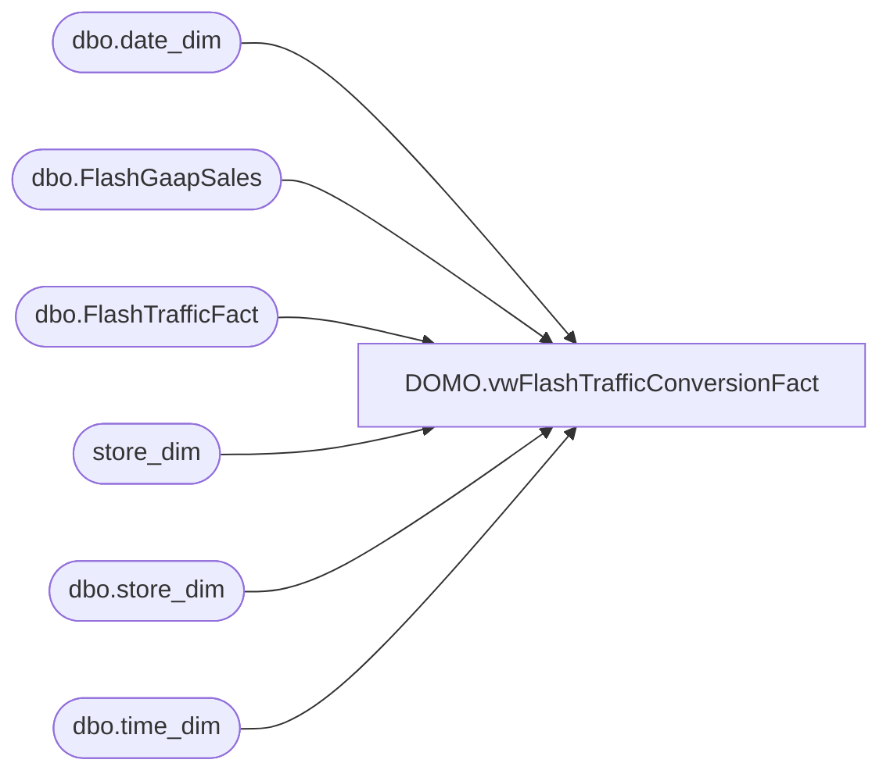

# DOMO.vwFlashTrafficConversionFact

**Database:** dw  
**Server:** papamart  

## Architecture Diagram



## Table Dependencies

| Referenced Table |
|---|
| dbo.date_dim |
| dbo.FlashGaapSales |
| dbo.FlashTrafficFact |
| store_dim |
| dbo.store_dim |
| dbo.time_dim |

## View Code

```sql
CREATE VIEW [DOMO].[vwFlashTrafficConversionFact] AS
-- =============================================================================================================
-- Name: [DOMO].[vwFlashTrafficConversionFact]
--
-- Description: Flash Traffic with Flash Gaap sales and Conversion by store by hour
--
--
-- Dependencies: 
--
-- Revision History
--		Name:				Date:			Comments:
--		Tim Bytnar			12/6/2017		Initial creation
--
-- =============================================================================================================

WITH StoreCounts AS
(
       SELECT sd.store_id,
                        td.hour,
                        CAST(ft.startDateTime as date) as TrafficDate,
                        SUM(ft.enters) as enters, 
                        SUM(ft.exits) as exits
       FROM dw.dbo.FlashTrafficFact ft
       LEFT JOIN store_dim sd
              ON ft.store_key = sd.store_key
       LEFT JOIN dw.dbo.time_dim td 
              ON ft.time_key = td.time_key
       WHERE datediff(dd, ft.startDateTime, getdate()) <=1
	   GROUP BY sd.store_id, td.hour, CAST(ft.startDateTime as date)
),
DataConversions AS
(
	SELECT REPLICATE('0',4-LEN(RTRIM(sd.store_id))) + RTRIM(sd.store_id) as StoreNumber
		  ,DATEADD(minute,std.minute,DATEADD(hour,std.hour,sdd.actual_date)) as StoreDateTime
		  ,bizdd.actual_date as BusinessDate
		  ,fgs.flash_gaap_sales as GaapSales
		  ,CAST(fgs.[TransactionCount] as float) as TransactionCount
		  ,CAST(fgs.NetUnits as float) as NetUnits
		  ,fgs.[Jurisdiction]
		  ,fgs.[CurrencyCode]
		  ,fgs.[TradingGroup]
		  ,CAST(sc.enters as float) as TrafficEnters
		  ,CAST(sc.exits as float) as TrafficExits
		  ,CASE
				WHEN sc.exits <> 0 THEN ROUND(((CAST(fgs.TransactionCount as float) / CAST(sc.exits as float)) * 100),2,0)
				ELSE 0.0
		   END as Conversion
		  ,CASE
				WHEN fgs.TransactionCount <> 0 THEN ROUND(CAST(fgs.flash_gaap_sales as float) / CAST(fgs.TransactionCount as float),2,0)
				ELSE 0 
		   END as DPT
		   ,CASE
				WHEN fgs.TransactionCount <> 0 THEN ROUND(CAST(fgs.NetUnits as float) /  CAST(fgs.TransactionCount as float),2,0) 
				ELSE 0 
		   END as UPT
	FROM [dw].[dbo].[FlashGaapSales] fgs

	LEFT JOIN [dw].[dbo].[date_dim] bizdd
		ON fgs.business_date_key = bizdd.date_key
	LEFT JOIN [dw].[dbo].[date_dim] sdd
		ON fgs.local_date_key = sdd.date_key
	LEFT JOIN [dw].[dbo].[time_dim] std
		ON fgs.local_time_key = std.time_key
	LEFT JOIN [dw].[dbo].[store_dim] sd
		ON fgs.store_key = sd.store_key
	LEFT JOIN StoreCounts sc
		ON sd.store_id = sc.store_id AND CAST(sdd.actual_date as date) = sc.TrafficDate AND std.hour = sc.hour
	WHERE datediff(dd,cast(bizdd.actual_date as date),getdate()) <= 1
		AND (sc.enters IS NOT NULL OR sc.exits IS NOT NULL)
)

SELECT 
		StoreNumber,
		StoreDateTime,
		BusinessDate,
		GaapSales,
		TransactionCount,
		NetUnits,
		Jurisdiction,
		CurrencyCode,
		TradingGroup,
		TrafficEnters,
		TrafficExits,
		Conversion,
		DPT,
		UPT,
		CASE
			WHEN (TransactionCount < TrafficExits) THEN ROUND(((TrafficExits * DPT) - GaapSales),2,0)
			ELSE 0
		END as MissedSales
FROM DataConversions
```

