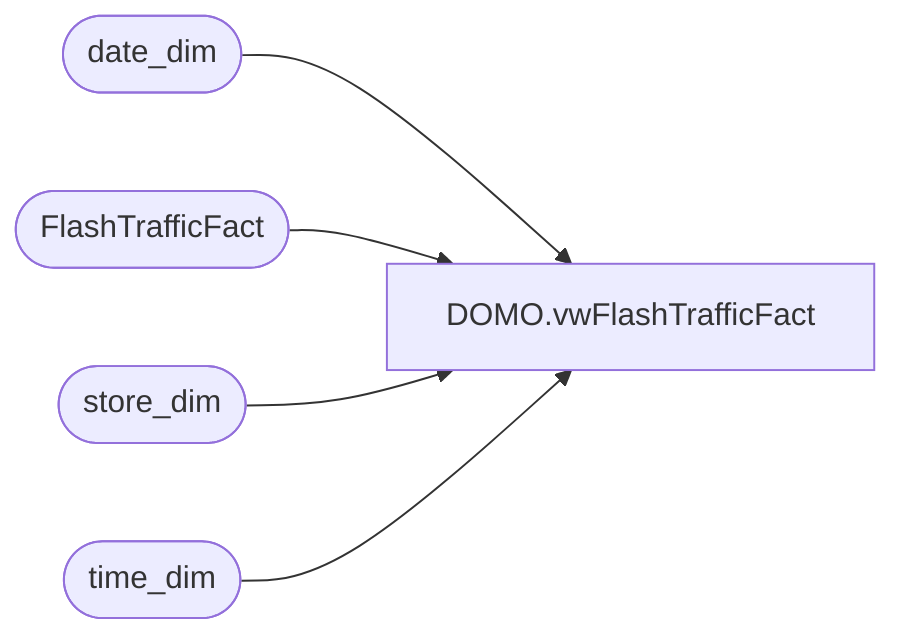

# DOMO.vwFlashTrafficFact

**Database:** dw  
**Server:** papamart  

## Architecture Diagram



## Table Dependencies

| Referenced Table |
|---|
| date_dim |
| FlashTrafficFact |
| store_dim |
| time_dim |

## View Code

```sql
CREATE VIEW [DOMO].[vwFlashTrafficFact] AS
-- =============================================================================================================
-- Name: [DOMO].[vwFlashTrafficFact]
--
-- Description: Flash Traffic by store by 15 minute increments inserted or updated in the past hour
--
--
-- Dependencies: 
--
-- Revision History
--		Name:				Date:			Comments:
--		Tim Bytnar			12/5/2017		Initial creation
--
-- =============================================================================================================
SELECT REPLICATE('0',4-LEN(RTRIM(sd.store_id))) + RTRIM(sd.store_id) as StoreNumber,
	   CAST(dd.actual_date as date) as TrafficDate,
	   CAST(CONCAT(td.hour,':',td.minute) as time) as TrafficTime,
	   ft.startDateTime as TrafficStartDateTime,
	   ft.enters as Enters,
	   ft.exits as Exits,
	   ft.insert_datetime,
	   ft.update_datetime
FROM FlashTrafficFact ft
LEFT JOIN time_dim td
	ON ft.time_key = td.time_key
LEFT JOIN date_dim dd
	ON ft.date_key = dd.date_key
LEFT JOIN store_dim sd
	ON ft.store_key = sd.store_key
WHERE DATEDIFF(day,ft.startDateTime,GETDATE()) <=1
```

