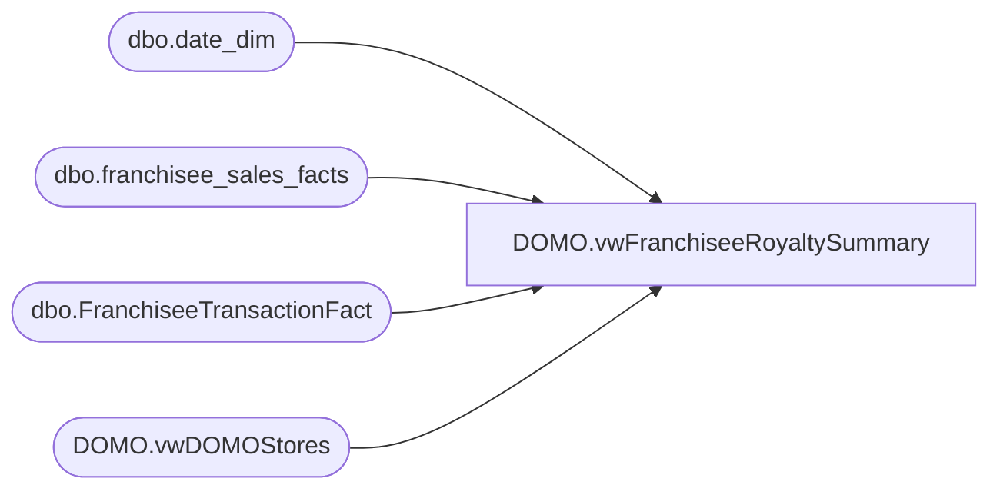

# DOMO.vwFranchiseeRoyaltySummary

**Database:** dw  
**Server:** papamart  

## Architecture Diagram



## Table Dependencies

| Referenced Table |
|---|
| dbo.date_dim |
| dbo.franchisee_sales_facts |
| dbo.FranchiseeTransactionFact |
| DOMO.vwDOMOStores |

## View Code

```sql
CREATE view [DOMO].[vwFranchiseeRoyaltySummary]

AS
-- =============================================================================================================
-- Name: [DOMO].[vwFranchiseeRoyaltySummary]
--
-- Description: Summary of sales for franchisee royalty reporting
--				This view can probably go away once all franchisees convert to the new data delivery system.  
--				Reports could then be build off of TransactionFactStoreDaySummaryFranchisee
--
--
-- Dependencies: 
--
-- Revision History
--		Name:				Date:			Comments:
--		Anthony Delgado		08/26/2016		Initial creation
--
-- =============================================================================================================
-- "Old" scorecard data entry
SELECT	d.actual_date AS TransactionDate
		,s.StoreID AS StoreKey
		,ISNULL(f.footware_sales,0) AS FootwareSales
		,ISNULL(f.sound_sales,0) AS SoundSales
		,ISNULL(f.unstuffed_sales,0) AS UnstuffedSales
		,ISNULL(f.gift_card_sales,0) AS GiftCardSales
		,ISNULL(f.accessories_sales,0) AS AccessoriesSales
		,ISNULL(f.clothes_sales,0) AS ClothesSales
		,ISNULL(f.prestuffed_sales,0) AS PrestuffedSales
		,ISNULL(f.giftcards_redeemed,0) AS GiftCardsRedeemed
		,ISNULL(f.total_sales,0) AS TotalSales
		,ISNULL(f.footware_sales,0)+ISNULL(f.sound_sales,0)+ISNULL(f.unstuffed_sales,0)+ISNULL(f.accessories_sales,0)
			+ISNULL(f.clothes_sales,0)+ISNULL(f.prestuffed_sales,0)+ISNULL(f.gift_card_sales,0)-ISNULL(f.giftcards_redeemed,0) AS CalculatedSales
		,s.StoreNameFull
		,s.TradingGroup
		,s.Channel
		,s.SubChannel
		,s.Zone
		,s.District
		,s.CountryNameFull
		,s.CountryNameAbbr
FROM dw.dbo.franchisee_sales_facts f
INNER JOIN dw.DOMO.vwDOMOStores s
	ON s.StoreKey=f.franchisee_store_key
INNER JOIN dw.dbo.date_dim d
	ON d.date_key=f.week_ending_date_key
WHERE s.TradingGroup IN (	'Franchise - BAB GULF FZE', -- Gulf States
							'Franchise - BABW Turkey', -- Turkey
							--'Franchise - BABW-AU', -- Australia
							'Franchise - Build A Bear Deutschland GmbH', -- Germany
							'Franchise - Central Dept Stores LTD', -- Thailand
							'Franchise - CP Retail Concepts PTE LTD', -- Singapore
							'Franchise - INTENCITY ENTERTAINMENT (PTY) LTD', -- South Africa
							'Franchise - Koates X Siempre' -- Mexico
						)
AND d.actual_date>=DATEADD(year, -2, DATEADD(yy, DATEDIFF(yy, 0, GETDATE()), 0))

UNION ALL
-- "New" data files
SELECT	d.actual_date AS TransactionDate
		,s.StoreID AS StoreKey
		,ISNULL(SUM(f.footwear_UGA),0) AS FootwareSales
		,ISNULL(SUM(f.sounds_UGA),0) AS SoundSales
		,ISNULL(SUM(f.animal_UGA),0) AS UnstuffedSales
		,ISNULL(SUM(f.giftcard_UGA),0) AS GiftCardSales
		,ISNULL(SUM(f.accessories_UGA),0) AS AccessoriesSales
		,ISNULL(SUM(f.clothing_UGA),0) AS ClothesSales
		,ISNULL(SUM(f.prestuffed_UGA),0) AS PrestuffedSales
		,ISNULL(SUM(f.redemption_amount),0) AS GiftCardsRedeemed
		,ISNULL(SUM(f.GAAP_sales_amount),0) AS TotalSales
		,ISNULL(SUM(f.footwear_UGA),0)+ISNULL(SUM(f.sounds_UGA),0)+ISNULL(SUM(f.animal_UGA),0)+ISNULL(SUM(f.accessories_UGA),0)
			+ISNULL(SUM(f.clothing_UGA),0)+ISNULL(SUM(f.prestuffed_UGA),0)+ISNULL(SUM(f.giftcard_UGA),0)-ISNULL(SUM(f.redemption_amount),0) AS CalculatedSales
		,s.StoreNameFull
		,s.TradingGroup
		,s.Channel
		,s.SubChannel
		,s.Zone
		,s.District
		,s.CountryNameFull
		,s.CountryNameAbbr
FROM dw.dbo.FranchiseeTransactionFact f
INNER JOIN dw.DOMO.vwDOMOStores s
	ON s.StoreKey=f.store_key
INNER JOIN dw.dbo.date_dim d
	ON d.date_key=f.date_key
WHERE s.TradingGroup IN (	--'Franchise - BAB GULF FZE', -- Gulf States
							--'Franchise - BABW Turkey', -- Turkey
							'Franchise - BABW-AU' -- Australia
							--'Franchise - Build A Bear Deutschland GmbH', -- Germany
							--'Franchise - Central Dept Stores LTD', -- Thailand
							--'Franchise - CP Retail Concepts PTE LTD', -- Singapore
							--'Franchise - INTENCITY ENTERTAINMENT (PTY) LTD', -- South Africa
							--'Franchise - Koates X Siempre' -- Mexico
						) 
AND d.actual_date>=DATEADD(year, -2, DATEADD(yy, DATEDIFF(yy, 0, GETDATE()), 0))
GROUP BY d.actual_date
		,s.StoreID
		,s.StoreNameFull
		,s.TradingGroup
		,s.Channel
		,s.SubChannel
		,s.Zone
		,s.District
		,s.CountryNameFull
		,s.CountryNameAbbr
```

