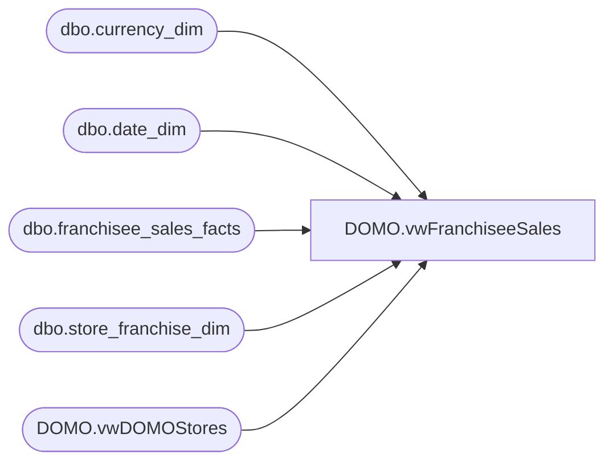

# DOMO.vwFranchiseeSales

**Database:** dw  
**Server:** papamart  

## Architecture Diagram



## Table Dependencies

| Referenced Table |
|---|
| dbo.currency_dim |
| dbo.date_dim |
| dbo.franchisee_sales_facts |
| dbo.store_franchise_dim |
| DOMO.vwDOMOStores |

## View Code

```sql
CREATE VIEW [DOMO].[vwFranchiseeSales] AS
-- =============================================================================================================
-- Name: [DOMO].[vwFranchiseeSales]
--
-- Description: Franchisee sales data by week.  Source is scorecard data entry on WorldBearNet 
--
--
-- Dependencies: 
--
-- Revision History
--		Name:				Date:			Comments:
--		Anthony Delgado		02/24/2016		Initial creation
--
-- =============================================================================================================
SELECT  ds.StoreID AS StoreNumber,
		StoreNameAbbr,
		Channel,
		TradingGroup,
		ds.CountryNameAbbr,
		ds.CountryNameFull, 
		ds.SubChannel,
		ds.Zone,
		ds.Area,
		ds.District,
		dd.actual_date AS WeekEndingDate,
		dd.fiscal_year AS FiscalYear,
		dd.fiscal_quarter AS FiscalQuarter,
		dd.fiscal_period AS FiscalMonth,
		dd.fiscal_week AS FiscalWeek,
        cd.currency_code AS CurrencyCode,
		fsf.total_sales AS TotalSales,
		fsf.sales_plan AS SalesPlan,
		fsf.transaction_count AS TransactionCount,
		fsf.footware_sales AS FootwareSales,
		fsf.footware_units AS FootwareUnits,
		fsf.sound_sales AS SoundSales,
		fsf.sound_units AS SoundUnits,
		fsf.unstuffed_sales AS UnstuffedSales,
		fsf.unstuffed_units AS UnstuffedUnits,
		fsf.party_sales AS PartySales,
		fsf.party_count AS PartyCount,
		fsf.gift_card_sales AS GiftCardSales,
		fsf.gift_card_units AS GiftCardUnits,
		fsf.accessories_sales AS AccessoriesSales,
		fsf.accessories_units AS AccessoriesUnits,
		fsf.clothes_sales AS ClothesSales,
		fsf.clothes_units AS ClothesUnits,
		fsf.sports_sales AS SportsSales,
		fsf.sports_units AS SportsUnits,
		fsf.prestuffed_sales AS PrestuffedSales,
		fsf.prestuffed_units AS PrestuffedUnits,
		fsf.coupons_and_discounts AS CouponsAndDiscounts,
		fsf.returns AS Returns,
		fsf.giftcards_redeemed AS GiftCardsRedeemed,
		fsf.friend_sales AS FriendSales,
		fsf.friend_units AS FriendUnits,
		fsf.human_sales AS HumanSales,
		fsf.human_units AS HumanUnits,
		fsf.pet_sales AS PetSales,
		fsf.pet_units AS PetUnits,
		fsf.stuffers_sales AS StuffersSales,
		fsf.stuffers_units AS StuffersUnits
FROM [dw].[dbo].[franchisee_sales_facts] fsf
INNER JOIN dw.dbo.store_franchise_dim sfd
	ON sfd.store_key=fsf.franchisee_store_key
INNER JOIN dw.DOMO.vwDOMOStores ds
	ON ds.StoreID=sfd.store_id
INNER JOIN dw.dbo.date_dim dd
	ON dd.date_key=fsf.week_ending_date_key
INNER JOIN dw.dbo.currency_dim cd
	ON cd.currency_key=fsf.currency_key
WHERE dd.actual_date>=DATEADD(day, -7, DATEADD(year, -2, DATEADD(yy, DATEDIFF(yy, 0, GETDATE()), 0)))
```

