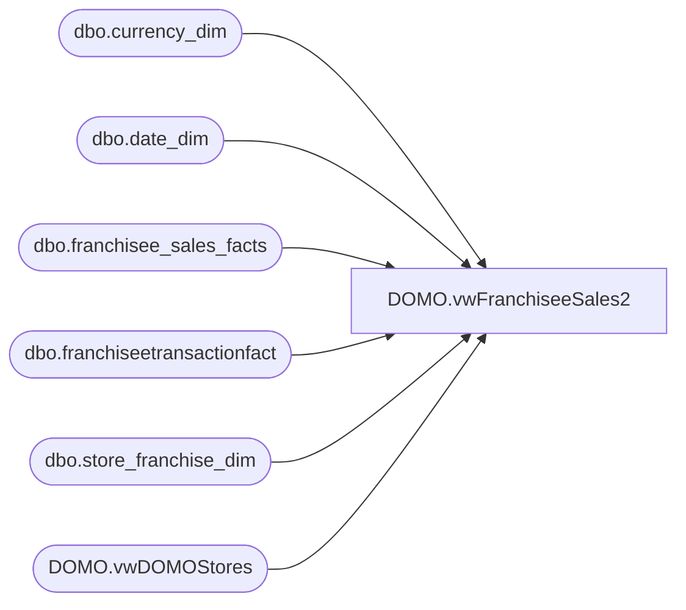

# DOMO.vwFranchiseeSales2

**Database:** dw  
**Server:** papamart  

## Architecture Diagram



## Table Dependencies

| Referenced Table |
|---|
| dbo.currency_dim |
| dbo.date_dim |
| dbo.franchisee_sales_facts |
| dbo.franchiseetransactionfact |
| dbo.store_franchise_dim |
| DOMO.vwDOMOStores |

## View Code

```sql
CREATE VIEW [DOMO].[vwFranchiseeSales2]
AS


SELECT        ds.StoreID AS StoreNumber, ds.StoreNameAbbr, ds.Channel, ds.TradingGroup, ds.CountryNameAbbr, ds.CountryNameFull, ds.SubChannel, ds.Zone, ds.Area, ds.District, dd.actual_date AS WeekEndingDate, 
                         dd.fiscal_year AS FiscalYear, dd.fiscal_quarter AS FiscalQuarter, dd.fiscal_period AS FiscalMonth, dd.fiscal_week AS FiscalWeek, cd.currency_code AS CurrencyCode, fsf.total_sales AS TotalSales, 
                         fsf.sales_plan AS SalesPlan, fsf.transaction_count AS TransactionCount, fsf.footware_sales AS FootwareSales, fsf.footware_units AS FootwareUnits, fsf.sound_sales AS SoundSales, 
                         fsf.sound_units AS SoundUnits, fsf.unstuffed_sales AS UnstuffedSales, fsf.unstuffed_units AS UnstuffedUnits, fsf.party_sales AS PartySales, fsf.party_count AS PartyCount, fsf.gift_card_sales AS GiftCardSales, 
                         fsf.gift_card_units AS GiftCardUnits, fsf.accessories_sales AS AccessoriesSales, fsf.accessories_units AS AccessoriesUnits, fsf.clothes_sales AS ClothesSales, fsf.clothes_units AS ClothesUnits, 
                         fsf.sports_sales AS SportsSales, fsf.sports_units AS SportsUnits, fsf.prestuffed_sales AS PrestuffedSales, fsf.prestuffed_units AS PrestuffedUnits, fsf.coupons_and_discounts AS CouponsAndDiscounts, 
                         fsf.[returns], fsf.giftcards_redeemed AS GiftCardsRedeemed, fsf.friend_sales AS FriendSales, fsf.friend_units AS FriendUnits, fsf.human_sales AS HumanSales, fsf.human_units AS HumanUnits, 
                         fsf.pet_sales AS PetSales, fsf.pet_units AS PetUnits, fsf.stuffers_sales AS StuffersSales, fsf.stuffers_units AS StuffersUnits,total_Sales as GaapSales
FROM            dbo.franchisee_sales_facts AS fsf INNER JOIN
                         dbo.store_franchise_dim AS sfd ON sfd.store_key = fsf.franchisee_store_key INNER JOIN
                         DOMO.vwDOMOStores AS ds ON ds.StoreID = sfd.store_id INNER JOIN
                         dbo.date_dim AS dd ON dd.date_key = fsf.week_ending_date_key INNER JOIN
                         dbo.currency_dim AS cd ON cd.currency_key = fsf.currency_key
WHERE        ds.TradingGroup IN 
				(
					'Franchise - BAB GULF FZE', 'Franchise - Build A Bear Deutschland GmbH', 
					'Franchise - Central Dept Stores LTD', 'Franchise - CP Retail Concepts PTE LTD', 
                    'Franchise - Koates X Siempre','Franchise - BABW-AU', 'Franchise - BABW Turkey'/* Mexico*/ 
				)
				or (ds.TradingGroup  in 
					( 
						'Franchise - BABW-AU','Franchise - INTENCITY ENTERTAINMENT (PTY) LTD',
						'Franchise - CP Retail Concepts PTE LTD'
					)
					and dd.Actual_Date < '12/31/2017')
Union
SELECT        ds.StoreID AS StoreNumber, ds.StoreNameAbbr, ds.Channel, ds.TradingGroup, ds.CountryNameAbbr, ds.CountryNameFull, ds.SubChannel, ds.Zone, ds.Area, ds.District, dd.actual_date AS WeekEndingDate, 
                         dd.fiscal_year AS FiscalYear, dd.fiscal_quarter AS FiscalQuarter, dd.fiscal_period AS FiscalMonth, dd.fiscal_week AS FiscalWeek, cd.currency_code AS CurrencyCode, 0 AS TotalSales, 0 AS SalesPlan, 
                         0 AS TransactionCount, ISNULL(SUM(fsf.footwear_UGA), 0) AS FootwareSales, 0 AS FootwareUnits, ISNULL(SUM(fsf.sounds_UGA), 0) AS SoundSales, 0 AS SoundUnits, ISNULL(SUM(fsf.animal_UGA), 0) 
                         AS UnstuffedSales, 0 AS UnstuffedUnits, 0 AS PartySales, 0 AS PartyCount, ISNULL(SUM(fsf.giftcard_UGA), 0) AS GiftCardSales, 0 AS GiftCardUnits, ISNULL(SUM(fsf.accessories_UGA), 0) AS AccessoriesSales, 
                         sum(fsf.accessories_units) AS AccessoriesUnits, ISNULL(SUM(fsf.clothing_UGA), 0) AS ClothesSales, 0 AS ClothesUnits, SUM(ISNULL(SPORTS_UGA, 0)) AS SportsSales, sum(fsf.sports_units) AS SportsUnits, 
                         ISNULL(SUM(fsf.prestuffed_UGA), 0) AS PrestuffedSales, sum(fsf.prestuffed_units) AS PrestuffedUnits, 0 AS CouponsAndDiscounts, 0 AS returns, ISNULL(SUM(fsf.redemption_amount), 0) AS GiftCardsRedeemed, 
                         0 AS FriendSales, 0 AS FriendUnits, 0 AS HumanSales, 0 AS HumanUnits, 0 AS PetSales, 0 AS PetUnits, 0 AS StuffersSales, 0 AS StuffersUnits,
						 ISNULL(sum(fsf.GAAP_sales_amount),0) as GaapSales
FROM            dbo.franchiseetransactionfact AS fsf INNER JOIN
                         dbo.store_franchise_dim AS sfd ON sfd.store_key = fsf.store_key INNER JOIN
                         DOMO.vwDOMOStores AS ds ON ds.StoreID = sfd.store_id INNER JOIN
                         dbo.date_dim AS dd ON dd.date_key = fsf.date_key INNER JOIN
                         dbo.currency_dim AS cd ON cd.currency_key = fsf.currency_key
WHERE        (ds.TradingGroup  in 
					( 
						'Franchise - BABW-AU','Franchise - INTENCITY ENTERTAINMENT (PTY) LTD',
						'Franchise - CP Retail Concepts PTE LTD'
					)
						       and dd.Actual_Date >= '12/31/2017') or 
					ds.TradingGroup in 
					( 
						'Franchise - Harry''s Kitchen Brand Limited',
						'Franchise - Tablez and Toys Pvt Ltd',
						'Franchise - Ansaldo S.A.',
						'Franchise - BAB GULF FZE'
					)
GROUP BY ds.StoreID, ds.StoreNameAbbr, ds.Channel, ds.TradingGroup, ds.CountryNameAbbr, ds.CountryNameFull, ds.SubChannel, ds.Zone, ds.Area, ds.District, dd.actual_date, dd.fiscal_year, dd.fiscal_quarter, 
                         dd.fiscal_period, dd.fiscal_week, cd.currency_code
```

