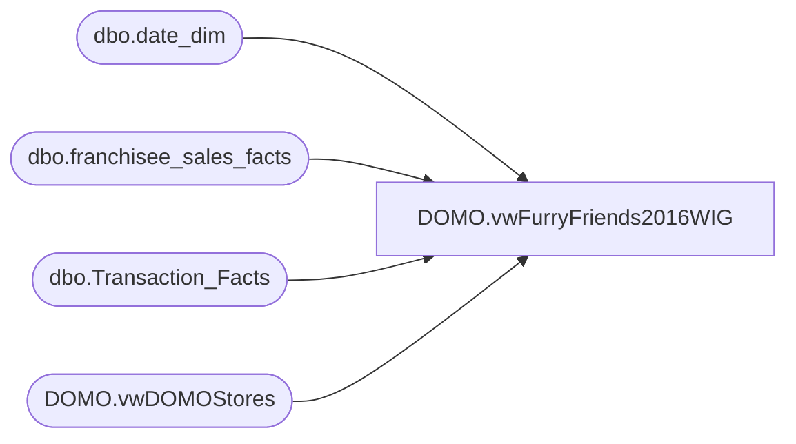

# DOMO.vwFurryFriends2016WIG

**Database:** dw  
**Server:** papamart  

## Architecture Diagram



## Table Dependencies

| Referenced Table |
|---|
| dbo.date_dim |
| dbo.franchisee_sales_facts |
| dbo.Transaction_Facts |
| DOMO.vwDOMOStores |

## View Code

```sql
CREATE VIEW [DOMO].[vwFurryFriends2016WIG]

AS
-- =============================================================================================================
-- Name: [DOMO].[vwFurryFriends2016WIG]
--
-- Description: 2015 and 2016 unstuffed sales side by side grouped by location hiearchy.
--
--
-- Dependencies: Transaction_Detail_Facts
--
-- Revision History
--		Name:				Date:			Comments:
--		Anthony Delgado		03/03/2016		Initial creation
--
-- =============================================================================================================

WITH [2015FurryFriends] AS (
	SELECT	d.Channel,
			d.CountryNameFull,
			d.SubChannel,
			d.Zone,
			d.District,
			d.StoreID,
			dd.fiscal_period AS FiscalPeriod, 
			SUM(t.animal_units) AS Units
	FROM dw.dbo.Transaction_Facts t
	INNER JOIN dw.DOMO.vwDOMOStores d
		ON d.StoreKey=t.Store_Key
	INNER JOIN dw.dbo.date_dim dd
		ON dd.date_key=t.date_key
	WHERE dd.fiscal_year=2015
	GROUP BY d.Channel,
			d.CountryNameFull,
			d.SubChannel,
			d.Zone,
			d.District,
			d.StoreID,
			dd.fiscal_period

	UNION ALL

	SELECT	d.Channel,
			d.CountryNameFull,
			d.SubChannel,
			d.Zone,
			d.District,
			d.StoreID,
			dd.fiscal_period AS FiscalPeriod, 
			SUM(fsf.unstuffed_units) AS Units
	FROM [dw].[dbo].[franchisee_sales_facts] fsf
	INNER JOIN dw.domo.vwDOMOStores d
		ON d.StoreKey=fsf.franchisee_store_key
	INNER JOIN dw.dbo.date_dim dd
		ON dd.date_key=fsf.week_ending_date_key
	WHERE dd.fiscal_year=2015
	GROUP BY d.Channel,
			d.CountryNameFull,
			d.SubChannel,
			d.Zone,
			d.District,
			d.StoreID,
			dd.fiscal_period
	),
[2016FurryFriends] AS (
	SELECT	d.Channel,
			d.CountryNameFull,
			d.SubChannel,
			d.Zone,
			d.District,
			d.StoreID,
			dd.fiscal_period AS FiscalPeriod, 
			SUM(t.animal_units) AS Units
	FROM dw.dbo.Transaction_Facts t
	INNER JOIN dw.DOMO.vwDOMOStores d
		ON d.StoreKey=t.Store_Key
	INNER JOIN dw.dbo.date_dim dd
		ON dd.date_key=t.date_key
	WHERE dd.fiscal_year=2016
	GROUP BY d.Channel,
			d.CountryNameFull,
			d.SubChannel,
			d.Zone,
			d.District,
			d.StoreID,
			dd.fiscal_period

	UNION ALL

	SELECT	d.Channel,
			d.CountryNameFull,
			d.SubChannel,
			d.Zone,
			d.District,
			d.StoreID,
			dd.fiscal_period AS FiscalPeriod, 
			SUM(fsf.unstuffed_units) AS Units
	FROM [dw].[dbo].[franchisee_sales_facts] fsf
	INNER JOIN dw.domo.vwDOMOStores d
		ON d.StoreKey=fsf.franchisee_store_key
	INNER JOIN dw.dbo.date_dim dd
		ON dd.date_key=fsf.week_ending_date_key
	WHERE dd.fiscal_year=2016
	GROUP BY d.Channel,
			d.CountryNameFull,
			d.SubChannel,
			d.Zone,
			d.District,
			d.StoreID,
			dd.fiscal_period
	)
SELECT	COALESCE(f1.Channel,f2.Channel) AS Channel, 
		COALESCE(f1.CountryNameFull,f2.CountryNameFull) AS Country, 
		COALESCE(f1.SubChannel,f2.SubChannel) AS SubChannel,
		COALESCE(f1.Zone,f2.Zone) AS Zone, 
		COALESCE(f1.District,f2.District) AS District, 
		COALESCE(f1.StoreID,f2.StoreID) AS StoreKey, 
		COALESCE(f1.FiscalPeriod,f2.FiscalPeriod) AS FiscalMonth, 
		f1.Units AS [2015Units], 
		f2.Units AS [2016Units]
FROM [2015FurryFriends] f1
FULL OUTER JOIN [2016FurryFriends] f2
	ON  f2.StoreID=f1.StoreID
	AND f2.FiscalPeriod=f1.FiscalPeriod
```

