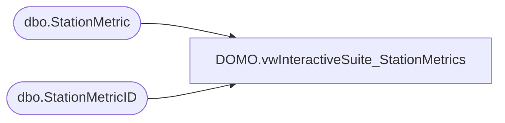

# DOMO.vwInteractiveSuite_StationMetrics

**Database:** dw  
**Server:** papamart  

## Architecture Diagram



## Table Dependencies

| Referenced Table |
|---|
| dbo.StationMetric |
| dbo.StationMetricID |

## View Code

```sql
CREATE VIEW [DOMO].[vwInteractiveSuite_StationMetrics]
AS
SELECT        sm.StoreNumber, sm.StationIP, smi.EventType, smi.MetricIDKey, sm.MetricValue, sm.MetricDateTime, sm.MetricHour, sm.ImportDate
FROM            KODIAK.BABW_Interactive_Metric.dbo.StationMetric AS sm LEFT OUTER JOIN
                         KODIAK.BABW_Interactive_Metric.dbo.StationMetricID AS smi ON sm.MetricID = smi.MetricID
```

