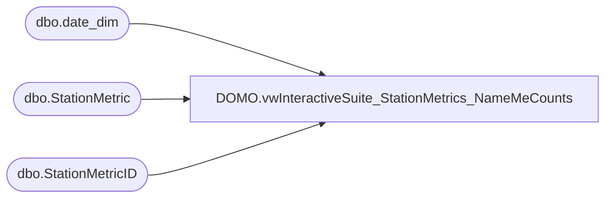

# DOMO.vwInteractiveSuite_StationMetrics_NameMeCounts

**Database:** dw  
**Server:** papamart  

## Architecture Diagram



## Table Dependencies

| Referenced Table |
|---|
| dbo.date_dim |
| dbo.StationMetric |
| dbo.StationMetricID |

## View Code

```sql
CREATE VIEW [DOMO].[vwInteractiveSuite_StationMetrics_NameMeCounts]
AS
WITH StationNameMeIPAll (StoreNumber, StationIP, MetricIDKey, MetricValueCount) AS (
		SELECT DISTINCT StoreNumber, StationIP, smi.MetricIDKey, 0
		FROM KODIAK .BABW_Interactive_Metric. dbo.StationMetric sm
		LEFT JOIN KODIAK. BABW_Interactive_Metric.dbo .StationMetricID AS smi ON sm.MetricID = smi .MetricID
		WHERE
		CAST(sm.MetricDateTime AS DATE) BETWEEN '01-01-2016' AND CAST (GETDATE() -1 AS DATE ) AND
		EventType = 'NAMEME'
		AND MetricIDKey IN ('SYSREBOOTNAMEME', 'BIRTHCERTCOUNTNAMEME', 'SCANCOUNTNAMEME')
		AND StationIP NOT LIKE ( '10.5.5.%')
		AND StationIP NOT LIKE ( '10.252.%')
		)
		,
	StationNameMeIPMetrics (StoreNumber, StationIP, MetricDateTime, MetricIDKey, MetricValueCount) AS (
		SELECT StoreNumber, StationIP, actual_date, MetricIDKey, COUNT(MetricIDKey) AS 'MetricValueCount'
			FROM
			(
				SELECT StoreNumber, StationIP, CAST(sm.MetricDateTime AS DATE) AS actual_date, smi.MetricIDKey
				FROM KODIAK.BABW_Interactive_Metric.dbo.StationMetric sm
				LEFT JOIN KODIAK.BABW_Interactive_Metric.dbo.StationMetricID AS smi ON sm.MetricID = smi.MetricID
				WHERE
				CAST (MetricDateTime AS DATE ) BETWEEN '01-01-2016' AND CAST ( GETDATE() -1 AS DATE ) AND
				EventType = 'NAMEME'
				AND MetricIDKey IN ( 'SYSREBOOTNAMEME', 'BIRTHCERTCOUNTNAMEME', 'SCANCOUNTNAMEME')
				AND StationIP NOT LIKE ( '10.5.5.%' )
				AND StationIP NOT LIKE ( '10.252.%' )
			) AS StationNameMeIPMetricsSimplified
			GROUP BY StoreNumber, StationIP, actual_date, MetricIDKey
		)
SELECT sa.StoreNumber, sa.StationIP, actual_date, sa.MetricIDKey, COALESCE(SUM( sa.MetricValueCount + s.MetricValueCount ),0 ) AS MetricValueCount
FROM StationNameMeIPAll sa
CROSS JOIN papamart. [dw].[dbo] .[date_dim] dd1
LEFT JOIN StationNameMeIPMetrics s ON dd1.actual_date = CAST(s.MetricDateTime AS DATE) AND sa.MetricIDKey = s.MetricIDKey AND sa.StationIP = s.StationIP and sa.StoreNumber = s.StoreNumber
WHERE
CAST(dd1.actual_date AS DATE ) BETWEEN '01-01-2016' AND CAST (GETDATE() -1 AS DATE )
GROUP BY sa.StoreNumber, sa.StationIP, dd1.actual_date, sa.MetricIDKey
```

