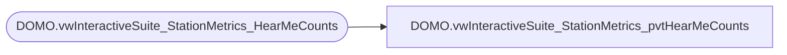

# DOMO.vwInteractiveSuite_StationMetrics_pvtHearMeCounts

**Database:** dw  
**Server:** papamart  

## Architecture Diagram



## Table Dependencies

| Referenced Table |
|---|
| DOMO.vwInteractiveSuite_StationMetrics_HearMeCounts |

## View Code

```sql
CREATE VIEW [DOMO].[vwInteractiveSuite_StationMetrics_pvtHearMeCounts]
AS
SELECT StoreNumber
      ,StationIP
	  ,actual_date
      ,ISNULL([SUCESSCHIPCOUNT_HEARME], 0) [SUCESSCHIPCOUNT_HEARME]
	  ,ISNULL([ELAPSEDTIMEHEARME], 0) [ELAPSEDTIMEHEARME]
      ,ISNULL([RECORDYOUROWNCOUNT], 0) [RECORDYOUROWNCOUNT]
      ,ISNULL([SYSREBOOTHEARME], 0) [SYSREBOOTHEARME]
      ,ISNULL([GENERICTAGCOUNTHEARME], 0) [GENERICTAGCOUNTHEARME]
      ,ISNULL([FAILEDCHIPCOUNT_HEARME], 0) [FAILEDCHIPCOUNT_HEARME]
      ,ISNULL([SCANCOUNTHEARME], 0) [SCANCOUNTHEARME]
FROM(
SELECT *
FROM dw.DOMO.vwInteractiveSuite_StationMetrics_HearMeCounts) AS c
PIVOT (MAX(MetricValueCount) FOR MetricIDKey IN ([SUCESSCHIPCOUNT_HEARME], [ELAPSEDTIMEHEARME], [RECORDYOUROWNCOUNT], [SYSREBOOTHEARME], [GENERICTAGCOUNTHEARME], [FAILEDCHIPCOUNT_HEARME], [SCANCOUNTHEARME])) AS p
```

