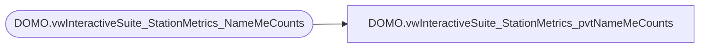

# DOMO.vwInteractiveSuite_StationMetrics_pvtNameMeCounts

**Database:** dw  
**Server:** papamart  

## Architecture Diagram



## Table Dependencies

| Referenced Table |
|---|
| DOMO.vwInteractiveSuite_StationMetrics_NameMeCounts |

## View Code

```sql
CREATE VIEW [DOMO].[vwInteractiveSuite_StationMetrics_pvtNameMeCounts]
AS
SELECT StoreNumber
      ,StationIP
	  ,actual_date
	  ,ISNULL([BIRTHCERTCOUNTNAMEME], 0) [BIRTHCERTCOUNTNAMEME]
	  ,ISNULL([SCANCOUNTNAMEME], 0) [SCANCOUNTNAMEME]
	  ,ISNULL([SYSREBOOTNAMEME], 0) [SYSREBOOTNAMEME]
FROM(
SELECT *
FROM dw.DOMO.vwInteractiveSuite_StationMetrics_NameMeCounts
) AS c
PIVOT (MAX(MetricValueCount) FOR MetricIDKey IN ([BIRTHCERTCOUNTNAMEME], [SCANCOUNTNAMEME], [SYSREBOOTNAMEME])) AS p
```

