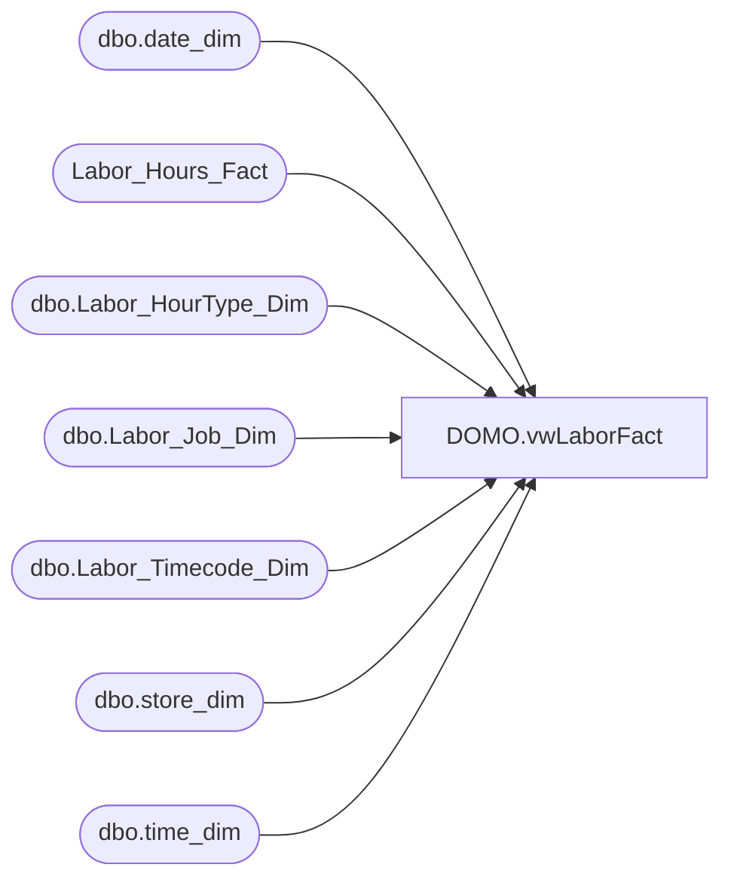

# DOMO.vwLaborFact

**Database:** dw  
**Server:** papamart  

## Architecture Diagram



## Table Dependencies

| Referenced Table |
|---|
| dbo.date_dim |
| Labor_Hours_Fact |
| dbo.Labor_HourType_Dim |
| dbo.Labor_Job_Dim |
| dbo.Labor_Timecode_Dim |
| dbo.store_dim |
| dbo.time_dim |

## View Code

```sql
CREATE VIEW [DOMO].[vwLaborFact]

AS
-- =============================================================================================================
-- Name: [DOMO].[vwLaborFact]
--
-- Description: Labor minutes worked by store, date/hour, hour type, time code type, and job type.
-- Excludes Unpaid Time
--
--
-- Dependencies: Labor_Hours_Fact
--
-- Revision History
--		Name:				Date:			Comments:
--		Anthony Delgado		2/23/2016		Initial creation
--
-- =============================================================================================================

WITH Labor (StoreKey, LaborDate, JobType, HourType, TimeCodeType, StartTime, EndTime, MinutesWorked) AS (
	SELECT
		sd.store_id,
		dd.actual_date,
		ljd.descr,
		htd.descr,
		tcd.descr,
		lhf.start_Time,
		lhf.end_Time,
		lhf.wrkd_minutes
	FROM Labor_Hours_Fact lhf
	INNER JOIN dw.dbo.store_dim sd
		ON sd.store_key=lhf.store_key
	INNER JOIN dw.dbo.date_dim dd
		ON dd.date_key=lhf.date_key
	INNER JOIN dw.dbo.Labor_Job_Dim ljd
		ON ljd.job_key=lhf.job_key
	INNER JOIN dw.dbo.Labor_HourType_Dim htd
		ON htd.hourtype_key=lhf.hourtype_key
	INNER JOIN dw.dbo.Labor_Timecode_Dim tcd
		ON tcd.timecode_key=lhf.timecode_key
	WHERE dd.actual_date>=DATEADD(YEAR, -2, DATEADD(yy, DATEDIFF(yy, 0, GETDATE()), 0))
	AND dd.actual_date<CONVERT(DATE,GETDATE())
	AND htd.descr<>'Unpaid Time'
	),
LaborTime (TimeKey, MinTime, MaxTime, OffsetDate) AS (
	SELECT [hour],
		CAST(CAST([hour] AS VARCHAR) + ':' + CAST([minute] AS VARCHAR) AS DATETIME) AS minTime,
		CAST(CAST([hour] AS VARCHAR) + ':' + CAST([minute] + 59 AS VARCHAR) + ':59' AS DATETIME) AS maxTime,
		0 AS OffsetDate
	FROM
		dbo.time_dim AS td WITH (NOLOCK)
	WHERE [minute]=(0)
	UNION ALL
	SELECT
		[hour],
		DATEADD(D, 1, CAST(CAST([hour] AS VARCHAR) + ':' + CAST([minute] AS VARCHAR) AS DATETIME)) AS minTime,
		DATEADD(D, 1, CAST(CAST([hour] AS VARCHAR) + ':' + CAST([minute] + 59 AS VARCHAR) + ':59' AS DATETIME)) AS maxTime,
		1 AS OffsetDate
	FROM
		dbo.time_dim AS td WITH (NOLOCK)
	WHERE [minute]=(0)
	),
StartEqualsEnd (StoreKey, LaborDate, LaborHour, MinutesWorked, HourType, TimeCodeType, JobType) AS (
	SELECT	l.StoreKey,
			CAST((l.LaborDate + lt.OffsetDate) AS DATE),
			lt.TimeKey,
			SUM(l.MinutesWorked),
			l.HourType,
			l.TimeCodeType,
			l.JobType
	FROM Labor l
	INNER JOIN LaborTime lt
		ON l.StartTime BETWEEN lt.MinTime AND lt.MaxTime
	WHERE l.StartTime = l.EndTime
	GROUP BY l.StoreKey,
			CAST((l.LaborDate + lt.OffsetDate) AS DATE),
			lt.TimeKey,
			l.HourType,
			l.TimeCodeType,
			l.JobType
	),
StartNotEqualsEnd (StoreKey, LaborDate, LaborHour, MinutesWorked, HourType, TimeCodeType, JobType) AS (
	SELECT	l.StoreKey,
			CAST((l.LaborDate + lt.OffsetDate) AS DATE),
			lt.TimeKey,
			SUM(CASE
					WHEN lt.MinTime <= l.StartTime AND
					lt.MaxTime <= l.EndTime THEN DATEDIFF(MINUTE, l.StartTime, lt.MaxTime) + 1
					WHEN lt.MinTime <= l.StartTime AND
					lt.MaxTime > l.EndTime THEN DATEDIFF(MINUTE, l.StartTime, l.EndTime)
					WHEN lt.MinTime > l.StartTime AND
					lt.MaxTime >= l.EndTime THEN DATEDIFF(MINUTE, lt.MinTime, l.EndTime)
					WHEN lt.Mintime > l.StartTime AND
					lt.MaxTime < l.EndTime THEN DATEDIFF(MINUTE, lt.MinTime, lt.MaxTime) + 1
					ELSE -99
			END) AS MinutesWorked,
			l.HourType,
			l.TimeCodeType,
			l.JobType
	FROM Labor l
	INNER JOIN LaborTime lt
		ON l.StartTime < lt.MaxTime
		AND l.EndTime > lt.MinTime
	WHERE l.StartTime <> l.EndTime
	GROUP BY l.StoreKey,
			CAST((l.LaborDate + lt.OffsetDate) AS DATE),
			lt.TimeKey,
			l.HourType,
			l.TimeCodeType,
			l.JobType
	)
SELECT StoreKey, LaborDate, LaborHour, MinutesWorked, HourType, TimeCodeType, JobType
FROM StartNotEqualsEnd
UNION ALL 
SELECT StoreKey, LaborDate, LaborHour, MinutesWorked, HourType, TimeCodeType, JobType
FROM StartEqualsEnd
```

