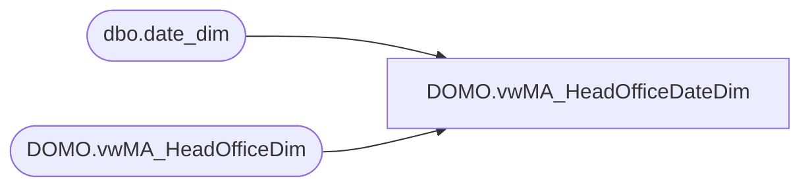

# DOMO.vwMA_HeadOfficeDateDim

**Database:** dw  
**Server:** papamart  

## Architecture Diagram



## Table Dependencies

| Referenced Table |
|---|
| dbo.date_dim |
| DOMO.vwMA_HeadOfficeDim |

## View Code

```sql
CREATE view [DOMO].[vwMA_HeadOfficeDateDim]

as

SELECT	 ho.LocnID AS LocnKey
		,ho.LocnNumber
		,ho.LocnNameAbbr
		,ho.LocnNameFull
		,ho.LocnPhoneNumber
		,ho.LocnFaxNumber
		,ho.LocnEmail
		,ho.TimeZoneDesc
		,ho.StateProvinceNameAbbr
		,ho.StateProvinceNameFull
		,ho.LocnLocator
		,ho.LocnMallWebsiteURL
		,ho.LocnLongitude
		,ho.LocnLatitude
		,ho.LocnLegalDescription
		,ho.Channel
		,ho.TradingGroup
		,ho.CountryNameAbbr
		,ho.CountryNameFull
		,ho.SubChannel
		,ho.Zone
		,ho.District
		,ho.Area
		,ho.PermCloseStatus
		,CAST(dd.actual_date AS DATE) as CalendarDate
		,dd.day_of_week as DayOfWeek
		,dd.fiscal_week as FiscalWeek
		,dd.fiscal_period as FiscalMonth
		,dd.fiscal_quarter as FiscalQuarter
		,dd.fiscal_year as FiscalYear
		,DATEADD(DAY, -364, dd.actual_date) as CompDate
		,'N/A' as MallType
		,'N/A' as LocnType
		,'N/A' as LocnDesign
		,'N/A' as LocationType
		,'N/A' as PricingModel
		,'N/A' as Hispanic
		,'N/A' as OpenStatus
		,'N/A' as CompStatus
		,'N/A' as TrafficOpenStatus
		,'N/A' as TrafficCompStatus
		,'N/A' as ZoneDirector
		,'N/A' as DistrictManager
		,'N/A' as AreaManager	
from DOMO.vwMA_HeadOfficeDim ho with (nolock)
cross join dbo.date_dim dd with (nolock)
where dd.actual_date>=DATEADD(year, -2, DATEADD(yy, DATEDIFF(yy, 0, GETDATE()), 0))
```

