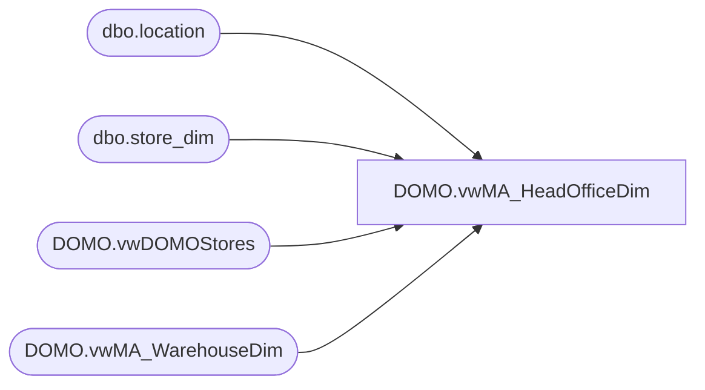

# DOMO.vwMA_HeadOfficeDim

**Database:** dw  
**Server:** papamart  

## Architecture Diagram



## Table Dependencies

| Referenced Table |
|---|
| dbo.location |
| dbo.store_dim |
| DOMO.vwDOMOStores |
| DOMO.vwMA_WarehouseDim |

## View Code

```sql
CREATE view [DOMO].[vwMA_HeadOfficeDim]

as

--Captures locations not captured in Store or Warehouse DOMO dimension views

select 
	  CAST(sd.store_id as varchar) as LocnID
	, right(('0000' + CAST(sd.store_id as varchar)), 4) AS LocnNumber
	, CAST(sd.store_key as varchar) as LocnKey
	, case when l.location_status_id = 5 then 1 else 0 end as PermCloseStatus
	, sd.store_name_abbrv as LocnNameAbbr
	, sd.store_name as LocnNameFull
	, sd.phone as LocnPhoneNumber
	, sd.fax as LocnFaxNumber
	, sd.email as LocnEmail
	, 'Unknown' as TimeZoneDesc
	, sd.state_province_name as StateProvinceNameAbbr
	, sd.state_province_name as StateProvinceNameFull
	, 'N/A' as LocnLocator
	, 'N/A' as LocnMallWebsiteURL
	, longitude as LocnLongitude
	, latitude as LocnLatitude
	, sd.legal_description as LocnLegalDescription
	, 'N/A' as Channel
	, CASE WHEN sd.country IN ('US','CA') THEN 'North America'
	          WHEN sd.country IN ('UK','DK','IE','CN') THEN 'Europe'
		 END AS TradingGroup
	, sd.country as CountryNameAbbr
	, sd.country_name as CountryNameFull
	, 'N/A' as SubChannel
	, 'N/A' AS Zone
    , 'N/A' AS Area
	, 'N/A' AS District
from dw.dbo.store_dim sd with (nolock)
join bedrockdb02.me_01.dbo.location l with (nolock) on right((cast('0000' as varchar) + cast(sd.store_id as varchar)), 4) = l.location_code
where 
	(
		sd.closing_date >= DATEADD(day, -7, DATEADD(year, -2, DATEADD(yy, DATEDIFF(yy, 0, GETDATE()), 0)))
	OR 
		sd.closing_date IS NULL
	)
AND 
	(
			not exists (select StoreKey from DOMO.vwDOMOStores where right(('0000' + CAST(sd.store_id as varchar)), 4) = StoreNumber)
		and
			not exists (select WarehouseKey from DOMO.vwMA_WarehouseDim where right(('0000' + CAST(sd.store_id as varchar)), 4) = WarehouseNumber)
	)
```

