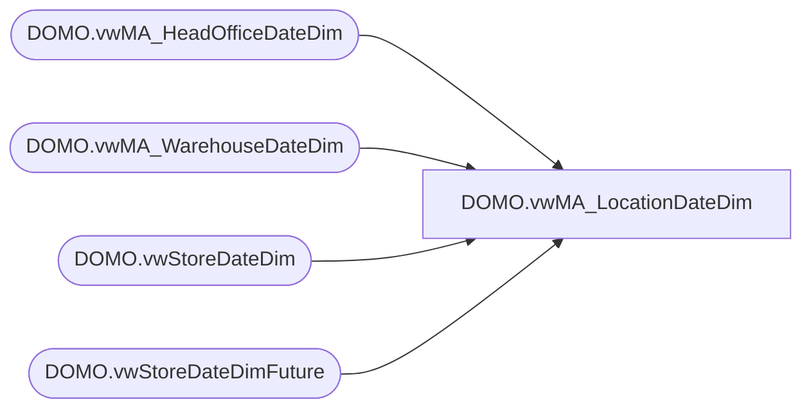

# DOMO.vwMA_LocationDateDim

**Database:** dw  
**Server:** papamart  

## Architecture Diagram



## Table Dependencies

| Referenced Table |
|---|
| DOMO.vwMA_HeadOfficeDateDim |
| DOMO.vwMA_WarehouseDateDim |
| DOMO.vwStoreDateDim |
| DOMO.vwStoreDateDimFuture |

## View Code

```sql
CREATE view [DOMO].[vwMA_LocationDateDim]

as


Select 
   StoreKey as LocationKey
  ,StoreNumber as LocationNumber
  ,StoreNameAbbr as NameAbbr
  ,StoreNameFull as NameFull
  ,StateProvinceNameAbbr 
  ,StateProvinceNameFull
  ,CountryNameAbbr
  ,CountryNameFull
  ,StoreLongitude as Longitude
  ,StoreLatitude as Latitude
  ,TimeZoneDesc 
  ,Channel
  ,TradingGroup
  ,SubChannel
  ,Zone
  ,District
  ,Area
  ,MallType
  ,StoreType as StoreType
  ,StoreDesign as StoreDesign
  ,LocationType
  ,PricingModel
  ,Hispanic
  ,cast(OpenStatus as varchar) as OpenStatus
  ,cast(CompStatus as varchar) as CompStatus
  ,cast(TrafficOpenStatus as varchar) as TrafficOpenStatus
  ,cast(TrafficCompStatus as varchar) as TrafficCompStatus
  ,ZoneDirector
  ,DistrictManager
  ,AreaManager
  ,PermCloseStatus
  ,CalendarDate
  ,DayOfWeek
  ,FiscalWeek
  ,FiscalMonth
  ,FiscalQuarter
  ,FiscalYear
  ,CompDate
 From [DOMO].[vwStoreDateDim]
 
  UNION

Select 
   StoreKey as LocationKey
  ,StoreNumber as LocationNumber
  ,StoreNameAbbr as NameAbbr
  ,StoreNameFull as NameFull
  ,StateProvinceNameAbbr 
  ,StateProvinceNameFull
  ,CountryNameAbbr
  ,CountryNameFull
  ,StoreLongitude as Longitude
  ,StoreLatitude as Latitude
  ,TimeZoneDesc 
  ,Channel
  ,TradingGroup
  ,SubChannel
  ,Zone
  ,District
  ,Area
  ,MallType
  ,StoreType as StoreType
  ,StoreDesign as StoreDesign
  ,LocationType
  ,PricingModel
  ,Hispanic
  ,cast(OpenStatus as varchar) as OpenStatus
  ,cast(CompStatus as varchar) as CompStatus
  ,cast(TrafficOpenStatus as varchar) as TrafficOpenStatus
  ,cast(TrafficCompStatus as varchar) as TrafficCompStatus
  ,ZoneDirector
  ,DistrictManager
  ,AreaManager
  ,PermCloseStatus
  ,CalendarDate
  ,DayOfWeek
  ,FiscalWeek
  ,FiscalMonth
  ,FiscalQuarter
  ,FiscalYear
  ,CompDate
  
From [DOMO].[vwStoreDateDimFuture]

  UNION

 Select 
   WarehouseKey as LocationKey
  ,WarehouseNumber as LocationNumber
  ,WarehouseNameAbbr as NameAbbr
  ,WarehouseNameFull as NameFull
  ,StateProvinceNameAbbr 
  ,StateProvinceNameFull
  ,CountryNameAbbr
  ,CountryNameFull
  ,WarehouseLongitude as Longitude
  ,WarehouseLatitude as Latitude
  ,TimeZoneDesc 
  ,Channel
  ,TradingGroup
  ,SubChannel
  ,Zone
  ,District
  ,Area
  ,MallType
  ,WarehouseType as StoreType
  ,WarehouseDesign as StoreDesign
  ,LocationType
  ,PricingModel
  ,Hispanic
  ,OpenStatus
  ,CompStatus
  ,TrafficOpenStatus
  ,TrafficCompStatus
  ,ZoneDirector
  ,DistrictManager
  ,AreaManager
  ,PermCloseStatus
  ,CalendarDate
  ,DayOfWeek
  ,FiscalWeek
  ,FiscalMonth
  ,FiscalQuarter
  ,FiscalYear
  ,CompDate
 From [DOMO].[vwMA_WarehouseDateDim]
 
 UNION
 
 Select 
   LocnKey as LocationKey
  ,LocnNumber as LocationNumber
  ,LocnNameAbbr as NameAbbr
  ,LocnNameFull as NameFull
  ,StateProvinceNameAbbr 
  ,StateProvinceNameFull
  ,CountryNameAbbr
  ,CountryNameFull
  ,LocnLongitude as Longitude
  ,LocnLatitude as Latitude
  ,TimeZoneDesc 
  ,Channel
  ,TradingGroup
  ,SubChannel
  ,Zone
  ,District
  ,Area
  ,MallType
  ,LocnType as StoreType
  ,LocnDesign as StoreDesign
  ,LocationType
  ,PricingModel
  ,Hispanic
  ,OpenStatus
  ,CompStatus
  ,TrafficOpenStatus
  ,TrafficCompStatus
  ,ZoneDirector
  ,DistrictManager
  ,AreaManager
  ,PermCloseStatus
  ,CalendarDate
  ,DayOfWeek
  ,FiscalWeek
  ,FiscalMonth
  ,FiscalQuarter
  ,FiscalYear
  ,CompDate
 From [DOMO].[vwMA_HeadOfficeDateDim]
```

