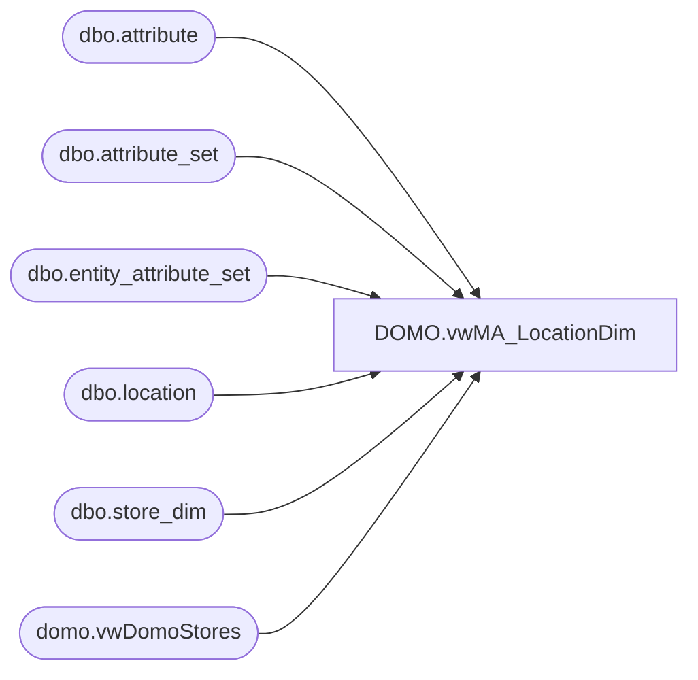

# DOMO.vwMA_LocationDim

**Database:** dw  
**Server:** papamart  

## Architecture Diagram



## Table Dependencies

| Referenced Table |
|---|
| dbo.attribute |
| dbo.attribute_set |
| dbo.entity_attribute_set |
| dbo.location |
| dbo.store_dim |
| domo.vwDomoStores |

## View Code

```sql
CREATE view [DOMO].[vwMA_LocationDim] as 

with LocAttrStg as
	(
		select 
			l.location_code, 
			att1.attribute_set_code as StoreConcept,
			att2.attribute_set_code as DCSource,
			att3.attribute_set_code as DistroDay,
			att4.attribute_set_code as DeliveryDay
		from 
			 bedrockdb02.me_01.dbo.location l with (nolock)
		join bedrockdb02.me_01.dbo.entity_attribute_set eas1 (nolock) on l.location_id = eas1.parent_id
		join bedrockdb02.me_01.dbo.attribute_set att1 (nolock) on eas1.attribute_set_id = att1.attribute_set_id
		join bedrockdb02.me_01.dbo.attribute a1 (nolock) on att1.attribute_id = a1.attribute_id and a1.parent_type = 2
		join bedrockdb02.me_01.dbo.entity_attribute_set eas2 (nolock) on l.location_id = eas2.parent_id
		join bedrockdb02.me_01.dbo.attribute_set att2 (nolock) on eas2.attribute_set_id = att2.attribute_set_id
		join bedrockdb02.me_01.dbo.attribute a2 (nolock) on att2.attribute_id = a2.attribute_id and a2.parent_type = 2 
		join bedrockdb02.me_01.dbo.entity_attribute_set eas3 (nolock) on l.location_id = eas3.parent_id
		join bedrockdb02.me_01.dbo.attribute_set att3 (nolock) on eas3.attribute_set_id = att3.attribute_set_id
		join bedrockdb02.me_01.dbo.attribute a3 (nolock) on att3.attribute_id = a3.attribute_id and a3.parent_type = 2 
		join bedrockdb02.me_01.dbo.entity_attribute_set eas4 (nolock) on l.location_id = eas4.parent_id
		join bedrockdb02.me_01.dbo.attribute_set att4 (nolock) on eas4.attribute_set_id = att4.attribute_set_id
		join bedrockdb02.me_01.dbo.attribute a4 (nolock) on att4.attribute_id = a4.attribute_id and a4.parent_type = 2 
		where 
			a1.attribute_code = 'STRCON'
		and a2.attribute_code = 'DC'
		and a3.attribute_code = 'DISDAY'
		and a4.attribute_code =	'DLVDAY'
	),
LocationAttributes as
	(
		select
			l.location_code,
			case when l.location_status_id = 5 then 1 else 0 end as PermCloseStatus,
			isnull(las.StoreConcept, 'N/A') as StoreConcept,
			isnull(las.DCSource, 'N/A') as DCSource,
			isnull(las.DistroDay, 'N/A') as DistroDay,
			isnull(las.DeliveryDay, 'N/A') as DeliveryDay
		from bedrockdb02.me_01.dbo.location l with (nolock) 
		left join LocAttrStg las on l.location_code = las.location_code
	),
LocationUnion as
	(
		select 
			ds.StoreKey as LocationKey,
			ds.StoreNumber as LocationNumber,
			ds.StoreNameAbbr as LocationNameAbbr,
			ds.StoreNameFull as LocationNameFull,
			ds.PermCloseStatus,
			ds.StateProvinceNameAbbr,
			ds.StateProvinceNameFull,
			ds.CountryNameAbbr,
			ds.CountryNameFull,
			ds.Channel,
			ds.TradingGroup,
			ds.SubChannel,
			ds.Zone,
			ds.Area,
			ds.District,
			la.StoreConcept,
			la.DCSource,
			la.DistroDay,
			la.DeliveryDay
		from dw.domo.vwDomoStores ds with (nolock)
		left join LocationAttributes la on ds.StoreNumber = la.location_code
		UNION
		select 
			CAST(sd.store_key as varchar) as LocationKey,
			right(('0000' + CAST(sd.store_id as varchar)), 4) AS LocationNumber,
			sd.store_name_abbrv as LocationNameAbbr,
			sd.store_name as LocationNameFull,
			la.PermCloseStatus,
			sd.state_province as StateProvinceNameAbbr,
			state_province_name as StateProvinceNameFull,
			sd.country as CountryNameAbbr,
			sd.country_name as CountryNameFull,
			'N/A' as Channel,
			CASE WHEN sd.country IN ('US','CA') THEN 'North America'
					  WHEN sd.country IN ('UK','DK','IE','CN') THEN 'Europe'
				 END AS TradingGroup,
			'N/A' as SubChannel,
			'N/A' AS Zone,
			'N/A' AS Area,
			'N/A' AS District,
			la.StoreConcept,
			la.DCSource,
			la.DistroDay,
			la.DeliveryDay
		from dw.dbo.store_dim sd with (nolock)
		left join LocationAttributes la on right(('0000' + CAST(sd.store_id as varchar)), 4) = la.location_code
		where CAST(sd.store_key as varchar) not in (select StoreKey from dw.domo.vwDomoStores)
	)
	
select
	LocationKey,
	LocationNumber,
	LocationNameAbbr,
	LocationNameFull,
	isnull(cast(PermCloseStatus as varchar), 'N/A') as PermCloseStatus,
	isnull(StateProvinceNameAbbr, 'N/A') as StateProvinceNameAbbr,
	isnull(StateProvinceNameFull, 'N/A') as StateProvinceNameFull,
	isnull(CountryNameAbbr, 'N/A') as CountryNameAbbr,
	isnull(CountryNameFull, 'N/A') as CountryNameFull,
	isnull(Channel, 'N/A') as Channel,
	isnull(TradingGroup, 'N/A') as TradingGroup,
	isnull(SubChannel, 'N/A') as SubChannel,
	isnull(Zone, 'N/A') as Zone,
	isnull(Area, 'N/A') as Area,
	isnull(District, 'N/A') as District,
	isnull(StoreConcept, 'N/A') as StoreConcept,
	isnull(DCSource, 'N/A') as DCSource,
	isnull(DistroDay, 'N/A') as DistroDay,
	isnull(DeliveryDay, 'N/A') as DeliveryDay
from LocationUnion
where isnumeric(LocationNumber) = 1
```

