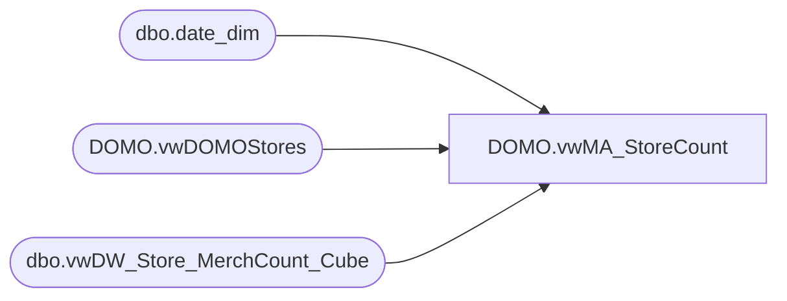

# DOMO.vwMA_StoreCount

**Database:** dw  
**Server:** papamart  

## Architecture Diagram



## Table Dependencies

| Referenced Table |
|---|
| dbo.date_dim |
| DOMO.vwDOMOStores |
| dbo.vwDW_Store_MerchCount_Cube |

## View Code

```sql
CREATE view [DOMO].[vwMA_StoreCount]

as 

select 
	ds.StoreNumber,
	cast(dd.actual_date as date) ActualDate,
	mc.MDSE_WGHT,
	mc.numStores
from 
	dw.dbo.vwDW_Store_MerchCount_Cube mc with (nolock)
	join dw.DOMO.vwDOMOStores ds with (nolock) on ds.StoreKey= CONVERT(VARCHAR,mc.store_key)
	join dw.dbo.date_dim dd with (nolock) on mc.date_key = dd.date_key 
where dd.fiscal_year = 2016
```

