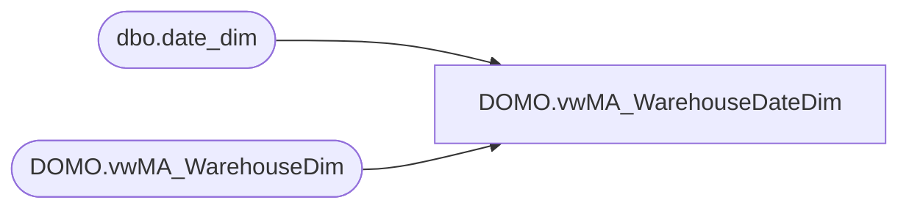

# DOMO.vwMA_WarehouseDateDim

**Database:** dw  
**Server:** papamart  

## Architecture Diagram



## Table Dependencies

| Referenced Table |
|---|
| dbo.date_dim |
| DOMO.vwMA_WarehouseDim |

## View Code

```sql
CREATE view [DOMO].[vwMA_WarehouseDateDim]

as

SELECT	 wd.WarehouseID AS WarehouseKey
		,wd.WarehouseNumber
		,wd.WarehouseNameAbbr
		,wd.WarehouseNameFull
		,wd.WarehousePhoneNumber
		,wd.WarehouseFaxNumber
		,wd.WarehouseEmail
		,wd.TimeZoneDesc
		,wd.StateProvinceNameAbbr
		,wd.StateProvinceNameFull
		,wd.WarehouseLocator
		,wd.WarehouseMallWebsiteURL
		,wd.WarehouseLongitude
		,wd.WarehouseLatitude
		,wd.WarehouseLegalDescription
		,wd.Channel
		,wd.TradingGroup
		,wd.CountryNameAbbr
		,wd.CountryNameFull
		,wd.SubChannel
		,wd.Zone
		,wd.District
		,wd.Area
		,wd.PermCloseStatus
		,CAST(dd.actual_date AS DATE) as CalendarDate
		,dd.day_of_week as DayOfWeek
		,dd.fiscal_week as FiscalWeek
		,dd.fiscal_period as FiscalMonth
		,dd.fiscal_quarter as FiscalQuarter
		,dd.fiscal_year as FiscalYear
		,DATEADD(DAY, -364, dd.actual_date) as CompDate
		,'N/A' as MallType
		,'N/A' as WarehouseType
		,'N/A' as WarehouseDesign
		,'N/A' as LocationType
		,'N/A' as PricingModel
		,'N/A' as Hispanic
		,'N/A' as OpenStatus
		,'N/A' as CompStatus
		,'N/A' as TrafficOpenStatus
		,'N/A' as TrafficCompStatus
		,'N/A' as ZoneDirector
		,'N/A' as DistrictManager
		,'N/A' as AreaManager	
from DOMO.vwMA_WarehouseDim wd with (nolock)
cross join dbo.date_dim dd with (nolock)
where dd.actual_date>=DATEADD(year, -2, DATEADD(yy, DATEDIFF(yy, 0, GETDATE()), 0))
```

