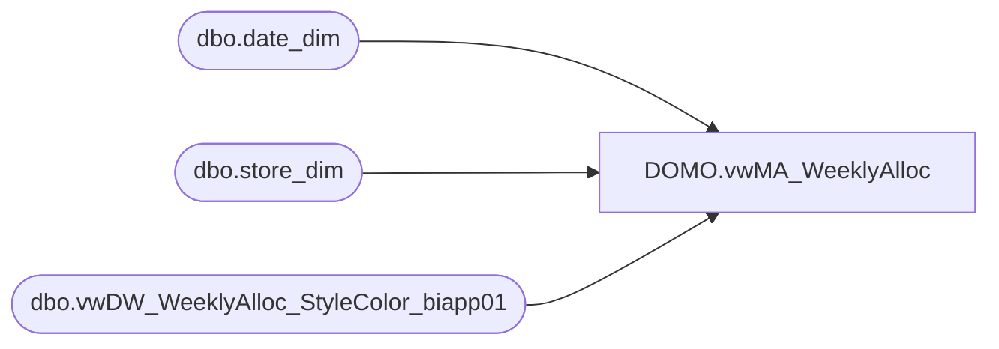

# DOMO.vwMA_WeeklyAlloc

**Database:** dw  
**Server:** papamart  

## Architecture Diagram



## Table Dependencies

| Referenced Table |
|---|
| dbo.date_dim |
| dbo.store_dim |
| dbo.vwDW_WeeklyAlloc_StyleColor_biapp01 |

## View Code

```sql
CREATE view [DOMO].[vwMA_WeeklyAlloc]

as

select 
	 ma.product_key as ProductKey
	,cast(sd.store_id as varchar) as StoreKey
	,cast(dd.actual_date as date) as ActualDate
	,ma.allocation_units as AllocatedUnits
from bedrockdb02.ma_01.dbo.vwDW_WeeklyAlloc_StyleColor_biapp01 ma with (nolock)
join dw.dbo.date_dim dd with (nolock) on ma.date_key = dd.date_key
join dw.dbo.store_dim sd with (nolock) on ma.store_key = sd.store_key
where dd.actual_date>=DATEADD(year, -2, DATEADD(yy, DATEDIFF(yy, 0, GETDATE()), 0))
```

