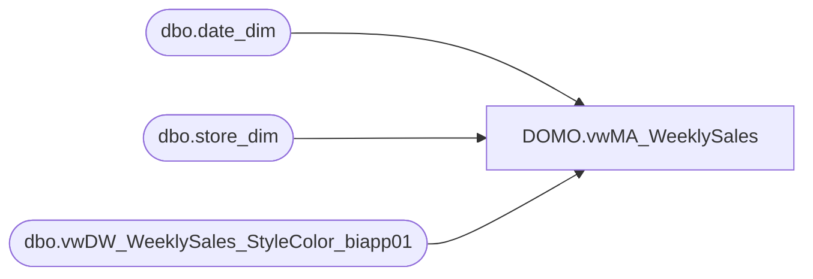

# DOMO.vwMA_WeeklySales

**Database:** dw  
**Server:** papamart  

## Architecture Diagram



## Table Dependencies

| Referenced Table |
|---|
| dbo.date_dim |
| dbo.store_dim |
| dbo.vwDW_WeeklySales_StyleColor_biapp01 |

## View Code

```sql
CREATE view [DOMO].[vwMA_WeeklySales]

as 


select 
	vw.product_key as ProductKey,
	CAST(sd.store_id as varchar) as StoreKey,
	CAST(dd.actual_date AS DATE) as ActualDate,
	vw.perm_md_retail as PermMDRetail,
	vw.perm_mu_retail as PermMURetail,
	vw.perm_mdc_retail as PermMDCRetail,
	vw.perm_muc_retail as PermMUCRetail,
	vw.promo_pc_total_retail as PromoPCTotalRetail,
	--vw.promo_pc_total_retail_te as PromoPCTotalRetailTe,
	vw.received_units as ReceivedUnits,
	vw.received_retail as ReceivedRetail,
	vw.return_to_vendor_units as ReturnToVendorUnits,
	vw.return_to_vendor_retail as ReturnToVendorRetail,
	vw.distributions_units as DistributionUnits,
	vw.distributions_retail as DistributionRetail,
	vw.transfer_in_units as TransferInUnits,
	vw.transfer_in_retail as TransferInRetail,
	vw.transfer_out_units as TransferOutUnits,
	vw.transfer_out_retail as TransferOutRetail,
	vw.sales_total_units as SalesTotalUnits,
	vw.sales_total_retail as SalesTotalRetail,
	vw.sales_total_retail_us_te as SalesTotalRetailUSte,
	vw.sales_total_retail_native_te as SalesTotalRetailNativete,
	vw.sales_total_cost as SalesTotalCost,
	vw.return_units as ReturnUnits,
	vw.return_retail as ReturnRetail,
	vw.return_retail_us_te as ReturnRetailUSte,
	vw.return_retail_native_te as ReturnRetailNativeTe,
	vw.return_cost as ReturnCost,
	vw.shrink_actual_units as ShrinkActualUnits,
	vw.shrink_actual_retail as ShrinkActualRetail,
	vw.adjustments_total_units as AdjustmentTotalUnits,
	vw.adjustments_total_retail as AdjustmentsTotalRetail,
	vw.sales_total_cost_native as SalesTotalCostNative,
	vw.return_cost_native as ReturnCostNative
from bedrockdb02.ma_01.dbo.vwDW_WeeklySales_StyleColor_biapp01 vw with (nolock)
join dw.dbo.date_dim dd with (nolock) on vw.date_key = dd.date_key
join dw.dbo.store_dim sd with (nolock) on vw.store_key = sd.store_key
where dd.year = datepart(yyyy, getdate())
and dd.fiscal_week = 40 --the week of saturday
```

