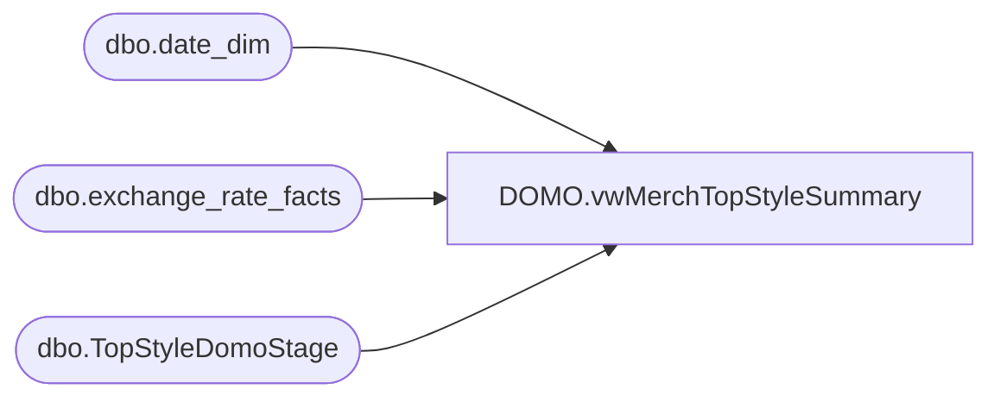

# DOMO.vwMerchTopStyleSummary

**Database:** dw  
**Server:** papamart  

## Architecture Diagram



## Table Dependencies

| Referenced Table |
|---|
| dbo.date_dim |
| dbo.exchange_rate_facts |
| dbo.TopStyleDomoStage |

## View Code

```sql
CREATE view [DOMO].[vwMerchTopStyleSummary]

as

with ExchangeRate as
	(
		--select 
		--	FiscalYear,
		--	FiscalMonth,
		--	FromCurrencyCode,
		--	ToCurrencyCode,
		--	round(ExchangeRate, 8) ExchangeRate
		--from dw.DOMO.vwCurrencyExchangeFact c
		--where 
		--	ToCurrencyCode = 'USD' and FromCurrencyCode = 'GBP'
		--UNION
		--select
		--	FiscalYear,
		--	FiscalMonth,
		--	ToCurrencyCode as FromCurrencyCode,
		--	FromCurrencyCode as ToCurrencyCode,
		--	round((1 / ExchangeRate), 8) ExchangeRate
		--from dw.DOMO.vwCurrencyExchangeFact	
		--where
		--	FromCurrencyCode = 'USD' and ToCurrencyCode = 'GBP'
		SELECT DISTINCT 
			d.fiscal_year AS FiscalYear, 
			d.fiscal_period AS FiscalMonth, 
			e.from_currency_code AS FromCurrencyCode, 
			e.to_currency_code AS ToCurrencyCode, 
			e.fiscal_month_end_rate AS ExchangeRate -- per notes, corporate uses avg, but the month_end_rate has the value that Bryson is expecting...could be that exchange_rate etl is mapped incorrectly...
		FROM dw.dbo.exchange_rate_facts e
		INNER JOIN dw.dbo.date_dim d
		ON d.date_key=e.date_key
		WHERE (e.to_currency_code IN ('USD') AND e.from_currency_code IN ('GBP'))
		AND d.actual_date>=DATEADD(year, -2, DATEADD(yy, DATEDIFF(yy, 0, GETDATE()), 0))
	),
DateDim as 
	(
		select distinct dd.fiscal_year, dd.fiscal_period, 
		datepart(yyyy, dd.actual_date) as actualYear, 
		datepart(wk, dd.actual_date) as actualWeek,
		max(cast(actual_date as date)) as WeekEndingDate
		from dw.dbo.date_dim dd 
		where exists (select er.FiscalYear from ExchangeRate er where er.FiscalYear = dd.fiscal_year and er.FiscalMonth = dd.fiscal_period)
		group by dd.fiscal_year, dd.fiscal_period, 
		datepart(yyyy, dd.actual_date), 
		datepart(wk, dd.actual_date)
	)
select 
	s.*,
	(s.UnitCost / e.ExchangeRate) as UnitCost_UK,
	s.Non_PromoRetail_US_CA as Non_PromoRetail_UK,
	(s.AvgUnitRetail / e.ExchangeRate) as AvgUnitRetail_UK,
	(s.WebUKAvgUnitRetail / e.ExchangeRate) as WebUKAvgUnitRetailex,
	dd.WeekEndingDate
from dwstaging.dbo.TopStyleDomoStage s
join DateDim dd 
	on left(s.MerchWeek, 4) = dd.actualYear
	and cast(right(s.MerchWeek, 2) as int) = dd.actualWeek
join ExchangeRate e 
	on dd.fiscal_year = e.FiscalYear
	and dd.fiscal_period = e.FiscalMonth
```

