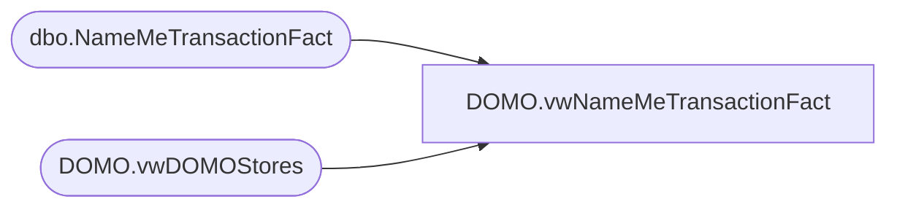

# DOMO.vwNameMeTransactionFact

**Database:** dw  
**Server:** papamart  

## Architecture Diagram



## Table Dependencies

| Referenced Table |
|---|
| dbo.NameMeTransactionFact |
| DOMO.vwDOMOStores |

## View Code

```sql
CREATE view [DOMO].[vwNameMeTransactionFact]

AS
-- =============================================================================================================
-- Name: [DOMO].[vwNameMeTransactionFact]
--
-- Description: Transaction data at the header level.
--
--
-- Dependencies: 
--
-- Revision History
--		Name:				Date:			Comments:
--		Anthony Delgado		10/07/2016		Initial creation
--
-- =============================================================================================================
SELECT n.[NameMeTransactionKey]
      ,ds.[StoreID] AS StoreKey
      ,n.[ProductKey]
      ,n.[NameMeTransactionNumber]
      ,n.[AnimalBarCode]
      ,n.[AnimalName]
      ,n.[AnimalBirthDate]
      ,n.[TransactionStartDate] AS TransactionDateTime
      ,CAST(n.[TransactionStartDate] AS DATE) AS TransactionDate
      ,n.[TransactionDuration]
      ,CASE WHEN n.[Gift]=0 THEN 'No'
			WHEN n.[Gift]=1 THEN 'Yes'
			WHEN n.[Gift] IS NULL THEN 'Unknown'
			ELSE 'Unknown'
		END AS Gift
      ,CASE WHEN n.[FirstVisit]=0 THEN 'No'
			WHEN n.[FirstVisit]=1 THEN 'Yes'
			WHEN n.[FirstVisit] IS NULL THEN 'Unknown'
			ELSE 'Unknown'
		END AS FirstVisit
      ,n.[Age]
      ,n.[TransactionSource]
      ,n.[Gender]
      ,n.[InsertedDate]
  FROM [dw].[dbo].[NameMeTransactionFact] n INNER JOIN
	    [dw].[DOMO].[vwDOMOStores] ds WITH(NOLOCK)
			ON ds.StoreKey=CONVERT(VARCHAR,n.StoreKey) 
WHERE CAST(n.TransactionStartDate AS DATE)>=DATEADD(year, -2, DATEADD(yy, DATEDIFF(yy, 0, GETDATE()), 0))
AND CAST(n.TransactionStartDate AS DATE)<CAST(GETDATE() AS DATE)
```

