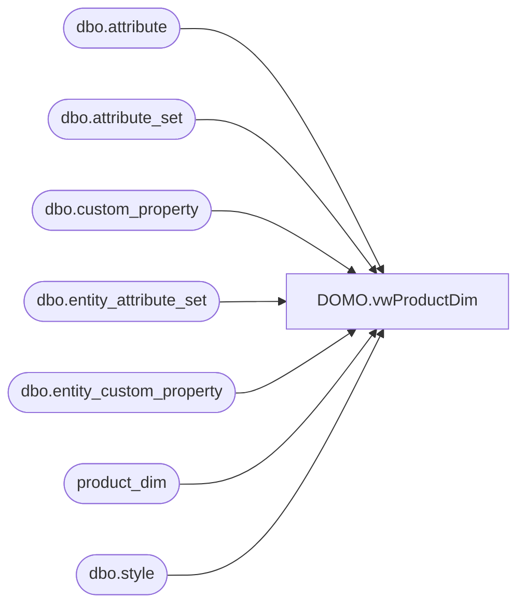

# DOMO.vwProductDim

**Database:** dw  
**Server:** papamart  

## Architecture Diagram



## Table Dependencies

| Referenced Table |
|---|
| dbo.attribute |
| dbo.attribute_set |
| dbo.custom_property |
| dbo.entity_attribute_set |
| dbo.entity_custom_property |
| product_dim |
| dbo.style |

## View Code

```sql
CREATE view [DOMO].[vwProductDim]

as
-- =============================================================================================================
-- Name: [DOMO].[vwProductDim]
--
-- Description: Product Dimension
--
--
-- Dependencies: 
--
-- Revision History
--		Name:				Date:			Comments:
--		Dan Tweedie		11/11/2015		
--		Dan Tweedie		05/16/2016			Added join to Merchandising system to get KeyStory. We'll circle back to add KeyStory to DW Product_Dim later.
--		Dan Tweedie		10/10/2016			Added Custom Properties and Attributes: 'IDATE', 'ODATE', 'ONOTE', 'OUTLET','OMSTAT' 
--											
-- =============================================================================================================


with Attibutes as 
(
	select 
		s.style_code, 
		cp.cust_prop_code AttributeName, 
		ecp.custom_property_value AttributeValue
	from bedrockdb02.me_01.dbo.style s
	join bedrockdb02.me_01.dbo.entity_custom_property ecp on s.style_id = ecp.parent_id and ecp.parent_type = 1
	join bedrockdb02.me_01.dbo.custom_property cp (nolock) on cp.custom_property_id = ecp.custom_property_id 
	where cp.cust_prop_code in ('IDATE', 'ODATE', 'ONOTE')
	union
	select 
		s.style_code, 
		a.attribute_code AttributeName, 
		att.attribute_set_code AttributeValue
	from bedrockdb02.me_01.dbo.style s (nolock)
	join bedrockdb02.me_01.dbo.entity_attribute_set eas (nolock) on s.style_id = eas.parent_id
	join bedrockdb02.me_01.dbo.attribute_set att (nolock) on eas.attribute_set_id = att.attribute_set_id
	join bedrockdb02.me_01.dbo.attribute a (nolock) on att.attribute_id = a.attribute_id and a.parent_type = 1
	where a.attribute_code in ('OUTLET','OMSTAT')
),
AttrPivot as 
	(
		select 
			style_code,
			case when AttributeName = 'IDATE' then AttributeValue else NULL end as IDATE,
			case when AttributeName = 'ODATE' then AttributeValue else NULL end as ODATE,
			case when AttributeName = 'ONOTE' then AttributeValue else NULL end as ONOTE,
			case when AttributeName = 'OUTLET' then AttributeValue else NULL end as OUTLET,
			case when AttributeName = 'OMSTAT' then AttributeValue else NULL end as OMSTAT
		from 
			Attibutes
	),
MaxAttr as
	(	
		select
			style_code,
			max(IDATE) IDATE,
			max(ODATE) ODATE,
			max(ONOTE) ONOTE,
			max(OUTLET) OUTLET,
			max(OMSTAT) OMSTAT
		from AttrPivot
		group by style_code
	)
select pd.product_key as ProductKey,
       pd.style_code as Style,
	   ISNULL(pd.style_desc, pd.product_desc) as StyleDescription,
	   pd.color_desc as Color,
	   pd.Concept as Concept,
	   pd.Chain as Chain,
	   pd.division as Division,
	   pd.department as Department,
	   pd.class as Class,
	   pd.subclass as SubClass,
	   pd.department_code as DeptCode,
	   pd.subclass_code as SubClassCode,
	   pd.ScorecardCategory as ScorecardCategory,
	   pd.primary_vendor_code as PrimaryVendorCode,
	   pd.primary_vendor_name as PrimaryVendorName,
	   pd.alt_primary_vendor_code as AltPrimaryVendorCode,
	   pd.current_retail as CurrentRetail,
	   pd.original_retail as OriginalRetail,
	   pd.current_selling_retail_home as CurrentSellingRetailHome,
	   pd.price_with_vat as PriceWithVat,
	   pd.euro_value as EuroValue,
	   pd.cdn_value as CanValue,
	   pd.merch_status as MerchStatus, 
	   pd.jurisdiction_code as JurisdictionCode,
	   pd.gender as Gender,
	   pd.core_fash_cd as CoreFashCode,
	   pd.inline_cd as InlineCode,
	   cast(pd.activation_date as date) ActivationDate,
	   ecp.custom_property_value as KeyStory,
	   ma.IDATE,
	   ma.ODATE,
	   ma.ONOTE,
	   ma.OUTLET,
	   ma.OMSTAT
from product_dim pd with (nolock)
left join bedrockdb02.me_01.dbo.style s on pd.style_code = s.style_code 
left join bedrockdb02.me_01.dbo.entity_custom_property ecp on s.style_id = ecp.parent_id and ecp.parent_type = 1 and ecp.custom_property_id = 60 -- 60 = KEYSTY
left join MaxAttr ma on pd.style_code = ma.style_code
```

