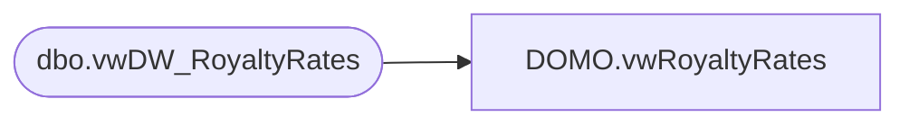

# DOMO.vwRoyaltyRates

**Database:** dw  
**Server:** papamart  

## Architecture Diagram



## Table Dependencies

| Referenced Table |
|---|
| dbo.vwDW_RoyaltyRates |

## View Code

```sql
CREATE VIEW DOMO.vwRoyaltyRates
AS
SELECT        franchID, Name, StartDate, EndDate, AttributeText, Code
FROM            KODIAK.FranchMstrData.dbo.vwDW_RoyaltyRates AS vwDW_RoyaltyRates
```

