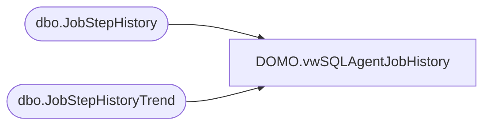

# DOMO.vwSQLAgentJobHistory

**Database:** dw  
**Server:** papamart  

## Architecture Diagram



## Table Dependencies

| Referenced Table |
|---|
| dbo.JobStepHistory |
| dbo.JobStepHistoryTrend |

## View Code

```sql
CREATE VIEW [DOMO].[vwSQLAgentJobHistory] AS
-- =============================================================================================================
-- Name: [DOMO].[vwDOMOSQLAgentJobHistory]
--
-- Description: SQL Agent job history stats for last 30 days.
--
--
-- Dependencies: 
--
-- Revision History
--		Name:				Date:			Comments:
--		Anthony Delgado		12/30/2015		Initial Creation
-- =============================================================================================================
 SELECT jsh.[recID] AS RecordID
	  ,jsh.[SERVER] AS ServerName
      ,jsh.[job_name] AS JobName
	  ,jsh.[step_id] AS StepID
      ,jsh.[step_name] AS StepName
      ,jsh.[run_date] AS RunDate
      ,jsh.[run_startDateTime] AS RunStartDateTime
      ,jsh.[run_endDateTime] AS RunEndDateTime
      ,jsh.[run_duration_secs] AS RunDuration
	  ,jsht.[avgRunDurationSecs] AS AvgRunDuration
	  ,jsh.[run_duration_secs]-jsht.[avgRunDurationSecs] AS RunDurationDeltaFromAvg
	  ,jsht.stdDev AS StdDev
	  ,CASE WHEN jsht.stdDev=0 THEN 0 ELSE (jsh.[run_duration_secs]-jsht.[avgRunDurationSecs])/jsht.stdDev END AS StdDevsOff
  FROM BABWSCORE01.[JobHistory].[dbo].[JobStepHistory] jsh 
  INNER JOIN BABWSCORE01.[JobHistory].[dbo].[JobStepHistoryTrend] jsht
		ON jsht.[SERVER]=jsh.[SERVER]
		AND jsht.job_name=jsh.job_name
		AND jsht.step_id=jsh.step_id
  WHERE jsh.run_date>GETDATE()-90
```

