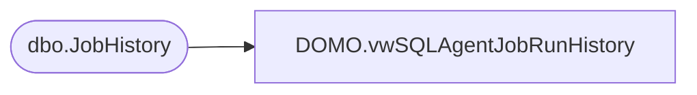

# DOMO.vwSQLAgentJobRunHistory

**Database:** dw  
**Server:** papamart  

## Architecture Diagram



## Table Dependencies

| Referenced Table |
|---|
| dbo.JobHistory |

## View Code

```sql
CREATE VIEW [DOMO].[vwSQLAgentJobRunHistory] AS
-- =============================================================================================================
-- Name: [DOMO].[vwDOMOSQLAgentJobRunHistory]
--
-- Description: SQL Agent job history stats for last 90 days.
--
--
-- Dependencies: 
--
-- Revision History
--		Name:				Date:			Comments:
--		Tim Bytnar		12/30/2015		Initial Creation
-- =============================================================================================================

SELECT [job_name]
      ,[run_startDateTime]
      ,[run_endDateTime]
      ,[run_duration_secs]
      ,[SERVER]
      ,[Run_Status_Text]
FROM BABWSCORE01.[JobHistory].[dbo].[JobHistory]
WHERE [run_startDateTime]>GETDATE()-90
```

