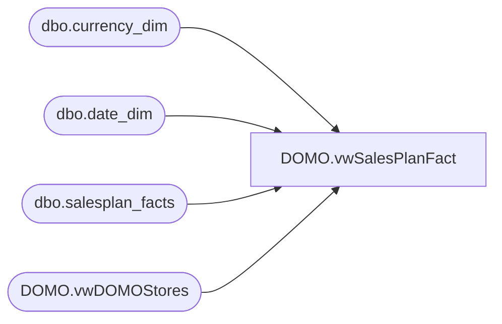

# DOMO.vwSalesPlanFact

**Database:** dw  
**Server:** papamart  

## Architecture Diagram



## Table Dependencies

| Referenced Table |
|---|
| dbo.currency_dim |
| dbo.date_dim |
| dbo.salesplan_facts |
| DOMO.vwDOMOStores |

## View Code

```sql
CREATE VIEW [DOMO].[vwSalesPlanFact]
AS
SELECT CAST(ds.StoreID AS VARCHAR) AS StoreKey
	, dd.Actual_Date AS CalendarDate
	, cd.currency_code AS CurrencyCode
	, spf.amount AS SalesPlan
FROM DW.dbo.salesplan_facts spf
INNER JOIN DW.DOMO.vwDOMOStores ds
	ON ds.StoreKey=CAST(spf.store_key AS VARCHAR)
INNER JOIN DW.dbo.date_dim dd
	ON dd.date_key=spf.date_key 
INNER JOIN DW.dbo.currency_dim cd
	ON cd.currency_key=spf.currency_key
WHERE spf.amount <> 0
AND dd.actual_date>=DATEADD(year, -2, DATEADD(yy, DATEDIFF(yy, 0, GETDATE()), 0))
```

