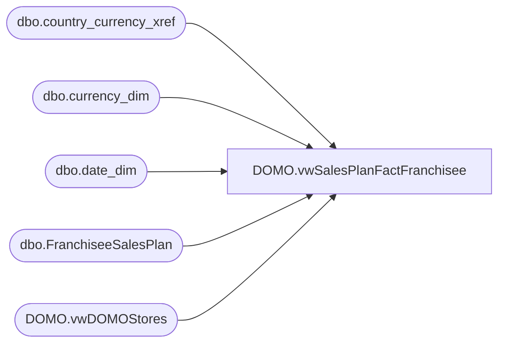

# DOMO.vwSalesPlanFactFranchisee

**Database:** dw  
**Server:** papamart  

## Architecture Diagram



## Table Dependencies

| Referenced Table |
|---|
| dbo.country_currency_xref |
| dbo.currency_dim |
| dbo.date_dim |
| dbo.FranchiseeSalesPlan |
| DOMO.vwDOMOStores |

## View Code

```sql
CREATE VIEW [DOMO].[vwSalesPlanFactFranchisee]
AS

SELECT  fsp.StoreID AS StoreKey
	   ,dd.actual_date AS CalendarDate
	   ,cd.currency_code AS CurrencyCode
	   ,fsp.PlannedSales/7 AS SalesPlan
FROM DW.dbo.FranchiseeSalesPlan fsp
INNER JOIN DW.DOMO.vwDOMOStores ds
	ON ds.StoreID=fsp.StoreID
INNER JOIN DW.dbo.date_dim dd
	ON dd.fiscal_year=fsp.FiscalYear
	AND dd.fiscal_week=fsp.FiscalWeek
INNER JOIN DW.dbo.country_currency_xref cc
	ON cc.country_code=fsp.Franchisee
INNER JOIN DW.dbo.currency_dim cd
	ON cd.currency_key=cc.currency_key
WHERE dd.actual_date>=DATEADD(year, -2, DATEADD(yy, DATEDIFF(yy, 0, GETDATE()), 0))
```

