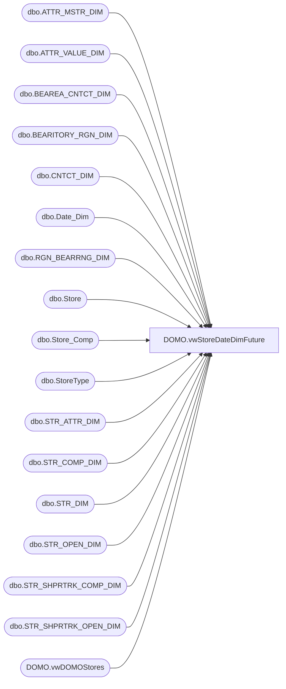

# DOMO.vwStoreDateDimFuture

**Database:** dw  
**Server:** papamart  

## Architecture Diagram



## Table Dependencies

| Referenced Table |
|---|
| dbo.ATTR_MSTR_DIM |
| dbo.ATTR_VALUE_DIM |
| dbo.BEAREA_CNTCT_DIM |
| dbo.BEARITORY_RGN_DIM |
| dbo.CNTCT_DIM |
| dbo.Date_Dim |
| dbo.RGN_BEARRNG_DIM |
| dbo.Store |
| dbo.Store_Comp |
| dbo.StoreType |
| dbo.STR_ATTR_DIM |
| dbo.STR_COMP_DIM |
| dbo.STR_DIM |
| dbo.STR_OPEN_DIM |
| dbo.STR_SHPRTRK_COMP_DIM |
| dbo.STR_SHPRTRK_OPEN_DIM |
| DOMO.vwDOMOStores |

## View Code

```sql
CREATE VIEW [DOMO].[vwStoreDateDimFuture] AS
-- =============================================================================================================
-- Name: [DOMO].[vwStoreDateDimFuture] 
--
-- Description: Store dimension by date, from today's date through end of dw.dbo.date_dim.
--				StoreKey is the 'User Friendly' store number.  We send this as the StoreKey to DOMO to be used in joins.
--				StoreNumber is the 'Display' store number padded with zeros (i.e. store 1 is 0001).
--
--
-- Dependencies: 
--
-- Revision History
--		Name:				Date:			Comments:
--		Anthony Delgado		05/16/2016		Initial creation
--
-- =============================================================================================================
WITH GeographyLeaders
	(
		StoreNumber
		,GeoLeaderType
		,LeaderName
		,StartDate
		,EndDate
	)
AS	(
		SELECT sd.STR_NUM, 'ZoneDirector', cd.FRST_NM + ' ' + cd.LAST_NM, zd.STRT_DT, zd.END_DT
		FROM KODIAK.BABWMstrData.dbo.RGN_BEARRNG_DIM zd
		INNER JOIN KODIAK.BABWMstrData.dbo.CNTCT_DIM cd
			ON zd.CNTCT_ID=cd.CNTCT_ID
		INNER JOIN KODIAK.BABWMstrData.dbo.STR_DIM sd
			ON sd.RGN_ID=zd.RGN_ID
		UNION ALL
		SELECT sd.STR_NUM, 'DistrictManager', cd.FRST_NM + ' ' + cd.LAST_NM, dd.STRT_DT, dd.END_DT
		FROM KODIAK.BABWMstrData.dbo.BEARITORY_RGN_DIM dd
		INNER JOIN KODIAK.BABWMstrData.dbo.CNTCT_DIM cd
			ON dd.CNTCT_ID=cd.CNTCT_ID
		INNER JOIN KODIAK.BABWMstrData.dbo.STR_DIM sd
			ON sd.RGN_ID=dd.BEARITORY_ID
		UNION ALL
		SELECT sd.STR_NUM, 'AreaManager', cd.FRST_NM + ' ' + cd.LAST_NM, ad.STRT_DT, ad.END_DT
		FROM KODIAK.BABWMstrData.dbo.BEAREA_CNTCT_DIM ad
		INNER JOIN KODIAK.BABWMstrData.dbo.CNTCT_DIM cd
			ON ad.CNTCT_ID=cd.CNTCT_ID
		INNER JOIN KODIAK.BABWMstrData.dbo.STR_DIM sd
			ON sd.RGN_ID=ad.BEAREA_ID
	),
StoreAttributes	
	(	
		StoreNumber
		,AttributeName
		,AttributeValue
		,StartDate
		,EndDate
	)
AS
	(
		-- Corp Store 'Attributes'
		SELECT	CAST(sd.STR_NUM AS VARCHAR)
				,amd.TITLE
				,avd.TITLE
				,ad.STRT_DT
				,ad.END_DT
		FROM	KODIAK.BABWMstrData.dbo.STR_DIM sd
		INNER JOIN KODIAK.BABWMstrData.dbo.STR_ATTR_DIM ad
			ON ad.STR_ID=sd.STR_ID
		INNER JOIN KODIAK.BABWMstrData.dbo.ATTR_MSTR_DIM amd
			ON amd.ATTR_MSTR_ID=ad.ATTR_MSTR_ID
		INNER JOIN KODIAK.BABWMstrData.dbo.ATTR_VALUE_DIM avd
			ON avd.ATTR_VALUE_ID=ad.ATTR_VALUE_ID
		WHERE ad.ATTR_MSTR_ID IN	(
										 1  -- Mall Type
										,2  -- Store Type
										,19 -- Store Design
										,20 -- Location Type
										,21 -- Pricing Model
										,22 -- Hispanic
									)
		UNION ALL		
		-- Corp Store Open Dates
		SELECT	CAST(sd.STR_NUM AS VARCHAR)
				,'Open Status'
				,'Open'
				,sod.OPEN_DT
				,sod.CLOSE_DT
		FROM	KODIAK.BABWMstrData.dbo.STR_OPEN_DIM sod
		INNER JOIN KODIAK.BABWMstrData.dbo.STR_DIM sd
			ON sd.STR_ID=sod.STR_KEY 
		UNION ALL
		-- Corp Store Comp Dates
		SELECT	CAST(sd.STR_NUM AS VARCHAR)
				,'Comp Status'
				,'Comp'
				,scd.Start_Comp_Date
				,scd.End_Comp_Date
		FROM	KODIAK.BABWMstrData.dbo.STR_COMP_DIM scd
		INNER JOIN KODIAK.BABWMstrData.dbo.STR_DIM sd
			ON sd.STR_ID=scd.STR_ID 
		UNION ALL
		-- Corp Store Traffic Open Dates
		SELECT	CAST(sd.STR_NUM AS VARCHAR)
				,'Traffic Open Status'
				,'Open'
				,stod.OPEN_DT
				,stod.CLOSE_DT
		FROM	KODIAK.BABWMstrData.dbo.STR_SHPRTRK_OPEN_DIM stod
		INNER JOIN KODIAK.BABWMstrData.dbo.STR_DIM sd
			ON sd.STR_ID=stod.STR_KEY 
		UNION ALL
		-- Corp Store Traffic Comp Dates
		SELECT	CAST(sd.STR_NUM AS VARCHAR)
				,'Traffic Comp Status'
				,'Comp'
				,stcd.Start_Comp_Date
				,stcd.End_Comp_Date
		FROM	KODIAK.BABWMstrData.dbo.STR_SHPRTRK_COMP_DIM stcd
		INNER JOIN KODIAK.BABWMstrData.dbo.STR_DIM sd
			ON sd.STR_ID=stcd.STR_ID 
		UNION ALL
		-- Franchise Store Open Dates
		SELECT	CAST(s.Code AS VARCHAR)
				,'Open Status'
				,'Open'
				,sc.Open_Date
				,sc.Close_Date
		FROM	KODIAK.FranchMstrData.dbo.Store_Comp sc
		INNER JOIN KODIAK.FranchMstrData.dbo.Store s
			ON s.storeID=sc.storeID 
		UNION ALL
		-- Franchise Store Comp Dates
		SELECT	CAST(s.Code AS VARCHAR)
				,'Comp Status'
				,'Comp'
				,sc.Start_Comp_Date
				,sc.End_Comp_Date
		FROM	KODIAK.FranchMstrData.dbo.Store_Comp sc
		INNER JOIN KODIAK.FranchMstrData.dbo.Store s
			ON s.storeID=sc.storeID 
		UNION ALL
		-- Franchise Store Type
		SELECT	CAST(s.Code AS VARCHAR)
				,'Store Type'
				,st.Descrip
				,MIN(sc.Open_Date)
				,'2399-12-31'
		FROM	KODIAK.FranchMstrData.dbo.Store_Comp sc
		INNER JOIN KODIAK.FranchMstrData.dbo.Store s
			ON s.storeID=sc.storeID 
		INNER JOIN KODIAK.FranchMstrData.dbo.StoreType st
			ON st.storeTypeID=s.storeTypeID
		WHERE st.descrip IN ('Store', 'Web')
		GROUP BY s.Code, st.Descrip
		UNION ALL
		-- Geography Leaders
		SELECT	CAST(StoreNumber AS VARCHAR)
				,GeoLeaderType
				,LeaderName
				,StartDate
				,EndDate
		FROM GeographyLeaders
	),
StoreAttributesByDate 
	(	
		StoreNumber
		,CalendarDate
		,DayOfWeek
		,FiscalWeek
		,FiscalMonth
		,FiscalQuarter
		,FiscalYear
		,CompDate
		,MallType
		,StoreType
		,StoreDesign
		,LocationType
		,PricingModel
		,Hispanic
		,OpenStatus
		,CompStatus
		,TrafficOpenStatus
		,TrafficCompStatus
		,ZoneDirector
		,DistrictManager
		,AreaManager
	) 
AS	(
		SELECT	sa.StoreNumber
				,CAST(dd.actual_date AS DATE)
				,dd.day_of_week
				,dd.fiscal_week
				,dd.fiscal_period
				,dd.fiscal_quarter
				,dd.fiscal_year
				,DATEADD(DAY, -364, dd.actual_date)
				,MAX(CASE WHEN (sa.AttributeName='Mall Type' AND CAST(dd.actual_date AS DATE) BETWEEN sa.StartDate and sa.EndDate) THEN sa.AttributeValue END)
				,MAX(CASE WHEN (sa.AttributeName='Store Type' AND CAST(dd.actual_date AS DATE) BETWEEN sa.StartDate and sa.EndDate) THEN sa.AttributeValue END)
				,MAX(CASE WHEN (sa.AttributeName='Store Design' AND CAST(dd.actual_date AS DATE) BETWEEN sa.StartDate and sa.EndDate) THEN sa.AttributeValue END)
				,MAX(CASE WHEN (sa.AttributeName='Location Type' AND CAST(dd.actual_date AS DATE) BETWEEN sa.StartDate and sa.EndDate) THEN sa.AttributeValue END)
				,MAX(CASE WHEN (sa.AttributeName='Pricing Model' AND CAST(dd.actual_date AS DATE) BETWEEN sa.StartDate and sa.EndDate) THEN sa.AttributeValue END)
				,MAX(CASE WHEN (sa.AttributeName='Hispanic' AND CAST(dd.actual_date AS DATE) BETWEEN sa.StartDate and sa.EndDate) THEN sa.AttributeValue END)
				,MAX(CASE WHEN (sa.AttributeName='Open Status' AND CAST(dd.actual_date AS DATE) BETWEEN sa.StartDate and sa.EndDate) THEN 1 ELSE 0 END)
				,MAX(CASE WHEN (sa.AttributeName='Comp Status' AND CAST(dd.actual_date AS DATE) BETWEEN sa.StartDate and sa.EndDate) THEN 1 ELSE 0 END)
				,MAX(CASE WHEN (sa.AttributeName='Traffic Open Status' AND CAST(dd.actual_date AS DATE) BETWEEN sa.StartDate and sa.EndDate) THEN 1 ELSE 0 END)
				,MAX(CASE WHEN (sa.AttributeName='Traffic Comp Status' AND CAST(dd.actual_date AS DATE) BETWEEN sa.StartDate and sa.EndDate) THEN 1 ELSE 0 END)
				,MAX(CASE WHEN (sa.AttributeName='ZoneDirector' AND CAST(dd.actual_date AS DATE) BETWEEN sa.StartDate and sa.EndDate) THEN sa.AttributeValue END)
				,MAX(CASE WHEN (sa.AttributeName='DistrictManager' AND CAST(dd.actual_date AS DATE) BETWEEN sa.StartDate and sa.EndDate) THEN sa.AttributeValue END)
				,MAX(CASE WHEN (sa.AttributeName='AreaManager' AND CAST(dd.actual_date AS DATE) BETWEEN sa.StartDate and sa.EndDate) THEN sa.AttributeValue END)
		FROM StoreAttributes sa
		CROSS JOIN dbo.Date_Dim dd	
		WHERE dd.actual_date>=CONVERT(DATE,GETDATE())
		GROUP BY sa.StoreNumber, dd.actual_date, dd.day_of_week, dd.fiscal_week, dd.fiscal_period, dd.fiscal_quarter, dd.fiscal_year, DATEADD(DAY, -364, dd.actual_date)
	)
SELECT	 ds.StoreID AS StoreKey
		,ds.StoreNumber
		,ds.StoreNameAbbr
		,ds.StoreNameFull
		,ds.StorePhoneNumber
		,ds.StoreFaxNumber
		,ds.StoreEmail
		,ds.TimeZoneDesc
		,ds.StateProvinceNameAbbr
		,ds.StateProvinceNameFull
		,ds.StoreLocator
		,ds.StoreMallWebsiteURL
		,ds.StoreLongitude
		,ds.StoreLatitude
		,ds.StoreLegalDescription
		,ds.Channel
		,ds.TradingGroup
		,ds.CountryNameAbbr
		,ds.CountryNameFull
		,ds.SubChannel
		,ds.Zone
		,ds.District
		,ds.Area
		,ds.PermCloseStatus
		,sa.CalendarDate
		,sa.DayOfWeek
		,sa.FiscalWeek
		,sa.FiscalMonth
		,sa.FiscalQuarter
		,sa.FiscalYear
		,sa.CompDate
		,sa.MallType
		,sa.StoreType
		,sa.StoreDesign
		,sa.LocationType
		,sa.PricingModel
		,sa.Hispanic
		,sa.OpenStatus
		,sa.CompStatus
		,sa.TrafficOpenStatus
		,sa.TrafficCompStatus
		,sa.ZoneDirector
		,sa.DistrictManager
		,sa.AreaManager	
FROM	DOMO.vwDOMOStores ds
INNER JOIN StoreAttributesByDate sa
	ON CAST(ds.StoreID AS VARCHAR)=sa.StoreNumber
```

