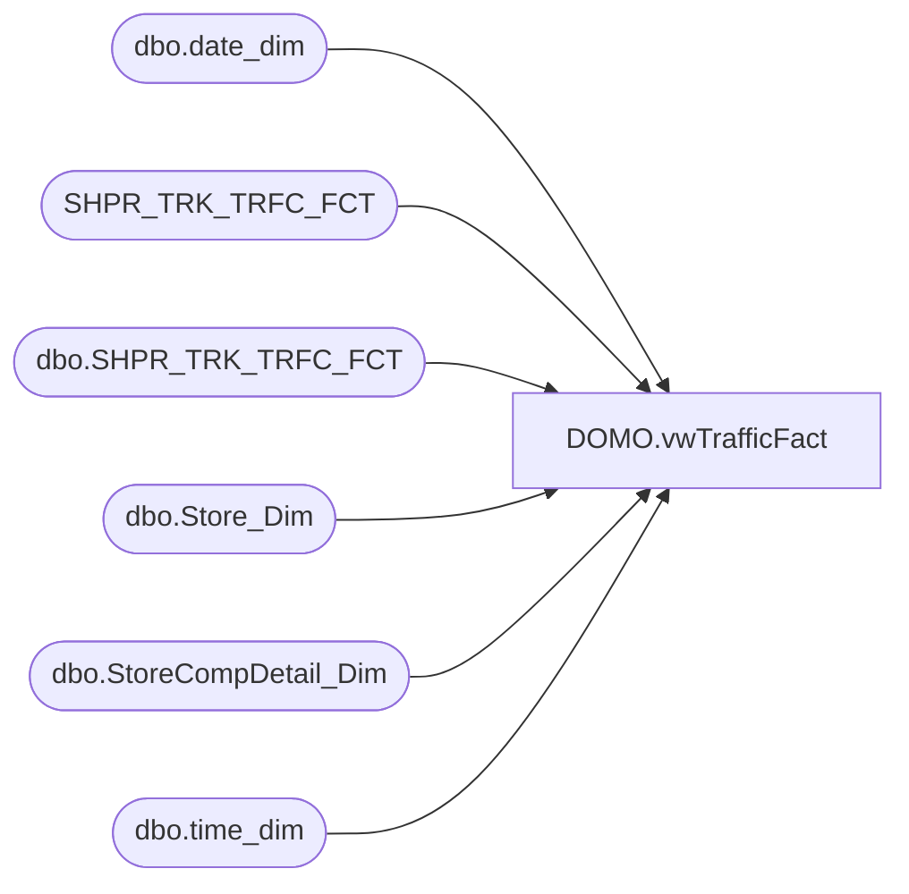

# DOMO.vwTrafficFact

**Database:** dw  
**Server:** papamart  

## Architecture Diagram



## Table Dependencies

| Referenced Table |
|---|
| dbo.date_dim |
| SHPR_TRK_TRFC_FCT |
| dbo.SHPR_TRK_TRFC_FCT |
| dbo.Store_Dim |
| dbo.StoreCompDetail_Dim |
| dbo.time_dim |

## View Code

```sql
CREATE VIEW [DOMO].[vwTrafficFact] AS
-- =============================================================================================================
-- Name: [DOMO].[vwTraffic]
--
-- Description: Traffic by store and hour.  
--
--
-- Dependencies: 
--
-- Revision History
--		Name:				Date:			Comments:
--		Anthony Delgado		11/12/2015		Initial creation
--		Anthony Delgado		06/21/2016		Added HasDailyTraffic flag
--
-- =============================================================================================================
WITH HasDailyTraffic (StoreKey, DateKey, HasDailyTraffic) AS (
	SELECT 
		s.STR_KEY,
		s.DT_KEY,
		CASE WHEN SUM(s.EXITS) = 0 THEN 0
			ELSE 1
		END
	FROM SHPR_TRK_TRFC_FCT s
	INNER JOIN DW.dbo.date_dim d
		ON d.date_key=s.DT_KEY
	WHERE
		(s.ENTERS <> 0
		OR s.EXITS <> 0)
		AND d.actual_date>=DATEADD(day, -7, DATEADD(year, -2, DATEADD(yy, DATEDIFF(yy, 0, GETDATE()), 0)))
	GROUP BY 
		s.STR_KEY,
		s.DT_KEY
	)
SELECT  sd.store_id AS StoreKey,
		CAST(dd.actual_date AS DATE) AS TrafficDate,
		td.hour AS TrafficHour,
	    SUM(sttf.EXITS) AS Traffic,
		h.HasDailyTraffic -- This field is used in "Traffic" transaction counts - when we only count transactions for stores that have traffic during that day.  Critical for conversion calcs.
FROM
	DW.dbo.SHPR_TRK_TRFC_FCT sttf 
	INNER JOIN DW.dbo.date_dim dd 
		ON dd.date_key = sttf.DT_KEY
	INNER JOIN DW.dbo.time_dim td 
		ON td.time_key = sttf.TM_KEY
	LEFT JOIN DW.dbo.StoreCompDetail_Dim cmp 
		ON cmp.store_key = sttf.STR_KEY AND cmp.date_key = sttf.DT_KEY
	INNER JOIN DW.dbo.Store_Dim sd
		ON sd.store_key=sttf.STR_KEY
	INNER JOIN HasDailyTraffic h
		ON h.StoreKey=sttf.STR_KEY
		AND h.DateKey=sttf.DT_KEY
WHERE
	(sttf.ENTERS <> 0
	OR sttf.EXITS <> 0)
	AND dd.actual_date>=DATEADD(day, -7, DATEADD(year, -2, DATEADD(yy, DATEDIFF(yy, 0, GETDATE()), 0)))
GROUP BY sd.store_id,
		 dd.actual_date,
		 td.hour,
		 h.HasDailyTraffic
```

