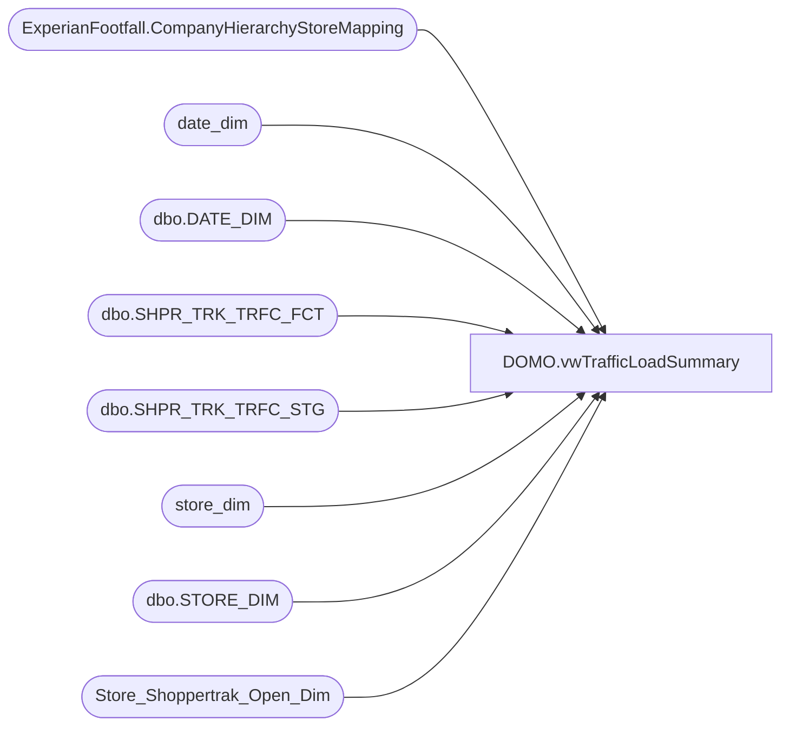

# DOMO.vwTrafficLoadSummary

**Database:** dw  
**Server:** papamart  

## Architecture Diagram



## Table Dependencies

| Referenced Table |
|---|
| ExperianFootfall.CompanyHierarchyStoreMapping |
| date_dim |
| dbo.DATE_DIM |
| dbo.SHPR_TRK_TRFC_FCT |
| dbo.SHPR_TRK_TRFC_STG |
| store_dim |
| dbo.STORE_DIM |
| Store_Shoppertrak_Open_Dim |

## View Code

```sql
CREATE VIEW [DOMO].[vwTrafficLoadSummary] AS
-- =============================================================================================================
-- Name: [DOMO].[vwTrafficLoadSummary]
--
-- Description: Traffic load summary for today.  
--
--
-- Dependencies: 
--
-- Revision History
--		Name:				Date:			Comments:
--		Anthony Delgado		03/03/2016		Initial creation
--
-- =============================================================================================================
WITH Data_Ind_Nm (StoreID, InputedInd) AS (
		SELECT DISTINCT sd.STORE_ID, tf.Data_Ind_Nm
		FROM [dw].[dbo].[SHPR_TRK_TRFC_FCT] tf
		INNER JOIN [dw].[dbo].[STORE_DIM] sd
			ON sd.STORE_KEY=tf.STR_KEY
		INNER JOIN [dw].[dbo].[DATE_DIM] dd
			ON dd.DATE_KEY=tf.DT_KEY
		WHERE dd.ACTUAL_DATE=GETDATE()-1
		AND tf.Data_Ind_Nm='Inputed'
		),
	TrafficFact (StoreID, SumEnters, SumExits) AS (
		SELECT sd.STORE_ID, SUM(t.enters), SUM(t.exits)
		FROM [dw].[dbo].[SHPR_TRK_TRFC_FCT] t
		INNER JOIN [dw].[dbo].[STORE_DIM] sd
			ON sd.STORE_KEY=t.STR_KEY
		INNER JOIN [dw].[dbo].[DATE_DIM] dd
			ON dd.DATE_KEY=t.DT_KEY
		WHERE dd.ACTUAL_DATE=CAST(GETDATE()-1 AS DATE)
		GROUP BY sd.STORE_ID
		),
	 TrafficSTG (StoreID, SumEnters, SumExits) AS (
		SELECT CUST_ID, sum(enters), sum(exits)
		FROM [DWStaging].[dbo].[SHPR_TRK_TRFC_STG] 
		WHERE DT=convert(int, convert(varchar(10), GETDATE()-1, 112))
		AND SHPR_TRK_ORG_ID not like '4____'
		GROUP BY CUST_ID
		),
	TrafficVendor (StoreID, IsShopperTrak, IsFootFall) AS (
		SELECT DISTINCT SiteIdentity, IsShopperTrak, IsFootFall 
		FROM  DWStaging.ExperianFootfall.CompanyHierarchyStoreMapping
		),
	IncludedStores (StoreID) AS (
		SELECT DISTINCT sd.store_id
		FROM store_dim sd
		INNER JOIN Store_Shoppertrak_Open_Dim sod
			ON sod.store_key=sd.store_key
		LEFT OUTER JOIN date_dim dd1
			ON dd1.date_key=sod.date_key_from
		LEFT OUTER JOIN date_dim dd2
			ON dd2.date_key=sod.date_key_thru
		WHERE GETDATE() BETWEEN ISNULL(dd1.actual_date,'1/1/1900') AND ISNULL(dd2.actual_date,'12/31/2999')
		AND (sd.closing_date>GETDATE() OR sd.closing_date IS NULL)
		)
SELECT	DISTINCT 
		right(('0000' + CAST(inc.StoreID AS VARCHAR)), 4) AS StoreNumber
		,CASE	WHEN tv.IsFootFall=1 THEN 'FootFall'
				WHEN tv.IsShopperTrak=1 THEN 'ShopperTrack'
		 END AS DataSource
		,ts.StoreID AS StageStore
		,ts.SumEnters AS StageSumEnters
		,ts.SumExits AS StageSumExits
		,tf.StoreID AS FactStore
		,tf.SumEnters AS FactSumEnters
		,tf.SumExits AS FactSumExits
		,ts.SumEnters-tf.SumEnters AS MissingEnters
		,ts.SumExits-tf.SumExits AS MissingExits
		,CASE	WHEN ts.SumExits IS NULL THEN 'N/A'
				WHEN di.InputedInd IS NULL THEN 'Actual' 
				ELSE di.InputedInd 
		 END AS InputedInd
FROM IncludedStores inc
LEFT OUTER JOIN TrafficSTG ts
		ON ts.StoreID=inc.StoreID
LEFT OUTER JOIN TrafficFact tf
		ON tf.StoreID=inc.StoreID
LEFT OUTER JOIN TrafficVendor tv
		ON tv.StoreID=inc.StoreID
LEFT OUTER JOIN Data_Ind_Nm di
		ON di.StoreID=inc.StoreID
```

