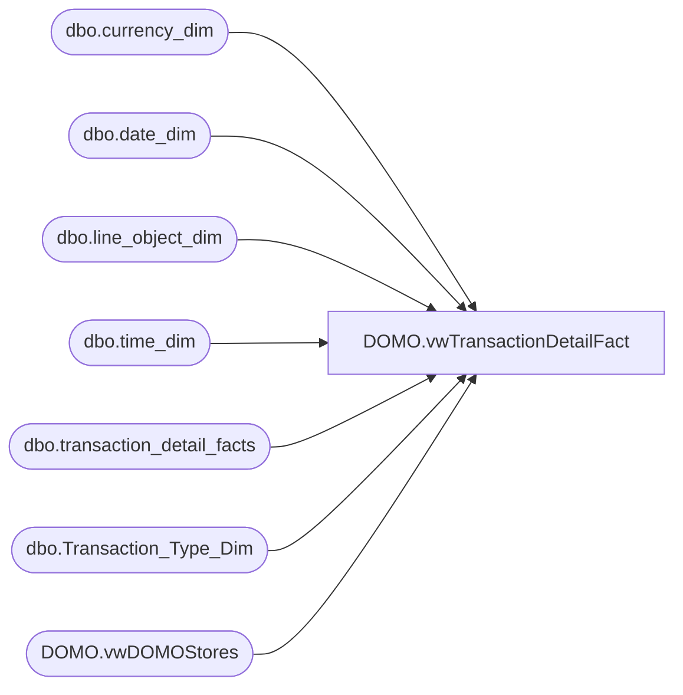

# DOMO.vwTransactionDetailFact

**Database:** dw  
**Server:** papamart  

## Architecture Diagram



## Table Dependencies

| Referenced Table |
|---|
| dbo.currency_dim |
| dbo.date_dim |
| dbo.line_object_dim |
| dbo.time_dim |
| dbo.transaction_detail_facts |
| dbo.Transaction_Type_Dim |
| DOMO.vwDOMOStores |

## View Code

```sql
CREATE VIEW [DOMO].[vwTransactionDetailFact]

AS
-- =============================================================================================================
-- Name: [DOMO].[vwTransactionDetailFacts]
--
-- Description: Transaction detail at line level.
--
--
-- Dependencies: Inner joins with vwDOMOStores, pulling back only those stores in the view.
--
-- Revision History
--		Name:				Date:			Comments:
--		Brian Byas		11/11/2015		Initial creation
--						11/29/2015		Added DiscountType
--
-- =============================================================================================================

SELECT tdf.product_key AS ProductKey
      ,cd.currency_code AS CurrencyCode
      ,tdf.[transaction_id] AS TransactionID
      ,[transaction_line_seq] AS TransactionLineSeq
      ,[Register_Num] AS RegisterNumber	
	  ,CONVERT(DATE, dd.actual_date) AS TransactionDate  
	  ,CAST(CONVERT(VARCHAR,CONVERT(DATE,dd.actual_date)) +' ' + LEFT(CONVERT(TIME,CONVERT(VARCHAR,td.hour) + ':' + CONVERT(VARCHAR,td.minute)),5) + ':00.000' AS DATETIME) AS TransactionDateTime
      ,ds.StoreID AS StoreKey
      ,tdf.[unit_gross_amount] AS UnitGrossAmount
      ,tdf.[units] AS Units
      ,[unit_disc_amount] AS UnitDiscAmount
      ,ISNULL(tdf.[party_y_n],'N') AS PartyFlag
      ,ttd.[transaction_type] AS TransactionType
      ,lod.Line_Object_Description AS LineObject
      ,tdf.[transaction_no] AS TransactionNumber
      ,tdf.[reference_no] AS ReferenceNumber
      ,[vat_tax_amount] AS VatTaxAmount
      ,[upsell_disc_allocated] AS UpsellDiscAllocated
      ,[ext_cost] AS ExtCost 
	  ,line_action_key as LineAction
FROM [dbo].[transaction_detail_facts] tdf 
INNER JOIN [DOMO].[vwDOMOStores] ds
	ON ds.StoreKey=CONVERT(VARCHAR, tdf.store_key) 
	LEFT OUTER JOIN [dbo].[currency_dim] cd
		ON cd.currency_key = tdf.currency_key 
	LEFT OUTER JOIN [dbo].[time_dim] td
		ON td.time_key = tdf.time_key 
	LEFT OUTER JOIN [dbo].[date_dim] dd
		ON tdf.date_key = dd.date_key 
	LEFT OUTER JOIN [dbo].[line_object_dim] lod
		ON lod.Line_Object_Key = tdf.line_object_key 
	LEFT OUTER JOIN [dbo].[Transaction_Type_Dim] ttd
		ON ttd.transaction_key = tdf.transaction_type_key
WHERE dd.actual_date>=DATEADD(year, -2, DATEADD(yy, DATEDIFF(yy, 0, GETDATE()), 0))
AND dd.actual_date<CONVERT(DATE,GETDATE())
AND tdf.Product_Key>=0
```

