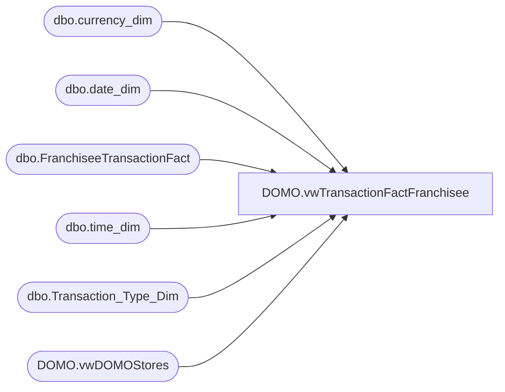

# DOMO.vwTransactionFactFranchisee

**Database:** dw  
**Server:** papamart  

## Architecture Diagram



## Table Dependencies

| Referenced Table |
|---|
| dbo.currency_dim |
| dbo.date_dim |
| dbo.FranchiseeTransactionFact |
| dbo.time_dim |
| dbo.Transaction_Type_Dim |
| DOMO.vwDOMOStores |

## View Code

```sql
CREATE view [DOMO].[vwTransactionFactFranchisee]

AS
-- =============================================================================================================
-- Name: [DOMO].[vwTransactionFactFranchisee]
--
-- Description: Transaction data at the header level for franchisees.
--
--
-- Dependencies: Should match column structure of DOMO.vwTransactionFact
--
-- Revision History
--		Name:				Date:			Comments:
--		Anthony Delgado		06/07/2016		Initial creation
--		Anthony Delgado		06/21/2016		Added StoreTransaction, StoreSalesAmount, and FinStoreSalesAmount
--		Anthony Delgado		08/16/2016		Added EnterpriseSellingUnits, GAAPUnits, EnterpriseSellingOnlyFlag, EnterpriseSellingAmount
--		Anthony Delgado		10/05/2016		Added CaptureEligible
--
-- =============================================================================================================
SELECT ftf.[transaction_id] AS TransactionId
      ,ds.[StoreID] AS StoreKey
      ,CONVERT(DATE,dd.actual_date) AS TransactionDate
	  ,CAST(CONVERT(VARCHAR,CONVERT(DATE,dd.actual_date)) +' ' + LEFT(CONVERT(TIME,CONVERT(VARCHAR,td.hour) + ':' + CONVERT(VARCHAR,td.minute)),5) + ':00.000' AS DATETIME) AS TransactionDateTime
      ,ttd.[transaction_type] AS TransactionType
      ,ftf.[transaction_no] AS TransactionNumber
      ,ftf.[register_no] AS RegisterNumber
      ,ftf.[GAAP_transaction_flag] AS GAAPTransaction
      ,ftf.[Store_transaction_flag] AS StoreTransaction
	  ,ftf.[Enterprise_Selling_Only_Flag] AS EnterpriseSellingOnlyTransaction
      ,ftf.[donation_only_flag] AS DonationTransaction
      ,ftf.[giftcard_only_flag] AS GiftCardOnlyTransaction
	  ,ftf.party_flag AS PartyFlag
	  ,ftf.total_units AS TotalUnits
      ,ftf.[GAAP_sales_amount] AS GAAPSalesAmount
      ,ftf.[Store_sales_amount] AS StoreSalesAmount
	  ,ftf.[Enterprise_Selling_Amount] AS EnterpriseSellingAmount
      ,ftf.[net_sales_amount] AS NetSalesAmount
	  ,ftf.[unit_gross_amount] AS UnitGrossAmount
      ,ftf.[unit_net_amount] AS UnitNetAmount
      ,ftf.[reward_certificate_amount] AS RewardCertificateAmount
      ,ftf.[buy_stuff_amount] AS BuyStuffAmount
	  ,ftf.[redemption_amount] AS RedemptionAmount
      ,ftf.[tax_amount] AS TaxAmount
	  ,ftf.[unit_discount_amount] AS UnitDiscountAmount
      ,ftf.[coupon_discount_amount] AS CouponDiscountAmount
      ,ftf.[coupon_discount_units] AS CouponDiscountUnits
      ,ftf.[giftcard_discount_amount] AS GiftcardDiscountAmount
	  ,ftf.[total_discount_amount] AS TotalDiscountAmount
	  ,ftf.[receipt_total_amount] AS ReceiptTotalAmount
      ,ftf.[fin_GAAP_sales_amount] AS FinGAAPSalesAmount
      ,ftf.[fin_Store_sales_amount] AS FinStoreSalesAmount
	  ,ftf.[upsell_discount_amount] AS UpsellDiscountAmount
      ,ftf.[merchandise_UGA] AS MerchandiseUnitGrossAmount
      ,ftf.[merchandise_units] AS MerchandiseUnits
      ,ftf.[Gaap_Units] AS GAAPUnits
      ,ftf.[Enterprise_Selling_Units] AS EnterpriseSellingUnits
      ,ftf.[merchandise_cost] AS MerchandiseCost
      ,ftf.[donations_UGA] AS DonationUnitGrossAmount
      ,ftf.[donations_units] AS DonationUnits 
      ,ftf.[party_deposit_UGA] AS PartyDepositUnitGrossAmount
      ,ftf.[party_deposit_units] AS PartyDepositUnits
      ,ftf.[giftcard_UGA] AS GiftCardUnitGrossAmount
      ,ftf.[giftcard_units] AS GiftCardUnits 
      ,ftf.[animal_UGA] AS AnimalUnitGrossAmount
      ,ftf.[animal_units] AS AnimalUnits
      ,ftf.[animal_cost] AS AnimalCost
      ,ftf.[non_animal_UGA] AS NonAnimalUnitGrossAmount
      ,ftf.[non_animal_units] AS NonAnimalUnits
      ,ftf.[non_animal_cost] AS NonAnimalCost
      ,ftf.[footwear_UGA] AS FootwearUnitGrossAmount
      ,ftf.[footwear_units] AS FootwearUnits
      ,ftf.[footwear_cost] AS FootwearCost
      ,ftf.[accessories_UGA] AS AccessoryUnitGrossAmount
      ,ftf.[footwear_cost] AS AccessoryCost
      ,ftf.[accessories_units] AS AccessoryUnits
      ,ftf.[sounds_UGA] AS SoundUnitGrossAmount
      ,ftf.[sounds_units] AS SoundUnits
      ,ftf.[sounds_cost] AS SoundCost
      ,ftf.[clothing_UGA] AS ClothingUnitGrossAmount
      ,ftf.[clothing_units] AS ClothingUnits
      ,ftf.[clothing_cost] AS ClothingCost
      ,ftf.[other_UGA] AS OtherUnitGrossAmount
      ,ftf.[other_units] AS OtherUnits
      ,ftf.[other_cost] AS OtherCost
      ,ftf.[shipping_UGA] AS ShippingUnitGrossAmount
      ,ftf.[shipping_units] AS ShippingUnits
      ,ftf.[other_fees_UGA] AS OtherFeesUnitGrossAmount
      ,ftf.[other_fees_units] AS OtherFeesUnits
      ,ftf.[cub_cash_UGA] AS CubCashUnitGrossAmount
      ,ftf.[cub_cash_units] AS CubCashUnits
      ,ftf.[paid_outs_UGA] AS PaidOutsUnitGrossAmount
      ,ftf.[paid_outs_units] AS PaidOutsUnits
      ,ftf.[stuffing_supplies_UGA] AS StuffingSuppliesUnitGrossAmount
      ,ftf.[stuffing_supplies_units] AS StuffingSuppliesUnits
      ,ftf.[sports_UGA] AS SportUnitGrossAmount
      ,ftf.[sports_units] AS SportUnits
      ,ftf.[sports_cost] AS SportCost
      ,ftf.[prestuffed_UGA] AS PresuffedUnitGrossAmount
      ,ftf.[prestuffed_units] AS PresuffedUnits
      ,ftf.[prestuffed_cost] AS PresuffedCost
      ,ftf.[scents_UGA] AS ScentUnitGrossAmount
      ,ftf.[scents_units] AS ScentUnits
      ,ftf.[scents_cost] AS ScentCost
	  ,cd.currency_code AS CurrencyCode
	  ,CASE WHEN (ftf.Store_transaction_flag=1 OR ftf.giftcard_only_flag=1) THEN 1 ELSE 0 END AS CaptureEligible,
	  NULL as EmployeeDiscountUGA,
	  NULL as ReturnUGA,
	  NULL as ReturnUnits
  FROM [dw].[dbo].[FranchiseeTransactionFact] ftf WITH(NOLOCK) INNER JOIN
	    [dw].[DOMO].[vwDOMOStores] ds WITH(NOLOCK)
			ON ds.StoreKey=CONVERT(VARCHAR,ftf.store_key) INNER JOIN
		[dw].[dbo].[date_dim] dd WITH(NOLOCK)
			ON ftf.date_key = dd.date_key  INNER JOIN
		[dw].[dbo].[time_dim] td WITH(NOLOCK)
			ON td.time_key = ftf.time_key INNER JOIN
		[dw].[dbo].[Transaction_Type_Dim] ttd WITH(NOLOCK)
			ON ttd.transaction_key = ftf.transaction_type_key INNER JOIN
		[dw].[dbo].[currency_dim] cd WITH(NOLOCK)
			ON cd.currency_key=ftf.currency_key
WHERE dd.actual_date>=DATEADD(year, -2, DATEADD(yy, DATEDIFF(yy, 0, GETDATE()), 0))
AND dd.actual_date<CONVERT(DATE,GETDATE())
--AND ds.TradingGroup IN ('Franchise - BABW-AU','Franchise - BAB GULF FZE','Franchise - Build A Bear Deutschland GmbH','Franchise - INTENCITY ENTERTAINMENT (PTY) LTD') 
AND LEFT(ds.TradingGroup,9) = 'Franchise'
```

