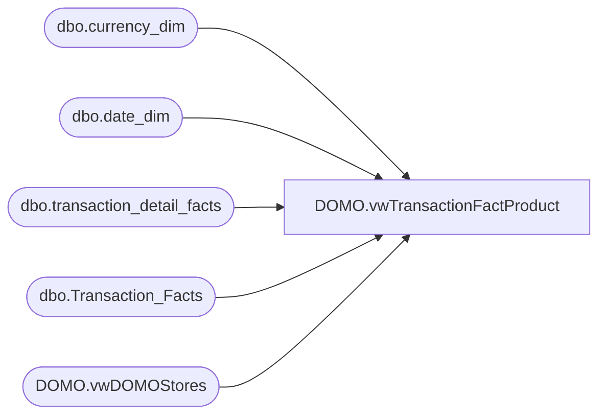

# DOMO.vwTransactionFactProduct

**Database:** dw  
**Server:** papamart  

## Architecture Diagram



## Table Dependencies

| Referenced Table |
|---|
| dbo.currency_dim |
| dbo.date_dim |
| dbo.transaction_detail_facts |
| dbo.Transaction_Facts |
| DOMO.vwDOMOStores |

## View Code

```sql
CREATE VIEW [DOMO].[vwTransactionFactProduct]

AS
-- =============================================================================================================
-- Name: [DOMO].[vwTransactionFactProduct]
--
-- Description: Transaction-level sales summary for each product sold in that transaction.  
--				Used primarily in DPT/UPT analysis by style.
--
--
-- Dependencies: Inner joins with vwDOMOStores, pulling back only those stores in the view.
--
-- Revision History
--		Name:				Date:			Comments:
--		Anthony Delgado		07/26/2016		Initial creation
--		Anthony Delgado		10/11/2016		Added currency code
--
-- =============================================================================================================

SELECT	tdf.transaction_id AS TransactionID
		,d.actual_date AS TransactionDate
		,tdf.product_key AS ProductKey
		,s.StoreID AS StoreKey
		,SUM(tdf.unit_gross_amount-tdf.unit_disc_amount) AS ProductSalesAmount
		,SUM(tdf.units) AS ProductMerchandiseUnits
		,tf.Store_Sales_Amount AS TransactionStoreSalesAmount
		,tf.merchandise_units AS TransactionMerchandiseUnits
		,MIN(c.currency_code) AS CurrencyCode
FROM dw.dbo.transaction_detail_facts tdf
INNER JOIN dw.dbo.Transaction_Facts tf
	ON tf.transaction_id=tdf.transaction_id
INNER JOIN dw.dbo.date_dim d
	ON d.date_key=tf.date_key
INNER JOIN dw.DOMO.vwDOMOStores s
	ON s.StoreKey=tf.store_key
INNER JOIN dw.dbo.currency_dim c
	ON c.currency_key=tf.currency_key
WHERE d.fiscal_year>=(SELECT fiscal_year-1 FROM dw.dbo.date_dim WHERE actual_date=CAST(GETDATE() AS DATE))
AND d.actual_date<CAST(GETDATE() AS DATE)
AND tf.Store_transaction_flag=1
AND tdf.product_key>0
GROUP BY tdf.transaction_id, d.actual_date, tdf.product_key, s.StoreID, tf.Store_Sales_Amount, tf.merchandise_units
```

